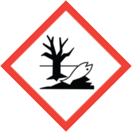
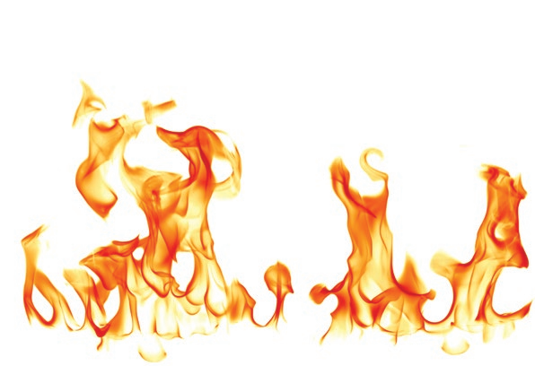
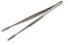
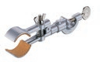
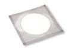

Published by American Chemical Society 1155 Sixteenth Street, NW
Washington, DC 20036
COPYRIGHT 2016

AMERICAN CHEMICAL SOCIETY

## Guidelines for Chemical Laboratory Safety in Secondary Schools

> **Disclaimer:**
>
> *The guidance contained in this publication is believed to be reliable but is not intended to specify minimal legal standards or to represent the policy of the American Chemical Society. No warranty, guarantee, or representation is made to the American Chemical Society as to the accuracy or sufficiency of the information contained herein, and the American Chemical Society assumes no responsibility in connection therewith. Users of these guidelines should consult pertinent local, state, and federal laws and legal counsel prior to initiating any accident prevention program.*
>

## TABLE OF CONTENTS

- ACKNOWLEDGMENTS

- FOREWORD

- **Suggested Learning Outcomes**

- **Recognize the Hazards**
  - General Safety Rules
  - Health and Safety Organizations
  - Hazard versus Risk
  - Globally Harmonized System for Classifying Hazardous Chemicals
  - National Fire Protection Association Hazard Identification System
  - Flammable Materials
  - Laboratory-Specific Signage for Flammables
    - *Fire Triangle*
    - *Fire Tetrahedron*
    - *Classes of Fires*
    - *Types of Fire Extinguishers*
  - Chemical Product Labels
  - Safety Data Sheets
    - *SDS Section Numbers and Headings*
  - Terms that All Chemistry Teachers and Other Science Teachers Should Know
    - *Routes of Exposure*
    - *Types of Exposure Limits*
    - *Examples of Acute Toxicants*
    - *Examples of Chronic Toxicants*
  - Incompatible Chemicals
  - Common Laboratory Hazards
  - Waste Disposal Considerations
  - Chemical Hygiene Plan
  - Basic Laboratory Glassware and Equipment

- **Assess the Risks of the Hazards**
  - Before an Experiment
  - During an Experiment
  - What if an Emergency Occurs?
  - After an Experiment

- **Minimize the Risks of the Hazards**
  - Before an Experiment
  - During an Experiment
  - After an Experiment

- **Prepare for Emergencies from Uncontrolled Hazards**
  - Emergency Preparation
    - *Recommended Safety Equipment*
    - *Exits and Emergency Drills*
    - *Emergency Response*
  - Special Considerations in the Laboratory
    - *Broken Glassware*
    - *Fires*
    - *Spills*
    - *Mercury Spills*
    - *Volatile Liquid Spills*

- APPENDIX A: GLOSSARY OF ABBREVIATIONS AND ACRONYMS

- APPENDIX B: SAMPLE SAFETY GUIDELINES AND SAFETY CONTRACT

## *Acknowledgments*

***This guide was produced by the ACS Committee on Chemical Safety (CCS) Task Force for Safety Education Guidelines.***

> ### TASK FORCE MEMBERS
>
> **TASK FORCE CO-CHAIRS**
>
> **Kirk Hunter,** *Texas State Technical College, Waco, TX*
>
> **W.H. "Jack" Breazeale,** *Francis Marion University, Florence, SC*
>
> #### Secondary Education
>
> **Jennifer Panther Bishoff** *Southern Garrett High School, Mountain Lake Park, MD*
>
> **Regis Goode** *Ridge View High School, Columbia, SC*
>
> **Karlo Lopez** *California State University Bakersfield, Bakersfield, CA*
>
> **Patricia Redden** *Saint Peter's University, Jersey City, NJ*
>
> #### Two- and Four-Year Undergraduate Education
>
> **Georgia Arbuckle** *Rutgers University, Camden, NJ*
>
> **Edgar Arriaga** *University of Minnesota, Minneapolis, MN*
>
> **Joe Crockett** *Bridgewater College, Bridgewater, VA*
>
> **Julie Ellefson** *Harper College, Palatine, IL*
>
> **Ken Fivizzani** RETIRED *Nalco Company, Naperville, IL*
>
> **Steven Fleming** *Temple University, Philadelphia, PA*
>
> **Frank Torre** *Springfield College, Springfield, MA*
>
> #### Graduate and Postgraduate Education
>
> **Dom Casadonte** *Texas Tech University, Lubbock, TX*
>
> **Anna Dunn** *University of Michigan, Ann Arbor, MI*
>
> **Scott Goode** *University of South Carolina, Columbia, SC*
>
> **Robert H. Hill** PAST CHAIR (2012--2014) COMMITTEE ON CHEMICAL SAFETY (CCS) *Battelle Memorial Institute, Atlanta, GA*
>
> **Neal Langerman** *Advanced Chemical Safety, Inc., San Diego, CA*
>
> ***In addition to the Task Force members, the contributions of the following people and groups to this document are gratefully acknowledged.***
>
> **David C. Finster** *Wittenberg University, Springfield, OH*
>
> **Elizabeth M. Howson** 2015--2017 CCS CHAIR *Morristown, NJ*
>
> **ACS Committee on** *Chemical Safety (CCS)*
>
> **ACS Committee on** *Professional Training (CPT)*
>
> **ACS Division of Chemical** *Health and Safety (CHAS)*
>
> **Marta U. Gmurczyk** ACS STAFF LIAISON TO THE CCS *ACS, Washington, DC*
>
> **Raihanah Rasheed** ACS ASSISTANT STAFF LIAISON TO THE CCS *ACS, Washington, DC*

## FOREWORD

All science teachers should have a strong foundation in the science safety culture appropriate to their educational level. Although this requirement applies to elementary, middle, and high school science educators, this publication is designed mainly for the high school chemistry teacher.

### RAMP

The guidelines in this publication were developed using the RAMP concept for scientific safety.[^a] RAMP[^b] is an acronym to help educators and students keep science safety in the forefront of their work in a laboratory environment. Robert H. Hill and David C. Finster coined the term in their textbook *Laboratory Safety for Chemistry Students*. RAMP stands for:

**R Recognize the hazards**
**A Assess the risks of the hazards**
**M Minimize the risks of the hazards**
**P Prepare for emergencies from uncontrolled hazards**

Industrial scientists often state that it is easy to tell when an individual's attention to laboratory safety began. Those graduates with a bachelor of science, master of science, or doctoral degree, who truly understand the importance of laboratory safety, had their safety education start at the secondary education level and continue throughout their undergraduate studies.

These guidelines were developed to help high school teachers in all science subjects to progressively increase their understanding of best practices to ensure the safety of their students and themselves in the scientific learning experience. It is hoped that these guidelines will help teachers to nurture a culture of science safety early in students' academic and professional careers. It is also hoped that these guide- lines will prepare teachers to handle any incident or emergency situation that might arise in the science classroom or
laboratory.

[^a]: *Source:* Hill, R. H.; Finster, D. C. *Laboratory Safety for Chemistry Students*; John Wiley & Sons, Inc.: Hoboken, NJ, 2010; p 1-7.
[^b]: See Appendix A for a glossary of abbreviations and acronyms used in these guidelines.

## Suggested Learning Outcomes

Below are the outcomes that teachers should expect of students. Teachers using these safety education guidelines can design lessons and assessments to ensure that these outcomes are integrated into curricular activities.

Students should be able to define, explain, and understand the following terms and concepts at a basic level.

### RECOGNIZE THE HAZARDS

#### Terms to Define or Explain

- Acute toxicity
- Allergen
- Asphyxiant
- Autoignition temperature
- Carcinogen
- Chronic toxicity
- Compressed gas
- Corrosive
- Cryogen
- Electrical hazard
- Environmental Protection Agency (EPA)
- Flammability
- Flash point
- Globally Harmonized System (GHS)
- Halogen
- Hazard
- Incompatible chemicals
- Mutagen
- National Fire Protection Association (NFPA)
- Organ toxicant
- Occupational Safety and Health Administration (OSHA)
- Personal protective equipment (PPE)
- Pyrophoric
- Radioactivity
- RAMP system
- Risk
- Runaway reaction
- Safety Data Sheet (SDS)
- Teratogen
- Toxicity

#### Basic Terminology and Concepts

1. Differentiate between hazard and risk.
2. Define acute and chronic toxicity and cite some examples of each.
3. State the general effects that corrosives have on the skin.
4. State the general hazards associated with the use and storage of flammable chemicals commonly used in the laboratory.
5. Explain the statement "The dose makes the poison."
6. Explain why reducing the scale reduces the risk.

#### Labels, SDS, and PPE

7. Explain the meaning of the GHS hazard pictograms.
8. Interpret information given on an NFPA diamond.
9. Identify and describe the use of basic PPE.

#### Basic Laboratory Safety

10. State the general rules for working safely in a chemical laboratory environment.
11. Describe the possible routes of exposure for a hazardous material.
12. Explain why food and drinks are not permitted in a chemical laboratory.
13. List the general considerations for appropriate waste disposal.

#### Regulatory Agencies and Regulations

14. State the purpose of regulatory agencies (e .g ., OSHA, EPA).

### ASSESS THE RISKS OF THE HAZARDS

#### Labels

15. Interpret the information given on a manufacturer's label for a chemical substance.

### MINIMIZE THE RISKS OF THE HAZARDS

#### General Concepts

16. Explain why the "buddy system" is used in laboratory environments.
17. Explain why various flammable and combustible materials should be available in limited quantities in laboratories.
18. Discuss the safety precautions or best practices that must be followed when transferring flammable materials from one container to another.
19. Explain the reasons for following written protocols and standard operating procedures (SOPs) for laboratory activities and experiments.
20. Explain the purpose of good housekeeping.
21. Demonstrate good housekeeping by maintaining a clean and orderly workspace.
22. Identify and demonstrate the appropriate use of personal protective equipment (PPE) for a given laboratory activity.
23. Identify and demonstrate the appropriate use of common laboratory safety equipment (e .g ., safety shower, eyewash station, fire blanket, fire extinguisher).
24. Describe and demonstrate methods to prevent spills due to falling containers, or when transferring and transporting chemicals.
25. Describe and demonstrate the appropriate use of common laboratory equipment for heating (e .g ., Bunsen burners, hot plates, alcohol burners, candles, heat guns, laboratory ovens).
26. Describe the basic precautions for the following common laboratory operations: chromatographic separations, distillations, refluxing, recrystallization, extraction, stirring.
27. Explain the hazards of mercury and ways to minimize exposures, including plans to eliminate mercury-containing equipment from laboratories.

#### Planning

28. Prepare a safety checklist for all laboratory activities using the RAMP concept.
29. Prepare and lead a short safety presentation appropriate to the laboratory setting and activity.

#### PPE

30. Describe the various types of eye protection and their appropriate uses.
31. Describe and discuss skin protection measures (e .g ., clothing, gloves, tools).
32. Explain why glove material and construction must be considered when selecting proper PPE.
33. Given a glove selection chart, select the proper glove material and construction for a laboratory operation or potential chemical exposure.
34. Select and wear appropriate PPE while in the laboratory.

#### Ventilation

35. Describe the proper use and operation of chemical hoods and ventilation systems.

#### Sharps

36. Demonstrate the proper disposal of "sharps".
37. Describe appropriate disposal methods for damaged glassware. Demonstrate proper procedures to prevent lacerations while handling glassware, either intact or broken.

#### Inventory, Storage, and Security

38. Describe the proper use of safety cabinets and appropriate procedures for the storage of corrosives and flammable chemicals.
39. Explain why incompatible chemicals must be stored separately.
40. Describe the steps needed to prevent incompatible chemicals from coming into contact with each other.

#### Chemical Wastes and Disposal

41. Describe the appropriate protocols for handling and disposing of leftover chemicals and chemical wastes.
42. Explain why disposal of chemical wastes by pouring them down the drain or placing them in the trash can is generally not appropriate.

#### Spills and Spill Prevention

43. Demonstrate the appropriate use of bottle carriers.
44. Use appropriate techniques to transfer gases, liquids, and solids from storage containers to laboratory equipment.
45. Describe and demonstrate how spills of solids and liquids can be minimized and contained during weighing operations.

### PREPARE FOR EMERGENCIES FROM UNCONTROLLED HAZARDS

#### General Preparation

46. Identify the location of all exits and laboratory safety equipment (e .g ., safety shower, eyewash station, fire extinguisher, first aid kit).

#### Emergency Response

47. Respond appropriately per institutional policies to emergency situations in the laboratory (e .g ., spills, fires).
48. Participate in an emergency exit or evacuation drill for the laboratory.

#### First Aid

49. Demonstrate basic first aid procedures for minor laboratory accidents.
50. Demonstrate the proper use of a safety shower and an eyewash station.

#### Fires

51. Describe the components of the fire triangle and the fire tetrahedron.
52. Describe the classes of fires and how to use different types of fire extinguishers.

#### Spills

53. Demonstrate proper techniques for cleaning up incidental spills of acids, bases, organic compounds, and mercury.

## R A M P - Recognize the Hazards

> The first principle of laboratory safety is to recognize the hazards of chemicals, equipment, and procedures. This section provides basic information on how to identify hazards.

### General Safety Rules

It is imperative to create a culture of safety in the science classroom from the first meeting of the class. Instilling a general understanding of safety in the laboratory is the responsibility of the teacher. There are many resources to guide the educator in adopting an appropriate set of safety rules for a given laboratory setting. The list of rules can be extensive. Therefore, it is recommended that the list for the students be manage- able and specific for a particular class and setting. Not only should a set of guidelines be given and explained to students; it is also important to provide a safety contract for the students and their parents or guardians to sign.

The safety contract provides the evidence that you, the teacher, take safety seriously and that you have a plan for operating a safe laboratory setting. In an effort to ensure that students not only have read the safety guidelines but also understand them, it is recommended that each student demonstrate knowledge in an assessment, such as a quiz. The assessment demonstrates accountability that the students are familiar with the safety expectations in the laboratory and that the teacher emphasizes a culture of safety.[^c]

[^c]: See Appendix B for sample safety guidelines for the laboratory and a safety contract by the American Chemical Society.

### Health and Safety Organizations

The following agencies are involved with the health and safety of individuals in the laboratory.

+-----------------------+-----------------------+---------------------------------------------------+
|**Agencies**           |                       |                                                   |
+=======================+=======================+===================================================+
|**Acronym**            |**Full Name**          | **Purpose and**                                   |
|                       |                       | **Website**                                       |
+-----------------------+-----------------------+---------------------------------------------------+
| CDC                   | Centers for Disease   | Research:                                         |
|                       | Control and           |                                                   |
|                       | Prevention            | Protects public                                   |
|                       |                       | health and safety                                 |
|                       |                       | through the control                               |
|                       |                       | and prevention of                                 |
|                       |                       | disease, injury, and                              |
|                       |                       | disability                                        |
|                       |                       |                                                   |
|                       |                       | [**www.cdc.gov**](http://www.cdc.gov/)            |
+-----------------------+-----------------------+---------------------------------------------------+
| EPA                   | Environmental         | Regulatory:                                       |
|                       | Protection Agency     |                                                   |
|                       |                       | Environmental,                                    |
|                       |                       | safety, and health                                |
|                       |                       | hazards                                           |
|                       |                       |                                                   |
|                       |                       | [**www3.epa.gov**](http://www3.epa.gov/)          |
+-----------------------+-----------------------+---------------------------------------------------+
| NFPA                  | National Fire         | Fire and building                                 |
|                       | Protection            | codes:                                            |
|                       | Association           |                                                   |
|                       |                       | Reduces the worldwide                             |
|                       |                       | burden of fire and                                |
|                       |                       | other hazards                                     |
|                       |                       |                                                   |
|                       |                       | [**www.nfpa.org**](http://www.nfpa.org/)          |
+-----------------------+-----------------------+---------------------------------------------------+
| NIOSH                 | National Institute    | Research:                                         |
|                       | for Occupational      |                                                   |
|                       | Safety and Health     | Conducts research and                             |
|                       |                       | recommends ways to                                |
|                       |                       | prevent injury and                                |
|                       |                       | illness                                           |
|                       |                       |                                                   |
|                       |                       | [**www.cdc.gov/niosh**](http://www.cdc.gov/niosh) |
+-----------------------+-----------------------+---------------------------------------------------+
| OSHA                  | Occupational Safety   | Regulatory:                                       |
|                       | and Health            |                                                   |
|                       | Administration        | Safety and health                                 |
|                       |                       | hazards in the                                    |
|                       |                       | workplace                                         |
|                       |                       |                                                   |
|                       |                       | [**www.osha.gov**](http://www.osha.gov/)          |
+-----------------------+-----------------------+---------------------------------------------------+

### Hazard versus Risk

The terms "hazard" and "risk" are frequently used interchangeably, but there is a distinct difference. A ***hazard*** is any source of potential damage or harm to an individual's health or life under certain conditions, whether at work or in the home.

+-----------------------+-----------------------+-----------------------+
| **Examples of         |                       |                       |
| Hazards and Their     |                       |                       |
| Effects**             |                       |                       |
+=======================+=======================+=======================+
| **Type of Hazard**    | **Example**           | **Potential Harm**    |
+-----------------------+-----------------------+-----------------------+
| Item                  | Broken glass          | Cut                   |
+-----------------------+-----------------------+-----------------------+
| Substance             | Sodium hydroxide      | Blistering of skin    |
+-----------------------+-----------------------+-----------------------+
| Source of energy      | Bunsen burner         | Burn                  |
+-----------------------+-----------------------+-----------------------+
| Condition             | Wet floor             | Slipping and falling  |
+-----------------------+-----------------------+-----------------------+

***Risk*** is the chance or probability of a person being harmed or experiencing an adverse health effect if exposed to a hazard. For example, a wet floor is a hazard, and there is a probability (risk) that someone might be harmed by slipping and falling. Risks can be reduced by taking measures to minimize or control the hazard. For example, the risk of falling could be reduced by placing signs warning of the wet floor or blocking access to the area where the hazard exists.

***Risk assessment*** is the process of estimating the probability of harm from a hazard (the severity of the hazard multiplied by the probability of exposure to the hazard) by considering the process or the laboratory procedure that will be used with the hazard. Conducting a risk assessment involves estimating the risk and then identifying steps to minimize the risk---reducing the quantity of the hazard being handled, using chemical hoods and protective barriers, devising safe procedures for handling the hazard, and using personal protective equipment (PPE). All chemistry and science teachers who work with students in the laboratory should know how to undertake and document a risk assessment.

### Globally Harmonized System for Classifying Hazardous Chemicals

The Globally Harmonized System (GHS) is an internationally adopted system for the classification and labeling of hazardous chemicals. It includes established criteria for classifying hazards and for further categorizing (or rating) the hazards according to their relative risks. The GHS provides established language and symbols for each hazard class and each category within a class.

This language includes a *signal word* (such as "danger" or "warning"), a *symbol* or *pictogram* (such as a flame within a red-bordered diamond), a *hazard statement* (such as "causes serious eye damage"), and *precautionary statements* for safely using the chemical.

An important part of this hazard classification system is the set of criteria that describe a given class of hazard (e.g., flammable liquids) and the ratings (categories) of the hazards within each hazard class. The hazard categories are numbered from 1 to perhaps as high as 5. The important thing to know is that the LOWER the number, the GREATER the severity of the hazard; thus, Category 1 hazards are the most dangerous. You should also know that this GHS numbering system is the *opposite* of the NFPA rating system; under the NFPA system, the most dangerous rating is 4 (see page 25), while 0 would pose a minimal hazard.

The GHS was developed to identify to the user of a material both the hazards and the risks associated with chemicals. The EPA, OSHA, and U.S. Department of Transportation have adopted the GHS for use in the United States. Science teachers are expected to understand and use the GHS signal word, symbol, hazard statement, and precautionary statement. These items are appropriately placed on commercial labels found on chemical containers and in Safety Data Sheets (SDSs). The prudent practice would be to transfer the signal word and symbol to the labels on secondary containers.

+-----------------------------------------+-----------------------------------+
| **GHS Hazard Symbols and Their          |                                   |
| Definitions**                           |                                   |
+=========================================+===================================+
| **GHS Symbol**                          | **GHS Class**                     |
+-----------------------------------------+-----------------------------------+
|        | **Explosive**                     |
|                                         |                                   |
|                                         | - Explosives                      |
|                                         | - Self-reactive substances        |
|                                         | - Organic peroxides               |
+-----------------------------------------+-----------------------------------+
|                | **Flammable**                     |
|                                         |                                   |
|                                         | - Flammable gases, aerosols,      |
|                                         |   liquids and solids              |
|                                         | - Pyrophoric liquids or solids    |
|                                         | - Self-heating substances         |
|                                         | - Self-reactive substances        |
|                                         | - Substances that emit a flammable|
|                                         |   gas upon contact with water     |
|                                         | - Organic peroxides               |
+-----------------------------------------+-----------------------------------+
|            | **Corrosive**                     |
|                                         |                                   |
|                                         | - Skin corrosion/burns            |
|                                         | - Eye damage                      |
|                                         | - Corrosive to metals             |
+-----------------------------------------+-----------------------------------+
|    | **Oxidizer**                      |
|                                         |                                   |
|                                         | - Oxidizing gases, liquids, and   |
|                                         | solids                            |
+-----------------------------------------+-----------------------------------+
|         | **Compressed gas**                |
|                                         |                                   |
|                                         | - Gases under pressure            |
+-----------------------------------------+-----------------------------------+
| | **Toxic Substance**               |
|                                         |                                   |
|                                         | - Acutely toxic substances that   |
|                                         |   may be fatal or toxic if        |
|                                         |   inhaled, ingested, or absorbed  |
|                                         |   through the skin                |
+-----------------------------------------+-----------------------------------+
|     | **Irritant**                      |
|                                         |                                   |
|                                         | - Irritant (skin and eye)         |
|                                         | - Skin sensitizer                 |
|                                         | - Acute toxins                    |
|                                         | - Narcotic effects                |
|                                         | - Respiratory tract irritants     |
|                                         | - Hazardous to                    |
|                                         |   ozone layer (non-mandatory)     |
|                                         |                                   |
+-----------------------------------------+-----------------------------------+
|        | **Health Hazard**                 |
|                                         |                                   |
|                                         | - Respiratory sensitizers         |
|                                         | - Carcinogens                     |
|                                         | - Mutagens                        |
|                                         | - Reproductive toxins             |
|                                         | - Target organ toxins,            |
|                                         |   single exposure                 |
|                                         |   or repeated exposure            |
|                                         | - Aspiration toxins               |
|                                         |                                   |
+-----------------------------------------+-----------------------------------+
|          | **Environmental Hazard**          |
|                                         | **(non-mandatory)**               |
|                                         |                                   |
|                                         | - Acute aquatic toxins            |
|                                         | - Chronic aquatic toxins          |
+-----------------------------------------+-----------------------------------+

*Source:* UNECE. Globally Harmonized System of Classification and Labelling of Chemicals, 2015. [www.unece.org/trans/danger/publi/ghs/ghs\_welcome\_e.html](http://www.unece.org/trans/danger/publi/ghs/ghs_welcome_e.html) (accessed Dec 1, 2015).

### National Fire Protection Association Hazard Identification System

The National Fire Protection Association (NFPA) developed a hazard identification system for emergency responders that is still in use today. In the past some chemical manufacturers used NFPA diamonds on their products, but now labels are required to use GHS labeling. This section briefly explains the NFPA system.

The NFPA diamond provides a quick visual representation of the health hazard, flammability, reactivity, and special hazards that a chemical may pose during a fire. The NFPA diamond consists of four color-coded fields: blue, red, yellow, and white. The blue, red, and yellow fields---which represent health hazard, flammability, and reactivity, respectively---use a numbering scale ranging from 0 to 4. A value of 0 means that the material poses essentially no hazard, whereas a rating of 4 indicates extreme danger. The white field is used to convey special hazards.

*Note: The numbering system in the NFPA Hazard Identification System and the numbering system in the GHS are opposite; higher values in the NFPA system indicate higher hazards, and the opposite is true for the GHS.*

It must be understood that the NFPA system was designed to convey safety information to emergency first responders, such as fire fighters. It was not designed to notify the user of the hazards of chemicals in the laboratory setting. Additional information must be available, such as GHS symbols and SDSs. The SDS is discussed in the section titled "Safety Data Sheets".

+--------------------+--------------------+-------------------+-------------------+
| **NFPA Hazard**    |                    |                   |                   |
| **Identification** |                    |                   |                   |
| **System**         |                    |                   |                   |
+====================+====================+===================+===================+
|**BLUE Diamond**    |**RED Diamond**     |**YELLOW Diamond** | **WHITE Diamond** |
|                    |                    |                   |                   |
|*Health Hazard*     |*Fire Hazard*       |*Reactivity*       |*Special Hazard*   |
|                    | (Flash             |                   |                   |
|                    | Points)            |                   |                   |
+--------------------+--------------------+-------------------+-------------------+
| **4** Deadly       | **4** Below 73 °F  | **4** May         | **ACID** --       |
|                    |                    | Detonate          | Acid              |
+--------------------+--------------------+-------------------+-------------------+
| **3** Extreme      | **3** Below 100 °F | **3** Shock       | **ALK** --        |
| Danger             |                    | and Heat May      | Alkali            |
|                    |                    | Detonate          |                   |
+--------------------+--------------------+-------------------+-------------------+
| **2** Hazardous    | **2** Above 100 °F | **2** Violent     | **COR** --        |
|                    |                    | Chemical          | Corrosive         |
|                    | Not Exceeding      | Change            |                   |
|                    | 200 °F             |                   |                   |
+--------------------+--------------------+-------------------+-------------------+
| **1** Slightly     | **1** Above 200    | **1** Unstable    | **OXY** --        |
| Hazardous          | °F                 | if Heated         | Oxidizer          |
+--------------------+--------------------+-------------------+-------------------+
| **0** Normal       | **0** Will Not     | **0** Stable      | Radioactive       |
| Material           | Burn               |                   |                   |
+--------------------+--------------------+-------------------+-------------------+
|                    |                    |                   |~~W~~ Use No Water |
+--------------------+--------------------+-------------------+-------------------+

*Note: Chart is for reference only. Consult the NFPA 704 standard for complete specifications.*

### Flammable Materials

The safe use of flammable and combustible materials is the responsibility of the teacher.

When such materials are improperly used in demonstrations, such as the "Rainbow Demonstration",[^d] serious injuries to students and teachers may occur.

Teachers should NEVER open a bottle of flammable liquid in the presence of a flame or hot surface (which is a source of ignition). It is the vapors from flammable liquids that are flammable, so when one opens a bottle and tilts it to pour out the liquid, the first thing that leaves the bottle is an invisible, highly flammable cloud of vapor, which will ignite immediately upon contact with a flame or source of ignition (a hot surface or a spark). This is why this demonstration should not be conducted on an open desk or bench.

For example, numerous incidents have been reported recently involving the Rainbow Demonstration where both students and teachers have been seriously injured. This demonstration illustrates metal flame colors using methyl alcohol or ethyl alcohol. Both of these alcohols are extremely flammable liquids and vapors. Use of this demonstration is discouraged; however, it may be performed safely ONLY by trained and experienced demonstrators. See the reference below for alternatives and precautions for this demonstration.

[^d]: American Chemical Society. Safety Alert Rainbow Demonstration. [www.acs.org/content/acs/en/about/governance/committees/chemicalsafety/safety-alert-rainbow-demonstration.html](http://www.acs.org/content/acs/en/about/governance/committees/chemicalsafety/safety-alert-rainbow-demonstration.html) (accessed May 22, 2016).

### Laboratory-Specific Signage for Flammables

+-------------------------------------+-----------------------------------+
| **Fire Triangle**                   |                                   |
+=====================================+===================================+
| **Three ingredients are**           |                                   |
| **essential to produce a fire**     |                                   |
|                                     |                                   |
| **These ingredients are**           |                                   |
| **represented on each side of the** |                                   |
| **fire triangle**                   |                                   |
+-------------------------------------+-----------------------------------+
|   |**1.** Enough oxygen to sustain    |
|                                     |combustion                         |
+-------------------------------------+-----------------------------------+
|                                     |**2.** Enough heat to raise the    |
|                                     |material to its ignition           |
|                                     |temperature                        |
+-------------------------------------+-----------------------------------+
|                                     |**3.** Some sort of fuel or        |
|                                     |combustible material               |
+-------------------------------------+-----------------------------------+

+---------------------------------------+-----------------------+-----------------------+
| **Fire**                              |                       |                       |
| **Tetrahedron**                       |                       |                       |
+=======================================+=======================+=======================+
| **When a chemical**                   |                       |                       |
| **chain reaction is**                 |                       |                       |
| **added to the fire**                 |                       |                       |
| **triangle, it**                      |                       |                       |
| **becomes a fire**                    |                       |                       |
| **tetrahedron Four**                  |                       |                       |
| **items are necessary**               |                       |                       |
| **to produce a fire**                 |                       |                       |
+---------------------------------------+-----------------------+-----------------------+
|  | **1.** Oxygen         |                       |
+---------------------------------------+-----------------------+-----------------------+
|                                       | **2.** Heat           |                       |
+---------------------------------------+-----------------------+-----------------------+
|                                       | **3.** Fuel or        |                       |
|                                       | combustible           |                       |
|                                       | material              |                       |
+---------------------------------------+-----------------------+-----------------------+
|                                       | **4.** A chemical     |                       |
|                                       | reaction              |                       |
+---------------------------------------+-----------------------+-----------------------+
| **One of the four**                   |                       |                       |
| **parts of the**                      |                       |                       |
| **tetrahedron much be**               |                       |                       |
| **addressed to**                      |                       |                       |
| **prevent or stop a**                 |                       |                       |
| **fire.**                             |                       |                       |
+---------------------------------------+-----------------------+-----------------------+
| Keep fuel and                         | Cut off oxygen to     | Use an appropriate    |
| ignition sources                      | the fire by           | fire extinguisher     |
| separate                              | smothering            | to remove part of     |
|                                       |                       | the fire              |
|                                       |                       | tetrahedron           |
+---------------------------------------+-----------------------+-----------------------+

+-----------------------------------+-----------------------------------+
| **Classes of Fires**              |                                   |
+===================================+===================================+
| **Class**                         | **Description**                   |
+-----------------------------------+-----------------------------------+
| A                                 | Fires involving ordinary          |
|                                   | combustibles, such as wood,       |
|                                   | paper, and some plastics          |
+-----------------------------------+-----------------------------------+
| B                                 | Fires involving flammable         |
|                                   | liquids, such as alcohols, lamp   |
|                                   | oils, or butane                   |
+-----------------------------------+-----------------------------------+
| C                                 | Fires involving electrical        |
|                                   | components                        |
+-----------------------------------+-----------------------------------+
| D                                 | Fires involving metals, such as   |
|                                   | aluminum or sodium                |
+-----------------------------------+-----------------------------------+
| K                                 | Fires involving cooking or        |
|                                   | animal oils, such as frying       |
|                                   | foods                             |
+-----------------------------------+-----------------------------------+

*Source:* OSHA. Fire Protection and Prevention, 2009. [https://www.osha.gov/sites/default/files/2019-03/fireprotection.pdf](https://www.osha.gov/sites/default/files/2019-03/fireprotection.pdf) (accessed July 6, 2023).

\

+-----------------------------------+-----------------------------------+
| **Types of Fire Extinguishers**   |                                   |
+===================================+===================================+
| **Type**                          | **Class of Fire**                 |
+-----------------------------------+-----------------------------------+
| Dry chemical (multipurpose)       | A, B, C                           |
+-----------------------------------+-----------------------------------+
| Water                             | A ONLY (will not work for other   |
|                                   | types of fires)                   |
+-----------------------------------+-----------------------------------+
| Foam                              | B ONLY (will not work for other   |
|                                   | types of fires)                   |
+-----------------------------------+-----------------------------------+
| Carbon dioxide (not to be used    | B, C                              |
| in confined areas)                |                                   |
+-----------------------------------+-----------------------------------+
| Halon                             | B, C                              |
+-----------------------------------+-----------------------------------+
| Metal                             | D                                 |
+-----------------------------------+-----------------------------------+
| Potassium acetate                 | K                                 |
+-----------------------------------+-----------------------------------+

*Note: In most cases, the high school laboratory will require a dry chemical extinguisher, but if you possess solid sodium or other reactive metals, a metal fire extinguisher is also recommended.*

*Source:* OSHA. Fire Protection and Prevention, 2009.
[https://www.osha.gov/sites/default/files/2019-03/fireprotection.pdf](https://www.osha.gov/sites/default/files/2019-03/fireprotection.pdf) (accessed July 6, 2023).

\

\

### Chemical Product Labels

***Always read the label on a chemical bottle to obtain and review basic safety information concerning the properties of a chemical. It is the responsibility of teachers to be fully aware of the hazards and risks of all chemicals they are using.***

{width="4.8in" height="2.1in"}

© Flinn Scientific, Inc. All Rights Reserved. Reproduced for one-time use with permission from Flinn Scientific, Inc., Batavia, Illinois, USA.

### Safety Data Sheets

The Safety Data Sheet (SDS), formerly known as the Material Safety Data Sheet (MSDS), is provided by the manufacturer, distributor, or importer of a chemical to provide information about the substance and its use. The SDS, unlike the MSDS, is required to present the information in a uniform manner. The information includes the properties of each chemical; the physical, health, and environmental health hazards; protective measures; and safety precautions for handling, storing, disposing of, and transporting the chemical. The GHS provides standard language or "building blocks" for communicating the hazards of chemicals in the SDS, just as on chemical labels. These "building blocks" include the use of specific signal words, pictograms, hazard statements, and precautionary statements.

+-------------------------------------+-----------------------------------+
| **SDS Section Numbers and**         |                                   |
| **Headings**                        |                                   |
+=====================================+===================================+
| **Section 1:** Identification       | **Section 9:** Physical and       |
|                                     | chemical properties               |
+-------------------------------------+-----------------------------------+
| **Section 2:** Hazard(s)            | **Section 10:** Stability and     |
| identification                      | reactivity                        |
+-------------------------------------+-----------------------------------+
| **Section 3:**                      | **Section 11:** Toxicological     |
| Composition/information on          | information                       |
| ingredients                         |                                   |
+-------------------------------------+-----------------------------------+
| **Section 4:** First-aid measures   | **Section 12:** Ecological        |
|                                     | information                       |
+-------------------------------------+-----------------------------------+
| **Section 5:** Fire-fighting        | **Section 13:** Disposal          |
| measures                            | considerations                    |
+-------------------------------------+-----------------------------------+
| **Section 6:** Accidental release   | **Section 14:** Transport         |
| measures                            | information                       |
+-------------------------------------+-----------------------------------+
| **Section 7:** Handling and         | **Section 15**: Regulatory        |
| storage                             | information                       |
+-------------------------------------+-----------------------------------+
| **Section 8:** Exposure             | **Section 16:** Other information |
| controls/personal protection        |                                   |
+-------------------------------------+-----------------------------------+

*Source:* OSHA. Hazard Communication Standard: Safety Data Sheets, 2012. [www.osha.gov/Publications/OSHA3514.html](http://www.osha.gov/Publications/OSHA3514.html) (accessed June 19, 2015).

### Terms that All Chemistry Teachers and Other Science Teachers Should Know

- **Allergen (sensitizer):** A chemical that causes an allergic reaction--- that is, evokes an adverse immune response (could be a severe rash or respiratory distress).

- **Asphyxiant:** A gas or vapor that can cause unconsciousness or death by suffocation due to lack of oxygen.

- **Autoignition temperature:** The temperature at or above which a substance will spontaneously ignite or catch fire without a spark or flame.

- **Carcinogen:** A substance that is capable of causing cancer.

- **Corrosive:** A highly reactive substance that causes obvious damage to living tissue by chemical action. Examples of corrosive substances are strong acids, strong bases, and oxidizing agents.

- **Exposure:** Direct contact with a hazard or chemical in a way that causes injury or harm.

+-----------------------------------+-----------------------------------+
| **Routes of Exposure**            |                                   |
+===================================+===================================+
| **Route**                         | **Explanation**                   |
+-----------------------------------+-----------------------------------+
| Inhalation                        | Chemicals in the form of gases,   |
|                                   | vapors, mists, fumes, and dusts   |
|                                   | can enter through the nose or     |
|                                   | mouth and be absorbed through     |
|                                   | the mucous membranes of the       |
|                                   | nose, trachea, bronchi, and       |
|                                   | lungs.                            |
+-----------------------------------+-----------------------------------+
| Ingestion                         | Chemicals can enter the body      |
|                                   | through the mouth and be          |
|                                   | swallowed. They may be            |
|                                   | absorbed into the bloodstream     |
|                                   | anywhere along the length of      |
|                                   | the gastrointestinal tract.       |
+-----------------------------------+-----------------------------------+
| Dermal                            | Although the skin is a good       |
|                                   | barrier to many substances,       |
|                                   | some chemicals can be absorbed    |
|                                   | through the skin, enter the       |
|                                   | bloodstream, and be carried       |
|                                   | throughout the body.              |
+-----------------------------------+-----------------------------------+
| Injection                         | While uncommon in most            |
|                                   | workplaces, exposure to a         |
|                                   | chemical can occur when a sharp   |
|                                   | object (e .g ., a needle or       |
|                                   | broken glass) punctures the       |
|                                   | skin and injects a chemical       |
|                                   | directly into the bloodstream.    |
+-----------------------------------+-----------------------------------+

- **Exposure limit:** The established concentration of a chemical that most people could be exposed to in a typical day without experiencing adverse effects. See the table below for the various types of exposure limits. Exposure limits help in understanding the relative risks of chemicals.

+-----------------------+-----------------------+-----------------------+
| **Types of Exposure** |                       |                       |
| **Limits**            |                       |                       |
+=======================+=======================+=======================+
| **Exposure Limit**    | **Acronym**           | **Explanation**       |
+-----------------------+-----------------------+-----------------------+
| Permissible           | PEL                   | Specifies the         |
| exposure limit        |                       | maximum amount or     |
|                       |                       | concentration of a    |
|                       |                       | chemical to which a   |
|                       |                       | worker may be         |
|                       |                       | exposed . It can be   |
|                       |                       | established in one    |
|                       |                       | of two ways:          |
|                       |                       |                       |
|                       |                       | 1. Ceiling values:    |
|                       |                       | At no time should     |
|                       |                       | this exposure limit   |
|                       |                       | be exceeded .         |
|                       |                       |                       |
|                       |                       | 2. 8-hour             |
|                       |                       | time-weighted         |
|                       |                       | average (TWA): An     |
|                       |                       | average value of      |
|                       |                       | exposure over the     |
|                       |                       | course of an 8-hour   |
|                       |                       | work shift.           |
+-----------------------+-----------------------+-----------------------+
| Threshold limit       | TLV                   | Denotes the level     |
| value                 |                       | of exposure that      |
|                       |                       | nearly all workers    |
|                       |                       | can experience        |
|                       |                       | without an            |
|                       |                       | unreasonable risk     |
|                       |                       | of disease or         |
|                       |                       | injury. Defined as    |
|                       |                       | ceiling limits,       |
|                       |                       | short-term exposure   |
|                       |                       | limits (STEL), and    |
|                       |                       | TWAs . It should be   |
|                       |                       | noted that these      |
|                       |                       | are only advisory     |
|                       |                       | limits and not        |
|                       |                       | enforceable by law.   |
|                       |                       | These may be the      |
|                       |                       | same as PELs          |
+-----------------------+-----------------------+-----------------------+
| Immediate danger to   | IDLH                  | Specifies a level     |
| life or health        |                       | of exposure that is   |
|                       |                       | immediately           |
|                       |                       | dangerous to life     |
|                       |                       | and/or health.        |
+-----------------------+-----------------------+-----------------------+

TLVs are produced by the American Conference of Governmental Industrial Hygienists (ACGIH).

- **Fetotoxicant:** A substance that enters the maternal and placental circulation and causes injury or death to the fetus.

- **Flammable:** A substance that easily catches fire. As defined by the GHS, a flammable substance is one that has a flash point at or above 73 °F (23 °C) and below 140 °F (60 °C). A highly flammable substance has a flash point below 73 °F (23 °C) and an initial boiling point above 95 °F (35 °C). An extremely flammable substance has a flash point below 73 °F (23 °C) and an initial boiling point below 95 °F (35 °C).[^e]

- **Flash point:** The lowest temperature at which a liquid or solid can produce a vapor sufficient to form an ignitable mixture in the air. The lower the flash point, the easier it is to ignite the material.

- **Mutagen:** A substance capable of changing genetic material in a cell and thus increasing the frequency of mutations.

- **Runaway reaction:** An unexpected event in which the rate of reaction increases significantly, resulting in a significant increase in temperature. The increase in temperature causes the rate of reaction to increase, further increasing the rate and tending to create an uncontrolled, often heat-producing, reaction.

- **Teratogen:** An agent that can cause non-inheritable genetic mutations or malformations of an embryo or fetus. The agent can be a chemical substance, virus, or ionizing radiation.

- **Toxic:** Any substance that has the capacity to produce personal injury or illness to humans through ingestion, inhalation, or absorption through any body surface, as defined by Federal Hazardous Substances Act (FHSA) regulation.

- **Acute toxicity:** The adverse effects of a substance resulting from a single exposure or multiple exposures over a very short time span (less than 24 hours). Acute toxicity is usually determined by exposing animals to a given chemical to determine the lethal dose, 50% (LD50). This is an experimental measure determined by administering varied doses of a chemical by some route to animals, observing the percentage lethality at these doses, and extrapolating to estimate the dose that would kill 50% of the animals.

[^e]: *Source:* UNECE. Globally Harmonized System of Classification and Labelling of Chemicals, 2015.[www.unece.org/fileadmin/DAM/trans/danger/publi/ghs/GHS\_presentations/English/phys\_haz\_e.pdf](http://www.unece.org/fileadmin/DAM/trans/danger/publi/ghs/GHS_presentations/English/phys_haz_e.pdf) (accessed Dec 1, 2015).

+-----------------------------------+-----------------------------------+
| **Examples of Acute Toxicants**   |                                   |
+===================================+===================================+
| **Type of Acute Toxicant**        | **Examples**                      |
+-----------------------------------+-----------------------------------+
| **Asphyxiant:** A gas or vapor    | Carbon monoxide, methane,         |
| that can cause unconsciousness or | hydrogen sulfide                  |
| death by suffocation due to lack  |                                   |
| of oxygen .                       |                                   |
+-----------------------------------+-----------------------------------+
| **Irritant:** A noncorrosive      | Acetone, heptane, ethyl acetate,  |
| chemical that causes reversible   | sodium carbonate                  |
| inflammation at the point of      |                                   |
| contact with the skin .           |                                   |
+-----------------------------------+-----------------------------------+
| **Neurotoxicant:** A chemical     | Mercury, lead, acetone, carbon    |
| that interferes with the          | disulfide                         |
| peripheral and central nervous    |                                   |
| systems .                         |                                   |
+-----------------------------------+-----------------------------------+
| **Organ toxicant:** A chemical    | Toluene, carbon tetrachloride,    |
| that adversely affects one or     | arsenic, chlorine                 |
| more organs or body systems .     |                                   |
+-----------------------------------+-----------------------------------+
| **Sensitizer/allergen:** A        | Formaldehyde, latex               |
| chemical that produces its        |                                   |
| effects by evoking an adverse     |                                   |
| response in the body's immune     |                                   |
| system .                          |                                   |
+-----------------------------------+-----------------------------------+
| **Teratogen or fetotoxicant:** A  | Ethanol, ethylene oxide, mercury  |
| chemical that adversely affects   | compounds                         |
| the embryo or fetus .             |                                   |
+-----------------------------------+-----------------------------------+

- **Chronic toxicity:** Adverse effects resulting from long-term exposure, usually at lower levels, to a substance.

+-----------------------------------+-----------------------------------+
| **Examples of Chronic**           |                                   |
| **Toxicants**                     |                                   |
+===================================+===================================+
| **Type of Chronic Toxicant**      | **Examples**                      |
+-----------------------------------+-----------------------------------+
| Carcinogen                        | Ethylene oxide, Cr(VI)            |
|                                   | formaldehyde, arsenic             |
+-----------------------------------+-----------------------------------+
| Neurotoxicant                     | Carbon disulfide, hexane, lead,   |
|                                   | nicotine, arsenic                 |
+-----------------------------------+-----------------------------------+
| Organ toxicant                    | Mercury, ethanol, beryllium,      |
|                                   | chloroform                        |
+-----------------------------------+-----------------------------------+

*Source:* Hill, R. H.; Finster, D. C. *Laboratory Safety for Chemistry Students;* John Wiley & Sons, Inc.: Hoboken, NJ, 2010; pp 4-1 to 4-34.

### Incompatible Chemicals

Many chemicals are incompatible with each other. According to *Laboratory Safety for Chemistry Students*, by Robert H. Hill and David C. Finster, "Incompatible chemicals are combinations of substances, usually in concentrated form, that react with each other to produce very exothermic reactions that can be violent and explosive and/or can release toxic substances, usually as gases." Care should be taken when handling, storing, or disposing of chemicals in combination. Below is a short list of common laboratory chemicals and the substances with which they are incompatible.

+-----------------------------------+-----------------------------------+
| **Incompatible Chemicals**        |                                   |
+===================================+===================================+
| **Chemical**                      | **Incompatible with**             |
+-----------------------------------+-----------------------------------+
| Acetic acid                       | Nitric acid, peroxides,           |
|                                   | permanganates                     |
+-----------------------------------+-----------------------------------+
| Acetic anhydride                  | Ethylene glycol,                  |
|                                   | hydroxyl-group-containing         |
|                                   | compounds                         |
+-----------------------------------+-----------------------------------+
| Acetone                           | Hydrogen peroxide                 |
+-----------------------------------+-----------------------------------+
| Ammonium nitrate                  | Acids, flammable liquids,         |
|                                   | powdered metals, finely divided   |
|                                   | organic or combustible materials  |
+-----------------------------------+-----------------------------------+
| Chlorate salts, such as sodium or | Acids, ammonium salts, metal      |
| potassium chlorate                | powders, finely divided organic   |
|                                   | or combustible materials          |
+-----------------------------------+-----------------------------------+
| Chlorine                          | Ammonia, butane, hydrogen,        |
|                                   | turpentine, finely divided metals |
+-----------------------------------+-----------------------------------+
| Copper                            | Hydrogen peroxide                 |
+-----------------------------------+-----------------------------------+
| Hydrocarbons                      | Bromine, chlorine, peroxides      |
+-----------------------------------+-----------------------------------+
| Hydrogen peroxide                 | Combustible materials, copper,    |
|                                   | iron, most metals and their       |
|                                   | salts, any flammable liquid       |
+-----------------------------------+-----------------------------------+
| Iodine                            | Ammonia                           |
+-----------------------------------+-----------------------------------+

+-----------------------------------+-----------------------------------+
| **Chemical**                      | **Incompatible with**             |
+===================================+===================================+
| Nitric acid, concentrated         | Acetic acid, acetone, alcohol,    |
|                                   | flammable substances, such as     |
| *Note: There have been many       | organic chemicals                 |
| explosions from inappropriate or  |                                   |
| inadvertent mixing of nitric acid |                                   |
| with organic chemicals in waste   |                                   |
| containers.*                      |                                   |
+-----------------------------------+-----------------------------------+
| Oxalic acid                       | Silver, mercury                   |
+-----------------------------------+-----------------------------------+
| Oxygen                            | Flammable materials, hydrogen,    |
|                                   | oils                              |
+-----------------------------------+-----------------------------------+
| Phosphorus, white                 | Air, oxygen                       |
+-----------------------------------+-----------------------------------+
| Potassium permanganate            | Ethylene glycol, glycerol,        |
|                                   | sulfuric acid                     |
+-----------------------------------+-----------------------------------+
| Sodium                            | Carbon dioxide, water, alcohols   |
|                                   |                                   |
| (Alkali metals: lithium,          |                                   |
| sodium, and potassium)            |                                   |
+-----------------------------------+-----------------------------------+
| Sodium nitrite                    | Ammonium salts                    |
+-----------------------------------+-----------------------------------+
| Sulfuric acid                     | Chlorates, perchlorates,          |
|                                   | permanganates                     |
+-----------------------------------+-----------------------------------+

*Source:* U.S. Consumer Product Safety Commission; Department of Health and Human Services. *School Chemistry Laboratory Safety Guide,* Oct 2006; pp 44--46. [www.cpsc.gov//PageFiles/122344/NIOSH2007107.pdf](http://www.cpsc.gov//PageFiles/122344/NIOSH2007107.pdf) (accessed June 19, 2015).

{width="5.1in" height="1.6in"}

### Common Laboratory Hazards

+-----------------------+-----------------------+-----------------------+
| **Common Laboratory** |                       |                       |
| **Hazards**           |                       |                       |
+=======================+=======================+=======================+
| **Hazards**           | **Cautions**          | **Examples**          |
+-----------------------+-----------------------+-----------------------+
| Acids and bases       | Due to their          | *Acids:* hydrochloric |
|                       | corrosive nature,     | acid, nitric acid,    |
|                       | they can irritate or  | sulfuric acid, acetic |
|                       | even burn the eyes,   | acid, phosphoric acid |
|                       | irritate the skin,    |                       |
|                       | and cause respiratory | *Bases:* sodium       |
|                       | distress . The risk   | hydroxide, potassium  |
|                       | is higher when they   | hydroxide, ammonia    |
|                       | are concentrated, but |                       |
|                       | even when diluted     |                       |
|                       | they can be hazardous |                       |
|                       | . Protective          |                       |
|                       | equipment, including  |                       |
|                       | chemical goggles,     |                       |
|                       | aprons, and gloves,   |                       |
|                       | is essential . The    |                       |
|                       | teacher should        |                       |
|                       | research the handling |                       |
|                       | of specific acids or  |                       |
|                       | bases by studying the |                       |
|                       | SDSs before using     |                       |
|                       | them .                |                       |
+-----------------------+-----------------------+-----------------------+
| Biological agents     | These are chemicals   | Bacteria, fungi       |
|                       | or organisms that     |                       |
|                       | increase the rate at  |                       |
|                       | which natural         |                       |
|                       | biodegradation occurs |                       |
|                       | . They have the       |                       |
|                       | ability to adversely  |                       |
|                       | affect human health   |                       |
|                       | in a variety of ways, |                       |
|                       | ranging from          |                       |
|                       | relatively mild,      |                       |
|                       | allergic reactions to |                       |
|                       | serious medical       |                       |
|                       | conditions, even      |                       |
|                       | death . They should   |                       |
|                       | be handled only by    |                       |
|                       | teachers with the     |                       |
|                       | knowledge and skills  |                       |
|                       | to work with them     |                       |
|                       | safely . They are not |                       |
|                       | recommended for use   |                       |
|                       | in the pre-college    |                       |
|                       | setting.              |                       |
+-----------------------+-----------------------+-----------------------+
| Compressed gases      | These are not common  | Helium, nitrogen,     |
|                       | in the pre-college    | carbon dioxide,       |
|                       | setting . The         | hydrogen, oxygen      |
|                       | compressed gas        |                       |
|                       | cylinders come in all |                       |
|                       | sizes . High school   |                       |
|                       | laboratories          |                       |
|                       | generally use lecture |                       |
|                       | bottles rather than   |                       |
|                       | large gas cylinders,  |                       |
|                       | which require the use |                       |
|                       | of special pressure   |                       |
|                       | regulators and valves |                       |
|                       | . The cylinder should |                       |
|                       | always be kept        |                       |
|                       | secured . The cap     |                       |
|                       | should always be on   |                       |
|                       | when not in use . The |                       |
|                       | valves and regulators |                       |
|                       | should be routinely   |                       |
|                       | checked for leaks.    |                       |
+-----------------------+-----------------------+-----------------------+
| Corrosives            | These can cause       | *Acids:* HCl, H2SO4,  |
|                       | severe burns on       | HNO3                  |
|                       | contact . It is       |                       |
|                       | important to minimize | *Bases:* NaOH, KOH,   |
|                       | exposure to these by  | NH4OH                 |
|                       | wearing chemical      |                       |
|                       | goggles, aprons, and  |                       |
|                       | gloves to prevent     |                       |
|                       | damage to the skin or |                       |
|                       | eyes.                 |                       |
+-----------------------+-----------------------+-----------------------+
|                       |                       | *Gases:* NO2, NH3     |
+-----------------------+-----------------------+-----------------------+
|                       |                       | *Oxidizing agents:*   |
|                       |                       | H2O2, KMnO4, HNO3     |
+-----------------------+-----------------------+-----------------------+
| Cryogenics            | These are chemicals   | Dry ice (solid        |
|                       | stored at very low    | CO2), liquid          |
|                       | temperatures . They   | nitrogen              |
|                       | should be handled     |                       |
|                       | with special          |                       |
|                       | cryogenic gloves .    |                       |
|                       | Only teachers should  |                       |
|                       | handle these          |                       |
|                       | substances .          |                       |
+-----------------------+-----------------------+-----------------------+

+-----------------------+-----------------------+-----------------------+
| **Hazards**           | **Cautions**          | **Examples**          |
+=======================+=======================+=======================+
| Electrical hazards    | Electricity has long  | Hot plates, magnetic  |
|                       | been recognized as    | stirrers, any         |
|                       | hazardous . It can    | equipment plugged     |
|                       | cause electric shock, | into an electrical    |
|                       | electrocution, burns, | outlet                |
|                       | fires, and even       |                       |
|                       | explosions. Ideally,  |                       |
|                       | all of the electrical |                       |
|                       | circuits in a science |                       |
|                       | laboratory should     |                       |
|                       | include ground fault  |                       |
|                       | circuit interrupters  |                       |
|                       | (GFCIs), which are    |                       |
|                       | designed to protect   |                       |
|                       | people from           |                       |
|                       | electrical hazards.   |                       |
|                       | Any electrical        |                       |
|                       | circuits used for     |                       |
|                       | measuring             |                       |
|                       | conductivity, or      |                       |
|                       | similar circuits,     |                       |
|                       | unless they are       |                       |
|                       | battery-powered, must |                       |
|                       | contain a momentary   |                       |
|                       | switch . The teacher  |                       |
|                       | should ensure that    |                       |
|                       | all electrical        |                       |
|                       | devices are           |                       |
|                       | functioning properly  |                       |
|                       | and that the          |                       |
|                       | electrical cords are  |                       |
|                       | in good condition.    |                       |
+-----------------------+-----------------------+-----------------------+
| Flammables            | These are most        | Acetone, ethanol,     |
|                       | commonly used in      | ethyl acetate,        |
|                       | the laboratory as     | hexane, methanol      |
|                       | solvents. Never       |                       |
|                       | use any type of       |                       |
|                       | open flame or any     |                       |
|                       | source of ignition    |                       |
|                       | around flammable      |                       |
|                       | chemicals.            |                       |
|                       |                       |                       |
|                       | *Note: It is the      |                       |
|                       | vapors from flammable |                       |
|                       | liquids that are      |                       |
|                       | flammable, and when   |                       |
|                       | one opens a bottle of |                       |
|                       | flammable liquid, the |                       |
|                       | first thing that      |                       |
|                       | leaves the bottle is  |                       |
|                       | the vapor (flammable  |                       |
|                       | part) from the top of |                       |
|                       | the bottle.*          |                       |
+-----------------------+-----------------------+-----------------------+
| Halogens              | These elements are    | Fluorine, chlorine,   |
|                       | highly reactive,      | bromine, iodine       |
|                       | toxic, corrosive, and |                       |
|                       | capable of irritating | *Note: Fluorine is    |
|                       | the skin.  In the     | extremely poisonous   |
|                       | pre-college setting,  | and requires special* |
|                       | they should only be   |                       |
|                       | used in small         | *equipment and        |
|                       | quantities by the     | handling.*            |
|                       | teacher in a          |                       |
|                       | well-ventilated hood, |                       |
|                       | using appropriate PPE |                       |
|                       | and with an           |                       |
|                       | appropriate reducing  |                       |
|                       | agent (sodium         |                       |
|                       | thiosulfate) present  |                       |
|                       | to clean up spills.   |                       |
+-----------------------+-----------------------+-----------------------+
| Hydrocarbons and      | These compounds are   | Hexane, pentane,      |
| volatile organic      | combustible or        | petroleum ether,      |
| compounds             | flammable and can     | acetone, methanol,    |
|                       | irritate the skin.    | ethanol               |
|                       | Used in a confined    |                       |
|                       | space, they can cause |                       |
|                       | asphyxiation.  They   |                       |
|                       | should always be used |                       |
|                       | in a well-ventilated  |                       |
|                       | area or hood, and     |                       |
|                       | away from any open    |                       |
|                       | flames.  Flammables   |                       |
|                       | and combustibles must |                       |
|                       | never be heated on a  |                       |
|                       | hot plate.            |                       |
+-----------------------+-----------------------+-----------------------+
| Mercury               | Mercury is a serious  | Mercury-in-glass      |
|                       | chronic health hazard | thermometers and      |
|                       | . Although it is not  | barometers            |
|                       | readily absorbed      |                       |
|                       | through the skin, its |                       |
|                       | greatest health       |                       |
|                       | hazard is due to      |                       |
|                       | inhalation of its     |                       |
|                       | vapors, usually as a  |                       |
|                       | result of a spill.    |                       |
|                       | All mercury or        |                       |
|                       | mercury-containing    |                       |
|                       | devices should be     |                       |
|                       | removed from the pre- |                       |
|                       | college laboratory.   |                       |
|                       | Mercury compounds (e  |                       |
|                       | .g ., alkyl mercury)  |                       |
|                       | are extremely toxic   |                       |
|                       | and must be handled   |                       |
|                       | with extreme care.    |                       |
+-----------------------+-----------------------+-----------------------+

+-----------------------+-----------------------+-----------------------+
| **Hazards**           | **Cautions**          | **Examples**          |
+=======================+=======================+=======================+
| Oxidizing agents/     | An oxidizing agent is | *Oxidizing agents:*   |
| oxidizers and         | a substance that      | chlorates, chromates, |
| reducing agents       | causes oxidation, or  | dichromates,          |
|                       | the loss of electrons | hypochlorites,        |
|                       | from an atom,         | nitrates, nitric      |
|                       | compound, or molecule | acid, nitrites,       |
|                       | . A reducing agent is | perchlorates,         |
|                       | a substance that      | permanganates,        |
|                       | causes reduction, or  | peroxides             |
|                       | the gain of electrons |                       |
|                       | . Oxidation and       | *Reducing agents:*    |
|                       | reduction always      | alkali metals,        |
|                       | occur together .      | alkaline earth        |
|                       | Oxidation-- reduction | metals, hydrogen gas, |
|                       | reactions tend to     | carbon monoxide       |
|                       | release heat, so      |                       |
|                       | oxidizers and         |                       |
|                       | reducing agents can   |                       |
|                       | cause other materials |                       |
|                       | to combust more       |                       |
|                       | readily .             |                       |
|                       |                       |                       |
|                       | Always store          |                       |
|                       | oxidizing and         |                       |
|                       | reducing agents       |                       |
|                       | away from each        |                       |
|                       | other and from        |                       |
|                       | flammable materials   |                       |
|                       | . Look up which       |                       |
|                       | substances are        |                       |
|                       | incompatible in the   |                       |
|                       | SDSs.                 |                       |
|                       |                       |                       |
|                       | *Note: Mixing         |                       |
|                       | oxidizing agents      |                       |
|                       | (nitric acid) with    |                       |
|                       | organic materials in  |                       |
|                       | waste bottles has     |                       |
|                       | resulted in many      |                       |
|                       | explosions.*          |                       |
+-----------------------+-----------------------+-----------------------+
| Peroxides             | These are a group of  | *Common peroxides     |
|                       | chemicals that have   | used in the           |
|                       | an oxygen-to-oxygen   | pre-college setting:* |
|                       | bond (R--O--O--R).    | hydrogen peroxide,    |
|                       | Care must be taken    | H2O2                  |
|                       | when handling         |                       |
|                       | inorganic or organic  | *Peroxide-forming     |
|                       | peroxides, since they | substances to avoid:* |
|                       | tend to be unstable   | ethers, alkenes,      |
|                       | and can, depending on | secondary alcohols,   |
|                       | the compound,         | ketones, alkali       |
|                       | decompose violently.  | metals                |
|                       | Some peroxides are    |                       |
|                       | used as reactants,    |                       |
|                       | but peroxides as      |                       |
|                       | contaminants          |                       |
|                       | in other chemicals    |                       |
|                       | are also a concern.   |                       |
|                       | Peroxides that        |                       |
|                       | contaminate organic   |                       |
|                       | solvents are of       |                       |
|                       | particular concern.   |                       |
|                       | Peroxides form slowly |                       |
|                       | in some organic       |                       |
|                       | solvents, and as      |                       |
|                       | their concentrations  |                       |
|                       | increase they present |                       |
|                       | a greater hazard.  At |                       |
|                       | the pre-college       |                       |
|                       | level, it is best to  |                       |
|                       | avoid using or        |                       |
|                       | storing these organic |                       |
|                       | solvents . Should     |                       |
|                       | these compounds be    |                       |
|                       | needed, only the      |                       |
|                       | quantity needed for   |                       |
|                       | experiments should be |                       |
|                       | ordered so that there |                       |
|                       | is no need for        |                       |
|                       | storage.              |                       |
+-----------------------+-----------------------+-----------------------+
| Pyrophorics           | These are substances  | White phosphorus,     |
|                       | that readily ignite   | alkali metals and     |
|                       | and burn in air       | their compounds       |
|                       | spontaneously.  These |                       |
|                       | substances have no    |                       |
|                       | place in the          |                       |
|                       | pre-college setting.  |                       |
|                       | They should be        |                       |
|                       | handled only by       |                       |
|                       | chemists with the     |                       |
|                       | knowledge and skills  |                       |
|                       | to work with them     |                       |
|                       | safely.               |                       |
+-----------------------+-----------------------+-----------------------+

### Waste Disposal Considerations

Waste disposal is a normal part of any science laboratory. As teachers or students perform demonstrations or laboratory experiments, chemical waste is generated. These wastes should be collected in appropriate containers and disposed of according to local, state, and federal regulations. Chemical wastes are governed by the EPA, as well as state and local regulations. All school districts should have a person with the responsibility of being familiar with these regulations. In order to minimize the amount of waste gener- ated and handle it safely, there are several steps to consider.

1. Spend time planning and preparing for the activity.

2. Select laboratory activities that are tailored to your science standards:

    a.  Review the properties of the chemicals required and the products     generated using resources such as the SDS. If the reactants or products require special disposal or create unique hazards, then modify the experiment to use safer materials.

    b.  Use small-scale or microscale procedures. These reduce waste, save on resources, and reduce preparation time. Know and review the federal, state, and local regulations for disposal of the chemicals involved.

3. Incorporate disposal instructions into your laboratory activity. By making waste disposal a routine in every activity, students will develop a culture of concern for the environment and accept it as part of their responsibility.

> *Note: Many laboratory explosions have occurred from inappropriate mixing of wastes, such as mixing nitric acid waste with organic wastes, so be sure that waste materials are compatible. Mixing nitric acid with any organic materials may result in an overpressurization of the waste container and release of the chemical into the workspace.*

4. Collect all compatible waste solutions with similar properties in a centrally located, well- labeled container.

5. Dispose of waste immediately, following the regulations appropriate for your area. Disposal of small amounts of waste is easier and quicker than disposal of larger, stockpiled amounts.

### Chemical Hygiene Plan[^f]

Every school should have a Chemical Hygiene Plan (CHP). This is the plan to help protect people working in a laboratory setting. You should be familiar with your school's CHP, and it should be readily available to all. The CHP is described in the OSHA document 29 CFR 1910.1450, Laboratory Standard. The components of a CHP are listed below.

- Standard operating procedures involving the use of hazardous chemicals;

- Criteria to determine and implement control measures to reduce employee exposure to hazardous chemicals;

- Requirements to ensure that control measures perform properly;

- Employee information and training;

- Identification of operations requiring prior employer approval;

- Medical consultation and examinations;

- Designation of chemical hygiene officers;

- Requirements for handling particularly hazardous chemicals;

- Identification of designated areas (e.g., laboratories, storage rooms, disposal areas);

- Containment equipment;

- Procedures for safe removal of contaminated waste; and

- Decontamination procedures.

[^f]: *Source:* Hill, R. H.; Finster, D. C. *Laboratory Safety for Chemistry Students*; John Wiley & Sons, Inc.: Hoboken, NJ, 2010; p 3-48.

### Basic Laboratory Glassware and Equipment

Below is a table of common laboratory equipment and the appropriate use. Knowing the proper use will help ensure safe laboratory practices.

+-----------------------+-----------------------+----------------------------------------------+
| **Basic Glassware**   |                       |                                              |
| **and Equipment**     |                       |                                              |
+=======================+=======================+==============================================+
| **Equipment Type**    | **Description of**    | **Representative**                           |
|                       | **Use**               | **Image**                                    |
+-----------------------+-----------------------+----------------------------------------------+
| Balance               | Used for measuring    | \               |
|                       | mass                  |                                              |
+-----------------------+-----------------------+----------------------------------------------+
| Beaker                | Used to hold, mix,    | \                |
|                       | and heat liquids      |                                              |
+-----------------------+-----------------------+----------------------------------------------+
| Beaker tongs          | Used to pick up       | \          |
|                       | beakers               |                                              |
+-----------------------+-----------------------+----------------------------------------------+
| Bunsen burner         | Frequently used as a  | \         |
|                       | heat source in the    |                                              |
|                       | absence of flammable  |                                              |
|                       | materials             |                                              |
+-----------------------+-----------------------+----------------------------------------------+

+-----------------------+-----------------------+----------------------------------------------+
| **Equipment Type**    | **Description of**    | **Representative**                           |
|                       | **Use**               | **Image**                                    |
+=======================+=======================+==============================================+
| Buret                 | Used for dispensing   | \                 |
|                       | an accurate volume of |                                              |
|                       | a liquid              |                                              |
|                       |                       |                                              |
|                       |                       |                                              |
+-----------------------+-----------------------+----------------------------------------------+
| Clay triangle         | Used to support a     | \         |
|                       | crucible during       |                                              |
|                       | heating               |                                              |
+-----------------------+-----------------------+----------------------------------------------+
| Crucible              | Used for holding      | \              |
|                       | chemicals during      |                                              |
|                       | heating to very high  |                                              |
|                       | temperatures          |                                              |
|                       |                       |                                              |
+-----------------------+-----------------------+----------------------------------------------+
| Crucible tongs        | Used to hold          | \        |
|                       | crucibles             |                                              |
+-----------------------+-----------------------+----------------------------------------------+
| Erlenmeyer flask      | Used to hold and mix  | \      |
|                       | chemicals . The small |                                              |
|                       | neck is to facilitate |                                              |
|                       | mixing without        |                                              |
|                       | spilling              |                                              |
+-----------------------+-----------------------+----------------------------------------------+

+-----------------------+-----------------------+----------------------------------------------+
| **Equipment Type**    | **Description of**    | **Representative**                           |
|                       | **Use**               | **Image**                                    |
+=======================+=======================+==============================================+
| Evaporating dish      | Used to heat liquids  | \      |
|                       | for evaporation       |                                              |
+-----------------------+-----------------------+----------------------------------------------+
| Forceps               | Used to pick up or    | \               |
|                       | hold small objects    |                                              |
+-----------------------+-----------------------+----------------------------------------------+
| Funnel                | Used to transfer      | \                |
|                       | liquids or fine-      |                                              |
|                       | grained materials     |                                              |
|                       | into containers with  |                                              |
|                       | small openings . Also |                                              |
|                       | used for filtration   |                                              |
+-----------------------+-----------------------+----------------------------------------------+
| Graduated cylinder    | Used to measure a     | \    |
|                       | precise volume of a   |                                              |
|                       | liquid                |                                              |
+-----------------------+-----------------------+----------------------------------------------+
| Mortar and pestle     | Used to crush and     | \     |
|                       | grind materials       |                                              |
+-----------------------+-----------------------+----------------------------------------------+

+-----------------------+-----------------------+----------------------------------------------+
| **Equipment Type**    | **Description of**    | **Representative**                           |
|                       | **Use**               | **Image**                                    |
+=======================+=======================+==============================================+
| Pipet bulb            | Used to draw liquids  | \            |
|                       | into a pipet          |                                              |
+-----------------------+-----------------------+----------------------------------------------+
| Ring clamp            | Used with a ring      | \            |
|                       | stand to hold         |                                              |
|                       | glassware, such as a  |                                              |
|                       | beaker or a funnel    |                                              |
+-----------------------+-----------------------+----------------------------------------------+
| Ring stand            | Used to hold or clamp | \            |
|                       | laboratory glassware  |                                              |
|                       | and other equipment   |                                              |
|                       | in place, so it does  |                                              |
|                       | not fall down or come |                                              |
|                       | apart                 |                                              |
+-----------------------+-----------------------+----------------------------------------------+
| Scoopula              | Used to transfer      | \              |
|                       | solids                |                                              |
+-----------------------+-----------------------+----------------------------------------------+
| Stirring rod          | Used for stirring and | \          |
|                       | mixing                |                                              |
+-----------------------+-----------------------+----------------------------------------------+

+-----------------------+-----------------------+----------------------------------------------+
| **Equipment Type**    | **Description of**    | **Representative**                           |
|                       | **Use**               | **Image**                                    |
+=======================+=======================+==============================================+
| Striker               | Used to light a       | \               |
|                       | Bunsen burner         |                                              |
+-----------------------+-----------------------+----------------------------------------------+
| Test tube             | Used to hold and mix  | \             |
|                       | liquids               |                                              |
+-----------------------+-----------------------+----------------------------------------------+
| Test tube clamp       | Used to hold a test   | \       |
|                       | tube, particularly    |                                              |
|                       | when hot              |                                              |
+-----------------------+-----------------------+----------------------------------------------+
| Test tube rack        | Used to hold several  | \        |
|                       | test tubes at one     |                                              |
|                       | time                  |                                              |
+-----------------------+-----------------------+----------------------------------------------+
| Thermometer (digital  | Used to measure       | \           |
| or alcohol, *not*     | temperature in        |                                              |
| mercury)              | Celsius               |                                              |
+-----------------------+-----------------------+----------------------------------------------+

+-----------------------+-----------------------+----------------------------------------------+
| **Equipment Type**    | **Description of**    | **Representative**                           |
|                       | **Use**               | **Image**                                    |
+=======================+=======================+==============================================+
| Utility clamp         | Used to secure        | \         |
|                       | glassware to a ring   |                                              |
|                       | stand                 |                                              |
+-----------------------+-----------------------+----------------------------------------------+
| Volumetric flask      | Used to prepare       | \      |
|                       | solutions to an       |                                              |
|                       | accurate volume       |                                              |
+-----------------------+-----------------------+----------------------------------------------+
| Volumetric pipet      | Used to measure small | \      |
|                       | amounts of liquid     |                                              |
|                       | very accurately .     |                                              |
|                       | Never pipet by mouth! |                                              |
|                       | Use pipetting aids    |                                              |
+-----------------------+-----------------------+----------------------------------------------+
| Wash bottle           | Used to rinse pieces  | \           |
|                       | of glassware and to   |                                              |
|                       | add small quantities  |                                              |
|                       | of water              |                                              |
|                       |                       |                                              |
+-----------------------+-----------------------+----------------------------------------------+

+-----------------------+-----------------------+----------------------------------------------+
| **Equipment Type**    | **Description of**    | **Representative**                           |
|                       | **Use**               | **Image**                                    |
+=======================+=======================+==============================================+
| Watch glass           | Used to hold solids   | \           |
|                       | while they are being  |                                              |
|                       | weighed or to cover a |                                              |
|                       | beaker                |                                              |
+-----------------------+-----------------------+----------------------------------------------+
| Wire gauze            | Used to support a     | \            |
|                       | container, such as a  |                                              |
|                       | beaker, on a ring     |                                              |
|                       | stand while it is     |                                              |
|                       | being heated . May    |                                              |
|                       | have a fiberglass or  |                                              |
|                       | ceramic center        |                                              |
+-----------------------+-----------------------+----------------------------------------------+

\

## R A M P - Assess the Risks of the Hazards

When you are working in a chemistry laboratory, there is a certain level of risk associated with each chemical you will be using.Assessing the risks of hazards means thinking about how you might be exposed to the hazard and what would be the probable results of that exposure, should it occur; so risk assessment involves determining (estimating) the probability of some adverse event occurring. This means that you will need to be thinking about the upcoming work with this chemical in terms of how you might be exposed during preparations before the experiment, use during the experiment, and after the experiment. After you assess the risks, the next step will be thinking about how you can minimize the risks of exposures (from the assessment) by using equipment or techniques or procedures to limit exposures. The case example provided below is for sodium hydroxide (NaOH); however, you should approach the use of any chemical in a similar manner.

### Before an Experiment

1. *Know what you are working with.* You should always identify the substance you are working with and think about how you can minimize exposure to this in the experiment. For example, sodium hydroxide is commonly known as lye or caustic soda. If you are unsure, look for the Chemical Abstracts Service (CAS) Registry Number on the product label of the chemical and look it up online using reliable sources.

2. *Find and evaluate hazard information.* This information is typically found on the SDS, which suppliers are required to provide    the end user. The label of the original container also contains valuable safety information. For sodium hydroxide (NaOH) as an    example, the hazard information would include:

    a.  The corrosive levels for the solid and for solutions. In the case of NaOH, corrosive means "able to burn or corrode organic  tissue by chemical action".

    b.  The effects of exposure at varying concentrations; for example, 0.05 moles per liter (M) or less (may cause burns to eyes or open wounds), 0.05 M to 0.5 M (irritant to eyes and skin), and 0.5 M or greater (severe burns and may cause blindness if it comes in contact with eyes). The SDS, as with any chemical, gives information on the hazards.

3. *Ensure that the proper concentrations are prepared.* Students in a typical high school laboratory should not routinely work with basic (NaOH) or acidic (HCl) solutions at concentrations greater than 1 M.

4. *Ensure that all chemical bottles are properly labeled.* In a high school setting, using sodium hydroxide as the example again, the bottle should have the chemical name ("sodium hydroxide") spelled out, not just the formula ("NaOH"), and the concentration of the solution should also be listed. Additional information, such as signal words and words describing the specific hazards, should be on the label of the original chemical container. It is also recommended to add any GHS pictogram labels to secondary containers, as needed.

    a.  The signal words "Danger", "Warning", and "Caution" are used to describe the level of the hazard.

    b.  Words such as "Caustic", "Corrosive", and "Flammable" are used to describe specific hazards.

{width="5.17in" height="1.82in"}\

### During an Experiment

1. Use the lowest concentrations and smallest volumes possible for all chemicals. Do not allow students to handle solids that are classified as fatal or toxic if swallowed.

2. Wear appropriate eye protection that offers both impact and splash protection. This is not only for your safety but also as a    precaution in the event that an accident is caused by *someone else* in the laboratory.

3. Wear appropriate protective clothing (laboratory apron, coat, and gloves).

4. After transferring a chemical (solid or liquid) from a reagent bottle into a secondary container, be certain that the reagent    bottle and the container are properly closed.

### What if an Emergency Occurs?

Teachers must receive all necessary training in case of an incident or emergency. Normally, teachers should not provide medical treatment for students. However, in some cases the teacher may have to act before medical personnel arrive. The emergency training must include how to use an eyewash station and safety shower, for example:

1. *If the chemical is in the eye:* Flush water using an eyewash station for at least 15 minutes. Medical attention must be summoned as soon as possible.

2. *If the chemical is swallowed or ingested:* Do not induce vomiting unless the SDS recommends vomiting. Medical attention must be summoned as soon as possible.

3. *If the chemical comes into contact with skin:* Rinse the affected area for 15 minutes with tap water. It may be necessary to use a safety shower. If the safety shower is used, all contaminated clothing should be removed while the person is under the safety shower, and medical attention must be summoned as soon as possible.

### After an Experiment

1. *Ensure that all chemicals are properly stored.* Make sure that the caps on the reagent bottles are tightly secured.

2. *Ensure that benches are clean before the next class comes in.* One of the major causes of accidents is carelessness on the part of someone else.

{width="5.37in" height="4.78in"}\

## R A M P - Minimize the Risks of the Hazards

Minimizing the risks of hazards requires an evaluation of an entire experiment and a review of the chemicals used and produced, as well as the equipment, procedures, and PPE.

While other sections in these safety guidelines provide specific information on the types of hazards that must be evaluated, this section provides a step-by-step procedure for incorporating this information and reviewing an experiment.

### Before an Experiment

This is arguably the most important step you can take to minimize the risks in any laboratory setting. Incidents can happen even in the best-prepared scenario, but careful attention to detail can minimize the risks.

1. Carefully develop a list of all of the chemicals used and the quantities needed in an experiment:

    a.  Review the SDS for each chemical and evaluate any risk, keeping in mind the inexperience of your students.

    b.  Determine the minimum quantity of each chemical or solution that will be required for completion of an experiment. Build in a small excess, but avoid having large excesses that will require disposal.

    c.  Review the warnings given in the printed material that will be given to your students to make sure that all hazard information is clear and correct. If necessary, add additional information.

    d.  Identify those warnings that must be reinforced in the pre-laboratory instruction.

    e.  Be certain to fully explain and demonstrate any new procedures or techniques that will be introduced in the experiment.

2. Use appropriate containers for chemical distribution in the laboratory:

    a.  Ensure that all containers used for distribution are clearly and completely labeled with the name, formula, and concentration of the chemical. Safety information, such as signal words and GHS symbols, should also be included. Chemical formulas may be confused by inexperienced students, or even by experienced students who are rushing to complete an assignment.

    b.  Use dispensing bottles for solutions, if possible. Students will then take only the amount needed and will not be left with   excess reagent. This procedure also minimizes the risk of contamination of an entire bottle of reagent.

    c.  Use several small bottles rather than one large bottle for solutions, if dispensing bottles are not available. This will minimize the risk of spillage, and the small bottles are also easier to handle and pour. In addition, if a student pours excess reagent back into a small bottle --- which, of course, is poor technique because of the risk of pouring into the wrong bottle> or adding adulterated chemicals---there is less risk of contaminating the entire stock.

    d.  Use bottles with droppers or attach a test tube with a dropper, if using solutions that require drops rather than larger volumes, such as pH indicators. Disposable droppers may be used but must be carefully discarded after use to prevent cross-contamination.

    e.  Provide a scoop or spoon to remove the contents of solid materials, again taking care to avoid cross-contamination.

    f.  Stress the importance of closing or capping all containers after chemicals are removed.

    g.  Review procedures for student disposal of excess reagent.

3. Consider the physical arrangement and the facilities available in your laboratory:

    a.  If an experiment involves the production of volatile materials, or if you are using flammable solvents, ensure that there are adequate fume hoods and ventilation to provide a safe environment.

    b.  Determine whether stock reagent requires the use of a fume hood or can be placed in a central location.

    c.  The source of heat for an experiment is an important consideration, particularly if any flammable solvents are used. Common laboratory hot plates are NOT designed for the heating of flammable or combustible chemicals. In no case should a burner be used to heat a flammable or combustible chemical. If flammable materials need to be heated, this should be done in small quantities in a hot water bath and in a fume hood. Never use a burner near a flammable substance. If no flammable materials are present and burners are used, they should be checked to ensure that the hoses and mechanical parts are in good condition.

    d.  If glass apparatus must be assembled (e.g., as in a filtration or distillation), it must be securely held to avoid breakage. Any apparatus assembled by the students must be checked for safety by the teacher before use.

    e.  Check that fire extinguishers, eyewash stations, and safety showers are working and unblocked.

    f.  Remove stools or other equipment that may block aisles.

{width="4.80in" height="3.14in"}\

4. It is possible that one or more of your students have been identified as requiring accommodation because of special needs,   either physical or developmental. In planning the experiment, take particular note of these requests for reasonable accommodation and the best and safest way to address any special needs of your students.

### During an Experiment

Students should be closely and carefully supervised in the laboratory at all times. The teacher must be physically present during the entire experiment, concentrating on the students the entire time. Even a momentary lack of attention or absence could result in the escalation of an incident or emergency situation. Teachers need to have their full attention on all aspects of the laboratory work at all times.

1. During the pre-laboratory instruction, be sure to point out:

    a.  Potential hazards of the chemicals used;

    b.  Safety considerations in the use of chemicals;

    c.  Proper use of PPE;

    d.  Steps in the procedure that are new to the students or that require particular attention;

    e.  Methods of disposal of excess reagent or the products of a reaction; and

    f.  Emergency procedures specific to the experiment and materials.

2. Students and teachers must wear the appropriate personal protective equipment (PPE) and clothing. The basic requirements are listed
    here:

    a.  Chemical splash goggles are an absolute requirement in all chemistry laboratories and should be worn at all times.

    b.  Laboratory aprons, coats, and gloves should be used to protect clothing and skin.

    c.  Gloves must be changed as soon as they are contaminated. Contaminated gloves as well as aprons and coats must be disposed    of properly.

    d.  Long hair must be pulled back, and clothing must be tucked in.

    e.  Jewelry should be removed.

    f.  Open-toed shoes or sandals are not allowed in the laboratory.

3. Be aware of student handling of chemicals, use of equipment, and good housekeeping procedures:

    a.  At the dispensing center of a reagent, monitor spillage and contamination. Clean up any spillage immediately, using correct   procedures and materials.

    b.  Students should take only the amount required of each reagent. If there is excess, it must be disposed of properly and not returned to the reagent container.

    c.  Dry chemicals should never be placed directly on balance pans. Weighing paper, weighing dishes, or small beakers may be used to hold dry chemicals.

    d.  Make sure that all apparatus is properly set up before students are allowed to proceed with an experiment.

    e.  No mixing of chemicals should be allowed, other than that specified in an experimental procedure.

    f.  Chemical products should be turned in or disposed of properly.

### After an Experiment

The work is, of course, not completed when the students have finished the experimental procedure.

1. Before the students leave the laboratory, they should:

    a.  Return any chemicals (excess reagent, product, or waste) to the appropriate location, or dispose of them as instructed;

    b.  Clean any used glassware and return the items to the appropriate location; and

    c.  Wipe down the work surfaces.

2. The teacher should also ensure the following:

    a.  Returned glassware and equipment are clean and in usable, undamaged condition;

    b.  Reagent containers are clean, closed, and properly stored;

    c.  Chemicals requiring disposal are correctly handled;

    d.  Unforeseen events are completely documented to prevent repetition;

    e.  Work surfaces are left clean and dry; and

    f.  All gas outlets are closed, especially (but not only) if burners were used during the experiment.

{width="5.58in" height="3.31in"}\

## R A M P - Prepare for Emergencies from Uncontrolled Hazards

It is vital to prepare for emergencies and know how to respond to accidents, spills, and fires. This section focuses on emergency preparation and emergency response.

### Emergency Preparation

#### RECOMMENDED SAFETY EQUIPMENT

- *Plumbed-in eyewash station:* Be advised of the risk of possible bacterial contamination with portable eyewash stations where the  bottles may have been unused for long periods of time. Note also that these bottles do not supply a sufficient amount of water to   flush the eyes for the recommended 15 minutes.

- *Safety shower:* Operation must be verified on a regular basis. This includes ensuring the proper flow of clean water.

- *Chemical splash goggles stored in a UV-sanitizing goggle cabinet:* Some schools may require students to purchase goggles rather than sharing them.

- *Chemical and flame-resistant laboratory aprons and coats:* There should be written procedures for the handling, storage, cleaning, and disposal of aprons and coats.

- *Non-latex gloves*

- *Fire extinguisher:* Review the information provided on pages 28 and 29 concerning different types of extinguishers for various classes of fire. Teachers who are authorized to use a fire extinguisher must be trained on its proper use.

- *First aid kit:* As a general rule, teachers should not provide first aid to students. Call on the school nurse or emergency medical personnel if any student is in need of medical assistance. Follow your school's protocol about requesting the school nurse to come to the site of the accident. Be sure to also notify the student's parents or guardians about the incident.

- *Broken glass disposal container*

- *Fire blankets:* These are no longer recommended for the high school laboratory. Practice "Stop, Drop, and Roll" instead.

#### EXITS AND EMERGENCY DRILLS

- Exits should be clearly marked, and drills should be conducted to practice emergency response.

- At the beginning of each semester, students should learn how to use all safety equipment. The teacher should demonstrate appropriate use of the eyewash station and safety shower, and explain how spills and broken glass are handled.

#### EMERGENCY RESPONSE

In a school setting, maintenance or custodial staff will be handling much of the laboratory waste and spills. It is vital that anyone who has access to the laboratory is aware of spills, broken glassware, or any other relevant chemical information in the workplace.

### Special Considerations in the Laboratory

#### BROKEN GLASSWARE

- Handle broken glassware with gloves, and do not allow students to clean it up. A dustpan and brush, reserved for that purpose, may be useful for cleaning up broken glassware. If a dangerous chemical is on the glassware, treat the glassware as contaminated and dispose of it accordingly.

- Broken, non-contaminated glassware must be disposed of in appropriate containers (i.e., broken glass disposal boxes). Also, if    broken glass disposal boxes are used, the entire box must be disposed of, not just the inner plastic bag of broken glass. Do not   attempt to reuse the boxes!

#### FIRES

- Fires are a special consideration in the laboratory, due to the various kinds of fires that can occur and the different responses  necessary (see pages 28 and 29).

#### SPILLS[^g]

Prevent the spread of dust and vapors by closing the laboratory door and increasing ventilation.

1. Control the spread of liquid and absorb it with vermiculite, special absorbent material (e.g., Oil-Dri), cat litter, or spill pillows.

*Note: Hydrofluoric acid and concentrated sulfuric acid require special materials for absorption. Hydrofluoric acid and perchloric acid should never be present in a high school laboratory.*

2. Neutralize acids and bases:

    a.  Neutralize acids with sodium carbonate (soda ash) or sodium bicarbonate (baking soda);

    b.  Bases can be neutralized with citric acid or ascorbic acid; and

    c.  Use pH paper to determine when acid or base spills have been neutralized.

3. Collect and contain residues and place them in a plastic bag or bucket.

4. Dispose of the waste according to the SDS and local ordinances.

5. Decontaminate the area and the affected equipment using standard cleaning supplies (for most spills) or according to the SDS.

 {width="3.04in" height="1.33in"}\

[^g]: *Source:* American Chemical Society. *Guide for Chemical Spill Response Planning in Laboratories, 1995*. [www.acs.org/content/acs/en/about/governance/committees/chemicalsafety/publications/guide-for-chemical-spill-response.html](http://www.acs.org/content/acs/en/about/governance/committees/chemicalsafety/publications/guide-for-chemical-spill-response.html) (accessed June 19, 2015).

#### MERCURY SPILLS

The EPA recommends the following steps for cleaning up small, droplet-sized mercury spills, such as those resulting from a broken thermometer. Please note, however, that most states have banned the use or presence of mercury thermometers in schools because of the hazard of spilled mercury in case of breakage. Contact your state board of education for specific information related to the use of mercury in your school.

*Note: Mercury cleanup kits are available in chemical supply catalogs, and it is recommended that any school using equipment containing mercury obtain a spill kit.*

- Evacuate students from the immediate area, and be certain that no fabric or upholstery has come into contact with the mercury.

- Put on nitrile gloves.

- Inspect the entire area of the spill for mercury beads, and gather them into one area with a squeegee or piece of cardboard.

- Carefully pick up broken glass from the thermometer and place it in a paper towel. Fold the paper towel and seal it in a ziplock bag. Secure and label the bag.

- Use the mercury cleanup kit to collect the mercury beads. Deposit the cleanup material in the container supplied with the kit.

- After the larger mercury beads have been removed using this method, adhesive tape, such as duct tape, may be used to perform the final cleanup. Place all mercury-containing cleanup materials in a ziplock bag. Secure and label the bag.

- Do not use a vacuum cleaner to pick up spilled mercury, as this can vaporize and spread the mercury.

- Contact appropriate officials for proper disposal.

- Keep the immediate area well-ventilated to the outside for at least 24 hours.

- Have broken glass disposal boxes available. Be certain that your school and local maintenance employees are aware of the designation.

#### VOLATILE LIQUID SPILLS

1. Be especially careful to extinguish any sources of ignition and seal waste in a container.

2. Ventilate the area before proceeding with cleanup.

3. Volatile toxic compounds:

    a.  Absorb the spill, seal it in a bag or bucket, and submit it for hazardous-material disposal; and

    b.  Avoid direct-contact hazards.

4. Select PPE with care, ensuring that the construction material is appropriate for the chemicals being handled, and consider wearing two pairs of gloves for extra protection.

\

\

## Appendix A: Glossary of Abbreviations and Acronyms

+--------------+-----------------------------------------------------------------+
|              |                                                                 |
+==============+=================================================================+
| **ACGIH**    | American Conference of Governmental Industrial Hygienists       |
+--------------+-----------------------------------------------------------------+
| **ATFSEG**   | A Task Force for Safety Education Guidelines                    |
+--------------+-----------------------------------------------------------------+
| **ANSI**     | American National Standards Institute                           |
+--------------+-----------------------------------------------------------------+
| **CAS**      | Chemical Abstracts Service                                      |
+--------------+-----------------------------------------------------------------+
| **CDC**      | Centers for Disease Control and Prevention                      |
+--------------+-----------------------------------------------------------------+
| **CHP**      | Chemical Hygiene Plan                                           |
+--------------+-----------------------------------------------------------------+
| **EPA**      | Environmental Protection Agency                                 |
+--------------+-----------------------------------------------------------------+
| **FHSA**     | Federal Hazardous Substances Act                                |
+--------------+-----------------------------------------------------------------+
| **GFCI**     | Ground fault circuit interrupter                                |
+--------------+-----------------------------------------------------------------+
| **GHS**      | Globally Harmonized System                                      |
+--------------+-----------------------------------------------------------------+
| **IDLH**     | Immediate danger to life or health                              |
+--------------+-----------------------------------------------------------------+
| **LD50**     | Lethal dose, 50%                                                |
+--------------+-----------------------------------------------------------------+
| **M**        | Molarity (concentration in moles per liter)                     |
+--------------+-----------------------------------------------------------------+
| **MSDS**     | Material Safety Data Sheet                                      |
+--------------+-----------------------------------------------------------------+
| **NFPA**     | National Fire Protection Association                            |
+--------------+-----------------------------------------------------------------+
| **NIOSH**    | National Institute for Occupational Safety and Health           |
+--------------+-----------------------------------------------------------------+
| **OSHA**     | Occupational Safety and Health Administration                   |
+--------------+-----------------------------------------------------------------+
| **PEL**      | Permissible exposure limit                                      |
+--------------+-----------------------------------------------------------------+
| **PPE**      | Personal protective equipment                                   |
+--------------+-----------------------------------------------------------------+
| **RAMP**     | Recognize the hazards; assess the risks of the hazards;         |
|              | minimize the risks of the hazards; prepare for emergencies from |
|              | uncontrolled hazards                                            |
+--------------+-----------------------------------------------------------------+
| **SDS**      | Safety Data Sheet                                               |
+--------------+-----------------------------------------------------------------+
| **TLV**      | Threshold limit value                                           |
+--------------+-----------------------------------------------------------------+
| **TWA**      | Time-weighted average                                           |
+--------------+-----------------------------------------------------------------+
| **UNECE**    | United Nations Economic Commission for Europe                   |
+--------------+-----------------------------------------------------------------+

\

## Appendix B: Sample Safety Guidelines and Safety Contract

### STUDENT LABORATORY CODE OF CONDUCT FOR SECONDARY SCIENCE PROGRAM

Chemical laboratory classes include hands-on, inquiry-based investigations. Some secondary-level laboratory activities involve the use of chemicals or equipment that may pose a health or safety danger to students and teachers if not handled properly.

To ensure a safe and healthy environment in our classrooms and laboratories, the following Student Laboratory Code of Conduct has been developed. Students will receive two copies of this Code of Conduct during the first meeting of the class. The students and their parents or guardians must sign the Code and return a signed copy to their teacher before the students can participate in any laboratory work or handle chemicals. The students should keep the second copy in their class notebooks as a reminder of appropriate behavior.

### GENERAL GUIDELINES

1. Students should behave in a mature and responsible manner at all times in the laboratory or wherever chemicals are stored or handled. All inappropriate behavior is especially prohibited.

2. Students must follow all verbal and written instructions carefully. If you are unsure of the procedure, ask your teacher for help before proceeding.

3. Students should not touch any equipment or chemicals unless specifically instructed to do so.

4. Students must not eat, drink, apply cosmetics, or chew gum in the laboratory. Wash hands thoroughly after participating in any laboratory activities.

5. Students must perform only those experiments authorized by the teacher.

6. Students will receive training related to the locations and operating procedures for all applicable laboratory safety equipment and personal protective equipment (PPE).

### HANDLING CHEMICALS AND EQUIPMENT

1. Students must properly dispose of all chemical waste, as directed.

2. Students must never enter or remain in the science laboratory storage rooms or preparation areas unless accompanied by a teacher or a designated school employee.

3. Students must wear American National Standards Institute (ANSI)-approved eye protection whenever chemicals, heat, or glassware are used by either the teacher or the students in the laboratory. Students should wear appropriate personal apparel at all times in the laboratory and also avoid wearing loose or flammable clothing; long hair should be tied back.

4. Students must report any incident (including all spills, breakages, or other releases of hazardous materials) to the teacher immediately---no matter how insignificant it may appear. This should include all injuries such as cuts, burns, breathing problems, or other signs of physical harm. It is encouraged that students also report incidents that do not result in physical harm, so that lessons can be learned from these "near misses".

5. Students must never remove chemicals, equipment, or supplies from the laboratory area.

6. Students must carefully examine all equipment before each use and report any broken or defective equipment to the teacher immediately.

### HEATING SUBSTANCES

1. Students must never reach over an exposed flame or hot plate, or leave a flame or hot plate unattended.

2. Students must never point a test tube or reaction vessel of any type toward another person.

### RESPONSE TO VIOLATIONS OF THE STUDENT LABORATORY CODE OF CONDUCT

**1st Offense:** Verbal reprimand from the teacher, with a written record of the violation maintained. The teacher will review the rule with the student. If this is a serious viola- tion, which may have caused harm to human health or the environment, the parents or guardians will also be notified.

**2nd Offense:** The student will be suspended from laboratory work immediately and sent to the appropriate grade-level administrative office, with a disciplinary referral from the teacher. A written notification about the consequences for the student will also be sent to the parents or guardians. The student will not be permitted to return to laboratory work for one week, with alternative work assignment(s) to be provided in a supervised setting as determined by the building administration.

**3rd Offense:** The student will be suspended from laboratory work immediately and sent to the appropriate grade-level administrative office, with a disciplinary referral from the teacher. Written notification will also be sent to the parents or guardians, and a mandatory conference will be scheduled with the parents or guardians, teacher, and building administrator. Depending on the result of that conference, the student may be suspended from laboratory operations for the remainder of the school year. If this occurs, the student will be assigned alternative work assignment(s) to be provided in a supervised setting as determined by the building administration. In addition, the student may be required to schedule an alternative laboratory science course to satisfy any state graduation requirements.

### Safety Contract

#### STUDENT AGREEMENT

I, ____________________________________________ (student's name), have read and understand the Student Laboratory Code of Conduct set forth above . I realize that I must obey these rules to ensure my own safety and that of my fellow students and teachers . I will cooperate to the fullest extent with my teachers and fellow students to maintain a safe working environment in the laboratory. I am aware that violations of this safety code will result in disciplinary action as specified in the Code.

+--------------------------------------------------+-------------------+
|__________________________________________________+___________________|
| STUDENT SIGNATURE                                | DATE              |
+--------------------------------------------------+-------------------+

#### PARENT/GUARDIAN ACKNOWLEDGMENT

*Note to Parent/Guardian: We believe you should be informed regarding our school's efforts to create and maintain a safe science classroom and laboratory environment. Safety awareness involves the cooperation of parents or guardians, students, and teachers. Please read the Student Laboratory Code of Conduct, which details the safety concerns and expected student behaviors in the laboratory. No student will be permitted to perform laboratory activities unless both the student and at least one parent or guardian sign the Code and return a signed copy to their teacher.*

By signing below you indicate that you have read this Code of Conduct, are aware of the measures taken to ensure the safety of your child in the science laboratory, and will encourage your child to uphold the agreement to follow these rules and procedures.

+--------------------------------------------------+-------------------+
|__________________________________________________+___________________|
| PARENT OR GUARDIAN SIGNATURE                     | DATE              |
+--------------------------------------------------+-------------------+

## References

Additional examples of laboratory safety rules and expectations may be found at the following sites:

Flinn Scientific safety rules and contract.
[www.flinnsci.com/media/396468/safety_contract_hs.pdf](www.flinnsci.com/media/396468/safety_contract_hs.pdf) (accessed June 19, 2015).

Flinn Scientific safety quiz for students.
[www.flinnsci.com/media/396492/safety_exam_hs.pdf](www.flinnsci.com/media/396492/safety_exam_hs.pdf) (accessed June 19, 2015).

U.S. Consumer Product Safety Commission; Department of Health and Human Services. *School Chemistry Laboratory Safety Guide*, Oct 2006; p 6. [www.cpsc.gov//PageFiles/122344/NIOSH2007107.pdf](www.cpsc.gov//PageFiles/122344/NIOSH2007107.pdf) (accessed June 19, 2015).

## NOTES

_________________________________________________________________________

_________________________________________________________________________

_________________________________________________________________________

_________________________________________________________________________

_________________________________________________________________________

_________________________________________________________________________

_________________________________________________________________________

_________________________________________________________________________

_________________________________________________________________________

_________________________________________________________________________

_________________________________________________________________________

_________________________________________________________________________

## EMERGENCY TELEPHONE NUMBERS

Fire Department/Ambulance/Police: **911**

School Nurse: ___________________________________________________________

Poison Control Center: __________________________________________________

Security Office: ________________________________________________________

School Office: __________________________________________________________

\
