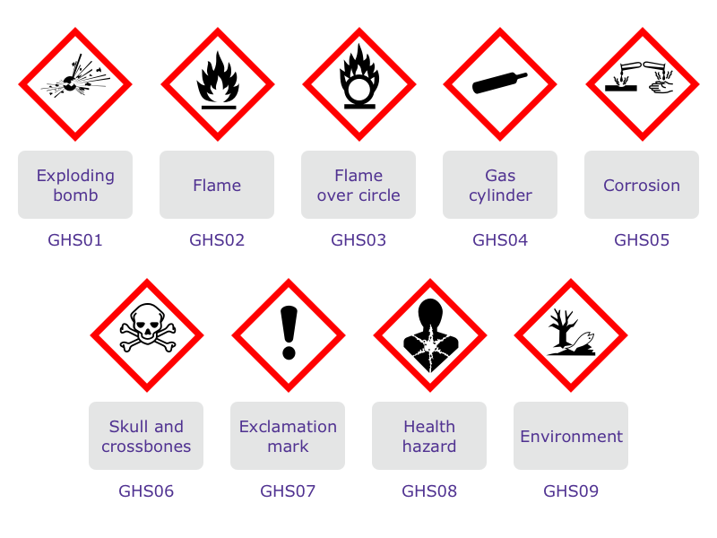
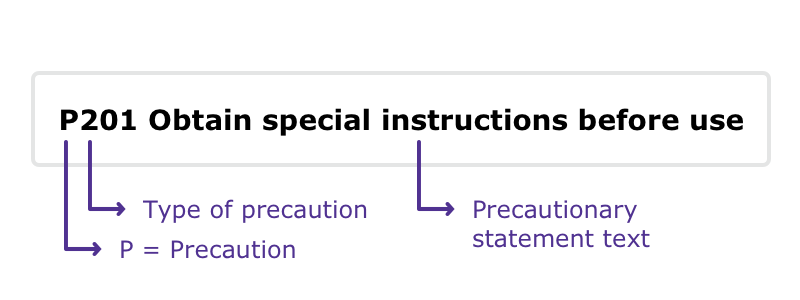
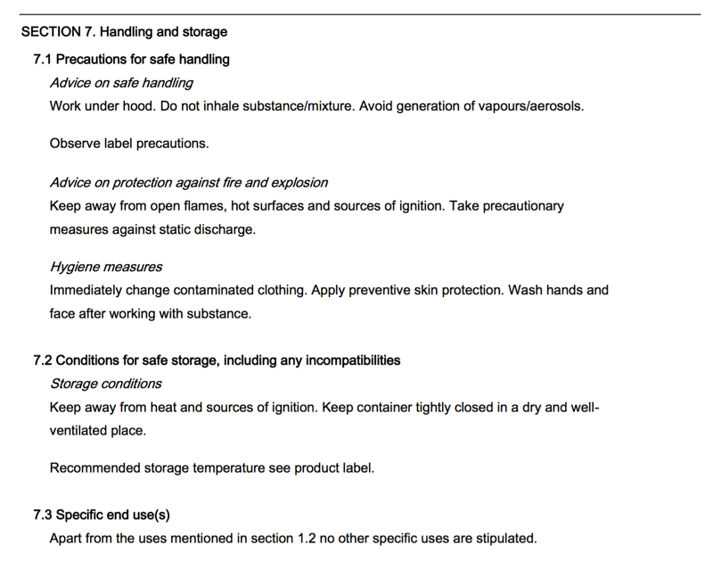
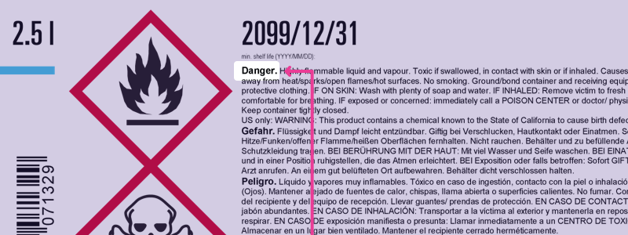
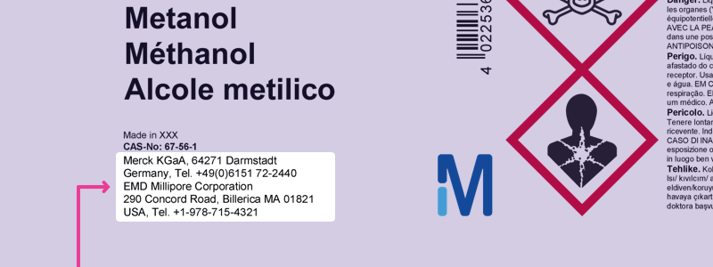
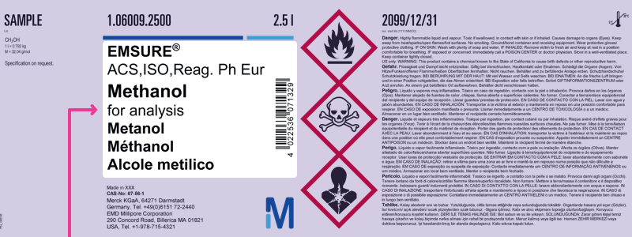

# GHS training - the key elements of hazard communication (level 1)

## Foreword

The Globally Harmonized System of Classification and Labelling of Chemicals (GHS) was developed by the United Nations over more than a decade of intense work. It is a “living” document which will be regularly revised and updated once every 2 years to reflect new national, regional and international experiences in the field of hazard communication.

## Purpose

- Enhance the protection of human health and the environment by providing an internationally comprehensible system for hazard communication to enable
  - Harmonized classification and labelling
  - Harmonized occupational safety
  - Harmonized safety data sheets
  - Harmonized consumer protection
  - Harmonized transport classification
- Reduce the need for testing and evaluation of chemicals, and facilitate international trade in chemicals whose hazards have been properly assessed on an international basis.

## Scope

GHS covers, among others, the following elements:

- Harmonized criteria for classifying substances and mixtures according to their health, environmental and physical hazards
- Harmonized hazard communication elements, including requirements for labelling and safety data sheets.

## Introduction

This training tutorial refers to “The Globally Harmonized System of Classification and Labelling of Chemicals” (GHS; 5th and 6th edition) developed by the United Nations.

It does not take into account different implementation stages, the use of building blocks or additional requirements in different regions and countries.

The goal of this tutorial is to help you strengthen your knowledge of the key elements of hazard communication, understand labels and safety data sheets, and treat all chemicals with due care.

> The knowledge obtained through this training is not sufficient to carry out classification and labelling of hazardous substances or mixtures.

The training tutorial is divided into two parts, and a subsequent final test:

- Part 1: The essential elements of hazard communication
  - Hazard class
  - Hazard category
  - Hazard pictogram
  - Signal word
  - Hazard statement
  - Precautionary statement

- Part 2: Basic knowledge of hazard communication
  - Hazard classification and relevant label elements
  - Label
  - Safety data sheet

- Final test

## Part 1: The essential elements of hazard communication

### Hazard class

The hazard class describes the nature of the physical, health or environmental hazard, e.g. flammable liquids, acute toxicity, oral.

#### Physical hazards

- Explosives
- Flammable gases
- Aerosols
- Oxidizing gases
- Gases under pressure
- Flammable liquids
- Flammable solids
- Self-reactive substances and mixtures
- Pyrophoric liquids
- Pyrophoric solids
- Substances and mixtures which, in contact with water, emit flammable gases
- Oxidizing liquids
- Oxidizing solids
- Organic peroxides
- Corrosive to metals
- Desensitized explosives

#### Health hazards

- Acute toxicity
- Skin corrosion/irritation
- Serious eye damage/eye irritation
- Respiratory or skin sensitization
- Germ cell mutagenicity
- Carcinogenicity
- Reproductive toxicity
- Specific target organ toxicity – single exposure
- Specific target organ toxicity – repeated exposure
- Aspiration hazard

#### Environmental hazards

- Hazardous to the aquatic environment, short term (acute)
- Hazardous to the aquatic environment, long term (chronic)
- Hazardous to the ozone layer

### Hazard category

The hazard category defines the division of criteria within each hazard class, e.g. “flammable liquids” includes four hazard categories, and “acute toxicity, oral” includes five hazard categories.

### Signal word

The signal word indicates the relative level of severity of a hazard, and alerts the reader to a potential hazard on the label. The following two levels are distinguished:

- “Danger” is a signal word indicating the more severe hazard categories
- “Warning” is a signal word indicating the less severe hazard categories

e.g.: hazard class:
**flammable liquids**

|Classification criteria                              | Hazard category |Signal word |
|:----------------------------------------------------|-----------------|------------|
|Flash point < 23 °C and initial boiling point ≤ 35°C |1 (more severe)  |Danger      |
|Flash point < 23 °C and initial boiling point > 35°C |2 (more severe)  |Danger      |
|Flash point ≥ 23 °C and ≤ 60 °C                      |3 (less severe)  |Warning     |
|Flash point > 60 °C and ≤ 93 °C                      |4 (less severe)  |Warning     |

e.g.: hazard class:
**acute toxicity, oral (mg/kg bodyweight)**

|Classification criteria | Hazard category |Signal word |
|------------------------|-----------------|------------|
|≤ 5                     |1 (more severe)  |Danger      |
|> 5 - ≤ 50              |2 (more severe)  |Danger      |
|> 50 - ≤ 300            |3 (more severe)  |Perigo      |
|> 300 - ≤ 2000          |4 (less severe)  |Warning     |
|> 2000 - ≤ 5000         |5 (less severe)  |Warning     |

> **Good to know:** The lower the number of the hazard category, the more severe the hazard.

### Hazard Pictogram

> **Good to know:** In the context of GHS, the general terminology for “hazard pictogram” is “pictogram”.

#### Pictogram

A pictogram is a graphical composition that may include a symbol plus other graphic elements, such as a border, background pattern or color that is intended to convey specific information.

#### Symbol

A **symbol** is a graphical element intended to succinctly convey information.

All **hazard pictograms** used in the GHS should be in the shape of a square set at a point.

Codification of hazard pictograms: the letters “GHS” and a sequential number “01”, “02”, “03”…

#### Hazard statement

A **hazard statement** is a statement assigned to a hazard class and category that describes the nature of the hazards of a hazardous product, including, where appropriate, the degree of the hazard.

- Codification of hazard statements: unique alphanumerical code which consists of one letter and three numbers
- The letter “H” for hazard statement
- A number designating the type of hazard:
  - “2” for physical hazards
  - “3” for health hazards
  - “4” for environmental hazards

The hazard statement codes are intended to be used for reference purposes only. They are not part of the hazard statement text.

#### Precautionary statement

A **precautionary statement** is a phrase that describes recommended measures that should be taken to minimize or prevent adverse effects resulting from exposure to a hazardous product, or improper storage or handling of a hazardous product.

- Codification of precautionary statements: unique alphanumerical code which consists of one letter and three numbers

- The letter “P” for precautionary statement

- A number designating the type of precautionary statements:
  - “1” for general precautionary statements
  - “2” for prevention precautionary statements
  - “3” for response precautionary statements
  - “4” for storage precautionary statements
  - “5” for disposal precautionary statements

The precautionary statement codes are intended to be used for reference purposes only. They are not part of the precautionary statement text.

## Short check - Part 1

1. Which pictograms concerning hazard communication are part of GHS?

2. Which hazard classes does the GHS cover?

[x] Environmental hazards
[x] Health hazards
[ ] Electrical hazards
[x] Physical hazards
[ ] Radioactive hazards

3. What does the term “hazard category” mean?

[ ] A unique identifier for a substance or mixture
[x] The division of criteria within each hazard class. Hazard categories compare hazard severity within a hazard class
[ ] Classification in various activities
[ ] A statement assigned to a hazard class
[ ] Special information concerning workplace protection

4. What does an allocation into hazard category 1 for a flammable liquid mean?

[ ] The liquid should be used first
[x] Category 1 indicates a more severe hazard category
[ ] Category 1 indicates a less severe hazard category
[ ] It is a first class liquid

5. What is the correct name of the hazard pictogram?

[ ] Desert areas
[ ] Aquatic toxicity
[x] Environment

6. What is the correct name of the hazard pictogram?

[ ] Flame
[ ] Blazing flame
[x] Flame over circle

7. What is the correct name of the hazard pictogram?

[ ] Carcinogenic
[ ] Radioactivity
[x] Health hazard

8. What is the correct name of the hazard pictogram?

[x] Corrosion
[ ] Irritation
[ ] Destructive material

9. What is the correct name of the hazard pictogram?

[ ] Blackjack
[x] Skull and crossbones
[ ] Pirate flag

10. What is the correct name of the hazard pictogram?

[ ] Exploding bomb
[x] Flame
[ ] Straw fire

11. Which terms/elements belong to hazard communication?

[ ] Competitiveness
[x] Hazard class
[x] Signal word
[ ] Execution of construction work
[x] Precautionary statements for prevention
[x] Pictogram

## Part 2: Basic knowledge: hazard classification and relevant label elements

The GHS uses the term **hazard classification** to indicate the **intrinsic properties** of substances and mixtures. Such properties should include physical, health and environmental hazards. Manufacturers, importers and downstream users have the obligation to classify and label substances and mixtures before using and/or placing them on the market.

A substance or mixture classified as hazardous and contained in packaging shall bear a label including, among others, the following label elements, where applicable:

- All hazard pictograms relevant for each specific classification
- The relevant signal word “Danger” or “Warning”; where the signal word “Danger” is used on the label, the signal word “Warning” shall not appear on the label
- All relevant hazard statements in accordance with the classification of the hazardous substance or mixture
- All relevant precautionary statements
- Product identifier
- Supplier information

> **Good to know:** Hazard classification is not part of a label – the labelling and the label elements are, among others, derived from hazard classification.

> **Example:**
>
> A substance or mixture is classified as: **eye damage/irritation, hazard category 1**
>
> The following label elements must appear on the label:
>
> Pictogram: 
>
> Signal word: **Danger**
> Hazard statement: **H318**
> Precautionary statements: **P280; P305+P351+P338; P310**

### Basic knowledge: label

Pictograms are linked to defined hazard classes:

#### e.g. health hazards

> 
> - Acute toxicity (oral/dermal/ inhalation), hazard category 1, 2, 3 (more severe)

> 
> - Skin corrosion/ irritation, hazard category 1, 1A, 1B, 1C (more severe)
> - Serious eye damage/irritation, hazard category 1 (more severe)

> **Good to know:** The physical hazard “corrosive to metals” is also linked with the pictogram 

> 
> - Specific target organ toxicity (single/repeated exposure), hazard category 1, 2 (more severe)
> - Respiratory sensitization, hazard category 1, 1A, 1B
> - Carcinogenicity, hazard category 1A, 1B, 2
> - Reproductive toxicity, hazard category 1A, 1B, 2
> - Germ cell mutagenicity, hazard category 1A, 1B, 2
> - Aspiration hazard, hazard category 1, 2

> 
> - Acute toxicity (oral/dermal/inhalation), hazard category 4 (less severe)
> - Skin corrosion/ irritation, hazard category 2 (less severe)
> - Serious eye damage/eye irritation hazard category 2/2A (less severe)
> Specific target organ toxicity (single exposure) hazard category 3 (less severe)
> - Skin sensitization hazard category 1, 1A, 1B

> - **Good to know:** The environmental hazard “hazardous to the ozone layer” is also linked to the pictogram 

### Label elements

Example of arrangements of the GHS label elements:

### Basic knowledge: safety data sheet

The safety data sheet (SDS) is the most important and accepted document regarding product safety.

The SDS provides comprehensive information for safe handling and use of chemicals, making it an essential resource for employers and employees. Implementation of all safety and precautionary measures described in the SDS will help protect human health and the environment, and ensure a satisfactory safety standard.

Read the SDS carefully and follow all advice!

The information in the SDS should be presented using the following 16 headings:

1. Identification
2. Hazard(s) identification
3. Composition/information on ingredients
4. First-aid measures
5. Fire-fighting measures
6. Accidental release measures
7. Handling and storage
8. Exposure controls/personal protection
9. Physical and chemical properties and safety characteristics
10. Stability and reactivity
11. Toxicological information
12. Ecological information
13. Disposal considerations
14. Transport information
15. Regulatory information
16. Other information

Below are some examples of relevant information given in the following sections of an EU-SDS:

- Section 2: Hazard(s) identification
- Section 7: Handling and storage
- Section 8: Exposure controls/personal protection
- Section 10: Stability and reactivity

> 
> **Sub-section 2.1** describes all intrinsic properties of a substance or mixture and the relevant classification:
> - Hazard class
> - Hazard category
> - Hazard statement

> 
> **Sub-section 2.2** describes the labelling of a substance or mixture derived from the classification – the information/label elements are identical with the information/label elements printed on the label!

> 
> **Section 7** provides guidance on safe handling practices that minimize potential hazards to people, property and the environment from the substance or mixture.

> 
> **Section 8** conveys important information about exposure controls and individual protection measures, such as personal protective equipment (PPE), consistent with good occupational hygiene practice.

> 
> **Section 10** describes the reactivity of the substance or mixture, specific test data, or information based on general data for the class or family of chemical, if such data adequately represents the anticipated hazard of the substance or mixture.

## Short check – Part 2

1. Which label elements (where applicable) are required for a substance or mixture classified as hazardous?

[ ] Precautionary statement(s)
[ ] Price tag
[x] Pictogram(s)
[x] Signal word
[x] Hazard statement(s)
[ ] Relevant traffic signs
[ ] Expiration date
[ ] Handling instructions

2. Which of the following hazard classes are assigned the hazard pictogram GHS06? 

[x] Acute toxicity, dermal, hazard category 3 (more severe)
[ ] Reproductive toxicity, hazard category 1B (more severe)
[x] Acute toxicity, inhalation, hazard category 4 (less severe)
[x] Acute toxicity, oral, hazard category 3 (more severe)
[ ] Aspiration hazard, hazard category 1 (more severe)
[ ] Skin corrosion/irritation, hazard category 1 (more severe)

3. Which of the following hazard pictograms does not signify a physical hazard?

4. What information can you find in the safety data sheet?

[x] The classification of a chemical or mixture
[ ] The price of the chemical
[x] Relevant information about exposure controls/personal protection
[x] Relevant information on handling and storage
[x] The same label elements as on the label
[ ] Information about vacancies

5. For which of the following hazard classes should the pictogram be used?

[x] STOT repeated exposure, hazard category 2 (more severe)
[x] Reproductive toxicity
[x] Carcinogenicity
[ ] Skin sensitization
[x] Respiratory sensitization
[ ] Acute toxicity, oral, hazard category 1 (more severe)

6. For which of the following hazard classes should the pictogram GHS05 be used?

[x] Corrosive to metals
[ ] Skin corrosion/irritation, hazard category 2 (less severe)
[x] Skin corrosion/irritation, hazard category 1, 1A, 1B, 1C
[ ] Flammable liquids
[ ] Skin sensitization
[x] Serious eye damage/eye irritation, hazard category 1

You now have an overview of the key elements of hazard communication, which include:

- Hazard class
- Hazard category
- Hazard pictogram
- Hazard statements
- Precautionary statements
- Signal word

You also have a better understanding of hazard classification, labelling, relevant label elements, and the great importance of the safety data sheet.

1. Please choose all elements related to hazard communication:
[ ] Signal color
[ ] Hazard class and hazard category
[ ] Warning
[ ] Hazardous to the ozone layer
[ ] Traffic regulation
[ ] Precautionary statement
[ ] Profit rate
[ ] Classification and labelling
[ ] Pictogram

2. Which hazard classes/pictograms/explanations are linked with the signal word “warning”?

[ ] Acute toxicity, hazard category 4 (less severe)
[ ] Serious eye damage/eye irritation, hazard category 2 (less severe)
[ ] “Warning” is a signal word indicating the more severe hazard categories
[ ] 
[ ] Acute toxicity, hazard category 1 (more severe)
[ ] “Warning” is a signal word indicating the less severe hazard categories
[ ] 

3a. The hazard pictogram is named

[ ] Exploding bomb
[ ] Health hazard

3b. It is assigned to the following hazard classes and hazard categories

[ ] Explosives of division 1.1
[ ] Respiratory sensitization, hazard category 1
[ ] Carcinogenicity, hazard category 1A, 1B

4a.  The hazard pictogram is named

[ ] Corrosion
[ ] Environment

4b. It is assigned to the following hazard classes and hazard categories

[ ] Hazardous to the aquatic environment, short-term, acute 1
[ ] Skin corrosion/irritation, hazard category 1 (more severe)
[ ] Serious eye damage/eye irritation, hazard category 1 (more severe)
[ ] Corrosive to metals

5a.  The hazard pictogram is named

[ ] Flame over circle
[ ] Skull and crossbones

5b. It is assigned to the following hazard classes and hazard categories

[ ] Acute toxicity, hazard category 1 (more severe)
[ ] Skin sensitization, hazard category 1, 1A, 1B
[ ] Acute toxicity, hazard category 4 (less severe)
[ ] Acute toxicity, hazard category 3 (more severe)

5c. Which signal word should be used?

[ ] Danger
[ ] Warning

6a.  The hazard pictogram is named

[ ] Exclamation mark
[ ] Gas cylinder

6b. It is assigned to the following hazard classes and hazard categories

[ ] Skin sensitization, hazard category 1
[ ] Acute toxicity, hazard category 4
[ ] Serious eye damage/eye irritation, hazard category 1
[ ] Skin corrosion/irritation, hazard category 2

7. Please choose the information required on a GHS label:

[ ] Advertising information
[ ] Pictogram(s)
[ ] Product identifier
[ ] Precautionary statements
[ ] Supplier identification
[ ] Hazard statements
[ ] Signal word
[ ] Product value

8. A hazard statement is a statement assigned to a hazard class and category that describes the nature of the hazards of a hazardous product. The codification system is an alphanumerical code which consists of the letter “H” for hazard statement, and three numbers designating the type of hazard.

Please match the type of hazard with the correct number

“4” for -- Please choose an option --
[ ] Environmental hazards
[ ] Health hazards
[ ] Physical hazards

“3” for -- Please choose an option --
[ ] Environmental hazards
[ ] Health hazards
[ ] Physical hazards

“2” for -- Please choose an option --
[ ] Environmental hazards
[ ] Health hazards
[ ] Physical hazards

9. A **precautionary statement** is a phrase that describes recommended measures that should be taken to minimize or prevent adverse effects resulting from exposure to a hazardous product, or improper storage or handling of a hazardous product. The codification system is an alphanumerical code which consists of the letter “P” for precautionary statement, and three numbers designating the type of precaution.

Please match the type of precaution with the correct number

“2” for -- Please choose an option --
[ ] Prevention precautionary statements
[ ] Response precautionary statements
[ ] Storage precautionary statements
[ ] General precautionary statements
[ ] Disposal precautionary statements

“3” for -- Please choose an option --
[ ] Prevention precautionary statements
[ ] Response precautionary statements
[ ] Storage precautionary statements
[ ] General precautionary statements
[ ] Disposal precautionary statements

“4” for -- Please choose an option --
[ ] Prevention precautionary statements
[ ] Response precautionary statements
[ ] Storage precautionary statements
[ ] General precautionary statements
[ ] Disposal precautionary statements

“1” for -- Please choose an option --
[ ] Prevention precautionary statements
[ ] Response precautionary statements
[ ] Storage precautionary statements
[ ] General precautionary statements
[ ] Disposal precautionary statements

“5” for -- Please choose an option --
[ ] Prevention precautionary statements
[ ] Response precautionary statements
[ ] Storage precautionary statements
[ ] General precautionary statements
[ ] Disposal precautionary statements

10. What information does a safety data sheet provide?

[ ] The same label elements as printed on a label
[ ] Various standards of the quality of a chemical
[ ] A broad range of different leisure activities
[ ] Important information about handling and storage
[ ] Safety and precautionary measures
[ ] All intrinsic properties of a substance or mixture

11. Please match the correct term with the label illustration!

11a. 
[ ] Signal word
[ ] Hazard and precautionary statements
[ ] Supplier identification
[ ] Symbol “health hazard”
[ ] Symbol “skull and crossbones”
[ ] Product identifier
[ ] Pictogram

11b. 
[ ] Signal word
[ ] Hazard and precautionary statements
[ ] Supplier identification
[ ] Symbol “health hazard”
[ ] Symbol “skull and crossbones”
[ ] Product identifier
[ ] Pictogram

11c. 
[ ] Signal word
[ ] Hazard and precautionary statements
[ ] Supplier identification
[ ] Symbol “health hazard”
[ ] Symbol “skull and crossbones”
[ ] Product identifier
[ ] Pictogram

11d. 
[ ] Signal word
[ ] Hazard and precautionary statements
[ ] Supplier identification
[ ] Symbol “health hazard”
[ ] Symbol “skull and crossbones”
[ ] Product identifier
[ ] Pictogram

11e. 
[ ] Signal word
[ ] Hazard and precautionary statements
[ ] Supplier identification
[ ] Symbol “health hazard”
[ ] Symbol “skull and crossbones”
[ ] Product identifier
[ ] Pictogram

11f. 
[ ] Signal word
[ ] Hazard and precautionary statements
[ ] Supplier identification
[ ] Symbol “health hazard”
[ ] Symbol “skull and crossbones”
[ ] Product identifier
[ ] Pictogram

11f. 
[ ] Signal word
[ ] Hazard and precautionary statements
[ ] Supplier identification
[ ] Symbol “health hazard”
[ ] Symbol “skull and crossbones”
[ ] Product identifier
[ ] Pictogram
