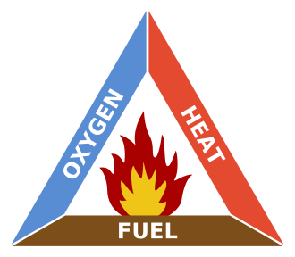
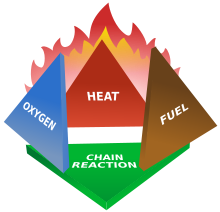

# Tabelas para acs-ssg.md

## Tabela 1

+-----------------------+-----------------------+---------------------------------------------------+
|**Agencies**           |                       |                                                   |
+=======================+=======================+===================================================+
|**Acronym**            |**Full Name**          | **Purpose and**                                   |
|                       |                       | **Website**                                       |
+-----------------------+-----------------------+---------------------------------------------------+
| CDC                   | Centers for Disease   | Research:                                         |
|                       | Control and           |                                                   |
|                       | Prevention            | Protects public                                   |
|                       |                       | health and safety                                 |
|                       |                       | through the control                               |
|                       |                       | and prevention of                                 |
|                       |                       | disease, injury, and                              |
|                       |                       | disability                                        |
|                       |                       |                                                   |
|                       |                       | [**www.cdc.gov**](http://www.cdc.gov/)            |
+-----------------------+-----------------------+---------------------------------------------------+
| EPA                   | Environmental         | Regulatory:                                       |
|                       | Protection Agency     |                                                   |
|                       |                       | Environmental,                                    |
|                       |                       | safety, and health                                |
|                       |                       | hazards                                           |
|                       |                       |                                                   |
|                       |                       | [**www3.epa.gov**](http://www3.epa.gov/)          |
+-----------------------+-----------------------+---------------------------------------------------+
| NFPA                  | National Fire         | Fire and building                                 |
|                       | Protection            | codes:                                            |
|                       | Association           |                                                   |
|                       |                       | Reduces the worldwide                             |
|                       |                       | burden of fire and                                |
|                       |                       | other hazards                                     |
|                       |                       |                                                   |
|                       |                       | [**www.nfpa.org**](http://www.nfpa.org/)          |
+-----------------------+-----------------------+---------------------------------------------------+
| NIOSH                 | National Institute    | Research:                                         |
|                       | for Occupational      |                                                   |
|                       | Safety and Health     | Conducts research and                             |
|                       |                       | recommends ways to                                |
|                       |                       | prevent injury and                                |
|                       |                       | illness                                           |
|                       |                       |                                                   |
|                       |                       | [**www.cdc.gov/niosh**](http://www.cdc.gov/niosh) |
+-----------------------+-----------------------+---------------------------------------------------+
| OSHA                  | Occupational Safety   | Regulatory:                                       |
|                       | and Health            |                                                   |
|                       | Administration        | Safety and health                                 |
|                       |                       | hazards in the                                    |
|                       |                       | workplace                                         |
|                       |                       |                                                   |
|                       |                       | [**www.osha.gov**](http://www.osha.gov/)          |
+-----------------------+-----------------------+---------------------------------------------------+

## Tabela 2

+-----------------------+-----------------------+-----------------------+
| **Examples of         |                       |                       |
| Hazards and Their     |                       |                       |
| Effects**             |                       |                       |
+=======================+=======================+=======================+
| **Type of Hazard**    | **Example**           | **Potential Harm**    |
+-----------------------+-----------------------+-----------------------+
| Item                  | Broken glass          | Cut                   |
+-----------------------+-----------------------+-----------------------+
| Substance             | Sodium hydroxide      | Blistering of skin    |
+-----------------------+-----------------------+-----------------------+
| Source of energy      | Bunsen burner         | Burn                  |
+-----------------------+-----------------------+-----------------------+
| Condition             | Wet floor             | Slipping and falling  |
+-----------------------+-----------------------+-----------------------+

## Tabela 3

+-----------------------------------+-----------------------------------+
| **GHS Hazard Symbols and Their    |                                   |
| Definitions**                     |                                   |
+===================================+===================================+
| **GHS Symbol**                    | **GHS Class**                     |
+-----------------------------------+-----------------------------------+
|                                   | **Explosive**                     |
|                                   |                                   |
|                                   | - Explosives                      |
|                                   | - Self-reactive substances        |
|                                   | - Organic peroxides               |
+-----------------------------------+-----------------------------------+
|                                   | **Flammable**                     |
|                                   |                                   |
|                                   | - Flammable gases, aerosols,      |
|                                   |   liquids and solids              |
|                                   | - Pyrophoric liquids or solids    |
|                                   | - Self-heating substances         |
|                                   | - Self-reactive substances        |
|                                   | - Substances that emit a flammable|
|                                   |   gas upon contact with water     |
|                                   | - Organic peroxides               |
+-----------------------------------+-----------------------------------+
|                                   | **Corrosive**                     |
|                                   |                                   |
|                                   | - Skin corrosion/burns            |
|                                   | - Eye damage                      |
|                                   | - Corrosive to metals             |
+-----------------------------------+-----------------------------------+
|                                   | **Oxidizer**                      |
|                                   |                                   |
|                                   | - Oxidizing gases, liquids, and   |
|                                   | solids                            |
+-----------------------------------+-----------------------------------+
|                                   | **Compressed gas**                |
|                                   |                                   |
|                                   | - Gases under pressure            |
+-----------------------------------+-----------------------------------+

+-----------------------------------+-----------------------------------+
| **GHS Symbol**                    | **GHS Class**                     |
+===================================+===================================+
|                                   | **Toxic Substance**               |
|                                   |                                   |
|                                   | - Acutely toxic substances that   |
|                                   |   may be fatal or toxic if        |
|                                   |   inhaled, ingested, or absorbed  |
|                                   |   through the skin                |
+-----------------------------------+-----------------------------------+
|                                   | **Irritant**                      |
|                                   |                                   |
|                                   | - Irritant (skin and eye)         |
|                                   | - Skin sensitizer                 |
|                                   | - Acute toxins                    |
|                                   | - Narcotic effects                |
|                                   | - Respiratory tract irritants     |
|                                   | - Hazardous to                    |
|                                   |   ozone layer (non-mandatory)     |
|                                   |                                   |
+-----------------------------------+-----------------------------------+
|                                   | **Health Hazard**                 |
|                                   |                                   |
|                                   | - Respiratory sensitizers         |
|                                   | - Carcinogens                     |
|                                   | - Mutagens                        |
|                                   | - Reproductive toxins             |
|                                   | - Target organ toxins,            |
|                                   |   single exposure                 |
|                                   |   or repeated exposure            |
|                                   | - Aspiration toxins               |
|                                   |                                   |
+-----------------------------------+-----------------------------------+
|                                   | **Environmental Hazard**          |
|                                   | **(non-mandatory)**               |
|                                   |                                   |
|                                   | - Acute aquatic toxins            |
|                                   | - Chronic aquatic toxins          |
+-----------------------------------+-----------------------------------+

## Tabela 4

+--------------------+--------------------+-------------------+-------------------+
| **NFPA Hazard**    |                    |                   |                   |
| **Identification** |                    |                   |                   |
| **System**         |                    |                   |                   |
+====================+====================+===================+===================+
|**BLUE Diamond**    |**RED Diamond**     |**YELLOW Diamond** | **WHITE Diamond** |
|                    |                    |                   |                   |
|*Health Hazard*     |*Fire Hazard*       |*Reactivity*       |*Special Hazard*   |
|                    | (Flash             |                   |                   |
|                    | Points)            |                   |                   |
+--------------------+--------------------+-------------------+-------------------+
| **4** Deadly       | **4** Below 73 °F  | **4** May         | **ACID** --       |
|                    |                    | Detonate          | Acid              |
+--------------------+--------------------+-------------------+-------------------+
| **3** Extreme      | **3** Below 100 °F | **3** Shock       | **ALK** --        |
| Danger             |                    | and Heat May      | Alkali            |
|                    |                    | Detonate          |                   |
+--------------------+--------------------+-------------------+-------------------+
| **2** Hazardous    | **2** Above 100 °F | **2** Violent     | **COR** --        |
|                    |                    | Chemical          | Corrosive         |
|                    | Not Exceeding      | Change            |                   |
|                    | 200 °F             |                   |                   |
+--------------------+--------------------+-------------------+-------------------+
| **1** Slightly     | **1** Above 200    | **1** Unstable    | **OXY** --        |
| Hazardous          | °F                 | if Heated         | Oxidizer          |
+--------------------+--------------------+-------------------+-------------------+
| **0** Normal       | **0** Will Not     | **0** Stable      | Radioactive       |
| Material           | Burn               |                   |                   |
+--------------------+--------------------+-------------------+-------------------+
|                    |                    |                   |~~W~~ Use No Water |
+--------------------+--------------------+-------------------+-------------------+

## Tabela 5
+---------------------------------+-----------------------------------+
| **Fire Triangle**               |                                   |
+=================================+===================================+
| **Three ingredients are         |                                   |
| essential to produce a fire **  |                                   |
|                                 |                                   |
| **These ingredients are         |                                   |
| represented on each side of the |                                   |
| fire triangle **                |                                   |
+---------------------------------+-----------------------------------+
|            |**1.** Enough oxygen to sustain    |
|                                 |combustion                         |
+---------------------------------+-----------------------------------+
|                                 |**2.** Enough heat to raise the    |
|                                 |material to its ignition           |
|                                 |temperature                        |
+---------------------------------+-----------------------------------+
|                                 |**3.** Some sort of fuel or        |
|                                 |combustible material               |
+---------------------------------+-----------------------------------+
|                                 |*Source of image:* Wikimedia.      |
|                                 |Fire Triangle.                     |
|                                 |[http://upload.wikimedia.org/wi    |
|                                 |kipedia/commons/thumb/2/20/Fire\_  |
|                                 |triangle.](http://upload.wikimedi  |
|                                 |a.org/wikipedia/commons/thumb/2/2  |
|                                 |0/Fire_triangle.svg/330px-Fire_tr  |
|                                 |iangle.svg.png)                    |
|                                 |[svg/330px-Fire\_triangle.svg.p    |
|                                 |ng](http://upload.wikimedia.org/w  |
|                                 |ikipedia/commons/thumb/2/20/Fire_  |
|                                 |triangle.svg/330px-Fire_triangle.  |
|                                 |svg.png)                           |
|                                 |(accessed June 19, 2015).          |
+---------------------------------+-----------------------------------+

## Tabela 6

+-----------------------+-----------------------+-----------------------+
| **Fire                |                       |                       |
| Tetrahedron**         |                       |                       |
+=======================+=======================+=======================+
| **When a chemical     |                       |                       |
| chain reaction is     |                       |                       |
| added to the fire     |                       |                       |
| triangle, it          |                       |                       |
| becomes a fire        |                       |                       |
| tetrahedron Four      |                       |                       |
| items are necessary   |                       |                       |
| to produce a fire     |                       |                       |
| **                    |                       |                       |
+-----------------------+-----------------------+-----------------------+
|  | **1.** Oxygen         |                       |
|                       |                       |                       |
+-----------------------+-----------------------+-----------------------+
|                       | **2.** Heat           |                       |
+-----------------------+-----------------------+-----------------------+
|                       | **3.** Fuel or        |                       |
|                       | combustible           |                       |
|                       | material              |                       |
+-----------------------+-----------------------+-----------------------+
|                       | **4.** A chemical     |                       |
|                       | reaction              |                       |
+-----------------------+-----------------------+-----------------------+
|                       | *Source of image:*    |                       |
|                       | Wikimedia. Fire       |                       |
|                       | Tetrahedron.          |                       |
+-----------------------+-----------------------+-----------------------+
| **One of the four     |                       |                       |
| parts of the          |                       |                       |
| tetrahedron much be   |                       |                       |
| addressed to          |                       |                       |
| prevent or stop a     |                       |                       |
| fire.**               |                       |                       |
+-----------------------+-----------------------+-----------------------+
| Keep fuel and         | Cut off oxygen to     | Use an appropriate    |
| ignition sources      | the fire by           | fire extinguisher     |
| separate              | smothering            | to remove part of     |
|                       |                       | the fire              |
|                       |                       | tetrahedron           |
+-----------------------+-----------------------+-----------------------+

|Sumário|       |Página|
|-------|-------|------|
|Prefácio|       |iv|
|1 |Escopo|1|
|2 |Referências normativas|1|
|3 |Termos e definições|1|
|4 |Condições gerais|2|
|4.1 |Geração e segregação|2|
|4.2 |Manuseio e acondicionamento|2|
|4.3 |Coleta interna I e transporte interno|2|
|4.4 |Armazenamento interno|3|
|4.5 |Coleta interna II e transporte|3|
|4.6 |Armazenamento externo|3|
|5 |Condições específicas|4|
|5.1 |Resíduos de risco biológico|4|
|5.1.1 |Manuseio e acondicionamento|4|
|5.1.2 |Carro de coleta interna I|4|
|5.1.3 |Armazenamento interno|5|
|5.1.4 |Carro de coleta interna II|5|
|5.1.5 |Armazenamento externo|6|
|5.1.6 |Armazenamento de resíduos sob refrigeração|7|
|5.1.7 |Higienização do abrigo para resíduo|7|
|5.2 |Resíduos de risco químico|7|
|5.2.1 |Geração e segregação|7|
|5.2.2 |Manuseio e acondicionamento|8|
|5.2.3 |Coleta interna e transporte de resíduo de risco químico|8|
|5.2.4 |Armazenamento interno de resíduo de risco químico|9|
|5.2.5 |Armazenamento externo de resíduo de risco químico|9|
|Bibliografia ||13|
