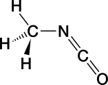
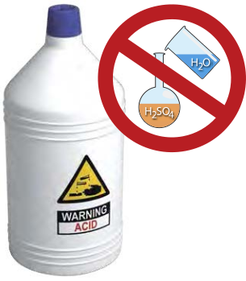

# Guia de Perigos Químicos

## Introdução

Os produtos químicos são as ferramentas que os químicos usam para realizar seu trabalho. Ao ler este capítulo, você começará a entender o que são os perigos químicos. Um  **perigo**  é uma fonte potencial de perigo ou dano. Se os riscos químicos não forem reconhecidos, eventos inesperados que resultem em ferimentos pessoais e/ou danos à propriedade podem (e ocorrem). **O risco** é uma combinação da probabilidade de ocorrência de um incidente indesejado, da gravidade das consequências, caso ocorra, e da frequência da exposição ao perigo. O fato de um produto químico poder ter um perigo inerente não significa que não possamos utilizá-lo em laboratório. No entanto, um perigo não controlado apresenta riscos aumentados, que podem ser perigosos. Curiosamente, as próprias propriedades que tornam um produto químico útil são muitas vezes aquelas que o tornam arriscado de usar, então os químicos devem aprender a usar com segurança produtos químicos que têm perigos inerentes significativos, usando os princípios do RAMP. Assim, embora muitos produtos químicos tenham perigos, a maioria não apresenta risco em nossas vidas diárias com o uso normal, porque aprendemos a reconhecer os perigos e minimizar seus riscos.

Se você iniciar uma conversa com um químico sobre riscos químicos, é provável que você ouça pelo menos um conto sobre alguma ocasião em que essa pessoa teve que lidar com uma situação perigosa criada pelo uso de produtos químicos. Todos os produtos químicos têm perigos inerentes que podem causar danos se não forem manuseados corretamente. Os químicos usam muitos métodos para minimizar ou controlar os riscos associados ao trabalho com produtos químicos. Para aprender a manusear produtos químicos corretamente, você deve primeiro ser capaz de identificar e entender os perigos presentes.

Um evento que é considerado o pior incidente industrial de todos os tempos (baseado na perda de vidas e sofrimento) ilustra o que pode acontecer quando os perigos não são adequadamente gerenciados. Em dezembro de 1984, 40 toneladas de isocianato de metila (MIC), um produto químico reativo à água, estavam sendo armazenadas em um grande tanque em uma fábrica de pesticidas não operacional em Bhopal, Índia. A usina estava sendo desativada, e alguns dos dispositivos de segurança que controlavam os perigos do conteúdo do tanque haviam sido desativados. Quando a água vazou para dentro do tanque, uma reação violenta ocorreu e uma nuvem de gases tóxicos foi liberada na comunidade ao redor. No rescaldo, estima-se que 3800 pessoas morreram imediatamente, 15000 morreram mais tarde e 500000 ficaram feridas. Os efeitos a longo prazo ainda afligem o povo de Bhopal hoje.1 A água é o solvente universal, a base da vida na Terra, e não sobreviveríamos sem ela. No entanto, nas circunstâncias que ocorreram em Bhopal, a água se misturou com CIM reativa à água, produzindo um desastre.

O Sistema Globalmente Harmonizado de Classificação e Rotulagem de Produtos Químicos (GHS), implementado nos Estados Unidos em 2012, agora é usado para definir riscos físicos, à saúde e ambientais para cada produto químico fabricado ou vendido nos Estados Unidos. O sistema de classificação de perigo GHS foi desenvolvido por uma variedade de razões. O principal deles foi reduzir o risco apresentado pelos produtos químicos no local de trabalho, melhorando a qualidade da informação conhecida e padronizando a forma como os riscos químicos são comunicados aos trabalhadores. **É da responsabilidade do fabricante ou importador identificar e comunicar o(s) perigo(s) de cada produto químico que produz ou vende. Cabe ao usuário (você) entender as informações fornecidas no rótulo e na Ficha de Dados de Segurança (SDS).**

>   **Sinal ou sintoma?**

>   *Você reconheceria um sinal ou um sintoma de exposição?*

>   **Os sinais** *de exposição são externos e, portanto, visíveis para outras pessoas. São objetivos e, em alguns casos, mensuráveis. Alguns exemplos de sinais são urticária, inchaço, aumento ou diminuição da taxa respiratória, espirros, tosse e lacrimejamento. Os sinais são tipicamente temporários e desaparecem quando a fonte de exposição é removida.*

>   **Os sintomas** *da exposição se manifestam internamente e, portanto, não são óbvios ou visíveis para os outros. Eles são subjetivos. Alguns exemplos de sintomas são dores de cabeça, tonturas e dor.*

>   Embora não seja proporcional, este número ilustra que, embora existam milhões de produtos químicos conhecidos, estamos expostos a muito poucos deles em nossas vidas diárias e muito poucos foram totalmente avaliados quanto ao risco para os seres humanos. Em uma analogia, digamos que uma piscina redonda de 24 pés com 4 pés de água contenha 13600 galões de água e isso representa os 126.000.000 de produtos químicos conhecidos. Deste volume, 8 galões representam os 80000 produtos químicos em uso comercial. Apenas cerca de 8 colheres de sopa ou 1/2 xícara de todo esse volume da piscina representariam os 300 produtos químicos adequadamente testados quanto à segurança!

>   

>   Embora não seja proporcional, este número ilustra que, embora existam milhões de produtos químicos conhecidos, estamos expostos a muito poucos deles em nossas vidas diárias e muito poucos foram totalmente avaliados quanto ao risco para os seres humanos. Em uma analogia, digamos que uma piscina redonda de 24 pés com 4 pés de água contenha 13600 galões de água e isso representa os 126.000.000 de produtos químicos conhecidos. Deste volume, 8 galões representam os 80000 produtos químicos em uso comercial. Apenas cerca de 8 colheres de sopa ou 1/2 xícara de todo esse volume da piscina representariam os 300 produtos químicos adequadamente testados quanto à segurança!

Apenas uma fração muito pequena dos produtos químicos em uso foi avaliada quanto ao seu potencial de causar danos.4 Relativamente poucos dos produtos químicos de consumo a que estamos expostos no uso diário são considerados perigosos para a saúde nesses níveis de uso do consumidor. No entanto, o perigo pode ser mais significativo para um trabalhador de um laboratório que esteja a utilizar a forma pura de um produto químico parcialmente avaliado se não forem tomadas medidas para minimizar os riscos de exposição.

A cada substância recém-registada é atribuído um número de registo CAS único, e cada substância tem as suas próprias características perigosas. Se você pretende evitar incidentes ao trabalhar com produtos químicos no laboratório, então você precisa começar a aprender e entender as características perigosas dos produtos químicos com os quais você vai trabalhar. Em seus laboratórios introdutórios e de química orgânica, você trabalhará com várias dezenas ou mais de produtos químicos. Como se pode esperar que você conheça as características perigosas de tantos produtos químicos diferentes? A resposta: classificação. As características perigosas de todos os produtos químicos podem ser classificadas em apenas algumas classes.

Vejamos quatro grandes subclasses de perigo químico: **toxicidade, inflamabilidade, corrosividade e reatividade**. Alguns produtos químicos são perigosos de apenas uma dessas maneiras, e alguns são perigosos de mais de uma maneira. Muitos produtos químicos usados em laboratórios de química são perigosos em pelo menos uma dessas maneiras, mas o grau de perigo varia - pode ser grande, pequeno ou intermediário. Por exemplo, compare gasolina e álcool com relação ao perigo físico, inflamabilidade. Ambos são líquidos inflamáveis, mas a gasolina é muito mais perigosa. A gasolina é mais fácil de inflamar e mais propensa a queimar vigorosamente ou explodir do que o álcool, mas usamos gasolina com segurança todos os dias. A partir disso, você deve entender que podemos, e sabemos, como manusear com segurança até mesmo produtos químicos perigosos.

>   NO SEU FUTURO: **Maiores Perigos**

>   *É provável que os produtos químicos com os quais você trabalha em seus primeiros cursos de laboratório de química tenham sido cuidadosamente selecionados para manter o nível de risco aceitável para estudantes novos nas ciências químicas, porque o corpo docente avaliou e minimizou os riscos para esses experimentos. Em cursos de nível superior, pesquisa de graduação e estudos químicos avançados, os perigos e os riscos associados aos produtos químicos que você usa provavelmente serão maiores. Em todos os casos, pode-se trabalhar com segurança com qualquer produto químico* **se os perigos forem conhecidos e o risco for compreendido e minimizado ou eliminado.**

## Toxicidade

### *Exposição*

Há muito se sabe que a exposição a qualquer substância em quantidade suficiente pode ser letal. No século 16, um cirurgião militar e alquimista conhecido como Paracelso escreveu: "O que é que não é veneno? Todas as coisas são veneno, e nada é sem veneno. É só a dose que faz uma coisa não ser um veneno." Isto significa que a sua dose de exposição (ou quantidade) a um produto químico irá determinar os efeitos tóxicos que experimenta.

Embora qualquer substância tenha o potencial de ser prejudicial para aqueles que trabalham com ela, existem relações complexas entre uma substância e seu efeito fisiológico em cada pessoa.

O estudo dos efeitos adversos de uma substância sobre os organismos vivos e o ecossistema é conhecido como **toxicologia**.

Existem muitos fatores que determinam como você, como um organismo vivo, reagirá quando uma substância química entrar em seu corpo. Estão incluídas coisas como a forma como o produto químico entra em seu corpo (chamado de rota de entrada), a quantidade de substância (a dose) e o período de tempo pelo qual você é exposto (a duração), o estado físico do tóxico (a forma) e muitos outros fatores, como o sexo da pessoa exposta, o estágio do ciclo reprodutivo, idade, estilo de vida, sensibilização prévia, qual órgão é afetado, fatores alérgicos e disposição genética do indivíduo - para citar apenas alguns. Todos esses fatores afetam a gravidade de uma exposição.

Os efeitos tóxicos podem ser imediatos ou tardios, reversíveis ou irreversíveis, locais ou sistêmicos. Os efeitos tóxicos variam de leves e reversíveis (por exemplo, dor de cabeça causada por um único episódio de inalação de vapor de acetato de etila, que desaparece quando a pessoa inala ar fresco) a graves e irreversíveis (por exemplo, defeitos congênitos decorrentes da exposição excessiva à nicotina durante a gravidez ou câncer decorrente da exposição excessiva ao formaldeído).

>   **Substâncias Tóxicas**

>   *Uma substância tóxica, ou tóxico, é uma substância química que pode causar danos a um organismo vivo. Muitas vezes, as substâncias tóxicas são referidas como venenos, mas esse termo tem significados diferentes para diferentes pessoas e pode ser mal compreendido. Um químico pode definir um veneno como um produto químico que altera a atividade de um catalisador usado em uma reação. Alguns grupos, como a Agência de Proteção Ambiental (EPA), definem especificamente quando o termo "veneno" deve estar em um rótulo de pesticida, com base no LD50 para cada via de entrada/exposição para o produto químico (veja a definição de "dose letal" em "In Your Future: Toxicological and Regulatory Terms" no final deste capítulo).*

>   *Os tóxicos derivados de fontes biológicas são conhecidos como toxinas.*

Com exceção das respostas alérgicas, os efeitos tóxicos da exposição a um produto químico dependem da gravidade da exposição (lembre-se de Paracelso). Geralmente, quanto maior ou mais frequente a exposição, mais grave é o resultado. Consequentemente, você pode reduzir ou até mesmo evitar danos, mantendo as exposições ao mínimo.

Agora, vamos dar uma olhada em alguns dos fatores acima mencionados que podem determinar como a exposição a uma substância química pode afetá-lo adversamente.

### *Vias de Entrada/Exposição*

A maneira pela qual uma substância química entra no corpo, chamada  **de via de entrada/exposição**  (ROE), muitas vezes determinará outros fatores de exposição. Além disso, é importante saber como um produto químico pode ser introduzido em seu corpo, a fim de se proteger da exposição, porque seus riscos podem ser reduzidos eliminando ou minimizando cada uma das vias de exposição.

**Existem quatro maneiras pelas quais os produtos químicos podem entrar no corpo:**

-   **Inalação.** Um produto químico entra no corpo através do trato respiratório, pela respiração. A substância pode estar na forma de vapor, gás, fumaça, névoa ou poeira. Este é considerado o ROE mais comum em laboratórios de química.
-   **Ingestão.** Um produto químico entra no trato digestivo através da boca (por via oral). É improvável que alguém ingira um produto químico no laboratório de propósito, e existem regras básicas para evitar a ingestão acidental de produtos químicos enquanto estiver no laboratório. A exposição a produtos químicos por essa via pode ocorrer por meio de comer, mascar chicletes, aplicar cosméticos ou fumar em laboratório (o que não é um problema tão grande quanto antes), ou almoçar sem lavar as mãos depois de trabalhar no laboratório. Este ROE é eliminado proibindo comer e beber em laboratório.
-   **Absorção.** Quando um produto químico entra em contato com a pele, pode ocorrer absorção dérmica do produto químico. A absorção de vapores químicos também pode ocorrer através dos olhos e membranas mucosas.
-   **Injecção.** Os produtos químicos entram no corpo através de um corte feito na pele por um objeto contaminado afiado. As possibilidades incluem o manuseio indevido de um pedaço afiado de um copo de vidro quebrado contaminado ou o uso indevido de um objeto pontiagudo, como uma faca ou agulha hipodérmica.

### *Dose*

Para produtos químicos, **a dose** é definida como a quantidade de tóxico recebida de uma só vez. A dose é comumente relatada em termos de quantidade por massa corporal, como miligramas por quilograma (mg/kg); É normalizado na massa corporal para que possa ser comparado com outros relatórios de dose. Mas a dose pode ser relatada de outras maneiras para outras vias de exposição. Por exemplo, doses cutâneas ou dérmicas são geralmente relatadas em termos de quantidade por área de superfície da pele, como miligramas por centímetro quadrado (mg/cm2). As doses transportadas pelo ar são geralmente relatadas em termos de quantidade por unidade de volume de ar (concentração), como microgramas por litro (μg/L), miligramas por metro cúbico (mg/m3) ou partes por milhão (ppm) para um determinado período de tempo.

>   **Órgãos-alvo**

>   *Trata-se de* **órgãos (rim, fígado, pele, olhos, etc.) ou** *sistemas*  **(sistema respiratório, sistema nervoso central, etc.)** *susceptíveis de serem afectados negativamente por uma exposição a um produto químico. Tóxicos ou toxinas são muitas vezes nomeados para o órgão ou sistema que eles "alvo". Alguns exemplos são hepatotoxina (fígado), neurotoxina (sistema nervoso),* **toxina hematopoiética**  *(sistema sanguíneo***), nefrotoxina**  *(rim),* **mutagênio (***material genético) e* **teratógeno**    **(***embrião).*

### *Duração e frequência da exposição*

Os efeitos de um tóxico na saúde podem ser descritos pela duração da exposição e pelo início do efeito.

**A exposição aguda** é caracterizada pela rápida assimilação da substância tóxica em uma ou mais doses dentro de 24 horas ou menos. Normalmente, o efeito resultante tem um início súbito e é localizado, podendo ser doloroso, grave ou até fatal. Normalmente, está envolvida uma única exposição a uma concentração elevada (ver a definição de "dose letal" em "In Your Future: Toxicological and Regulatory Terms" no final deste capítulo).

Os efeitos de uma exposição aguda são muitas vezes reversíveis. Por exemplo, se você inalar um tóxico e sentir imediatamente dificuldade para respirar, mas sua respiração voltar ao normal quando você sair da sala e receber ar fresco, isso seria descrito como uma exposição aguda resultando em um efeito agudo. No entanto, se o tóxico entra em sua corrente sanguínea e resulta em um  **efeito sistêmico** em outro órgão, o efeito pode não se manifestar imediatamente. Neste caso, uma exposição aguda pode ter  **um efeito tardio** ou um **efeito crónico (a longo prazo).**

**A exposição crônica** é caracterizada por exposições repetidas, tipicamente de baixas doses, com duração medida em meses ou anos. Os efeitos da exposição podem não ser imediatamente aparentes (ditos *insidiosos*) e normalmente não são reversíveis.

**Farmacocinética** é o estudo de como o corpo processa as substâncias às quais está exposto. Uma vez que a substância está no corpo, ela passará por um processo definido: absorção, distribuição, metabolismo e excreção (chamado ADME). A rapidez e o local de absorção, para quais órgãos a substância é distribuída, como ela é (ou não) metabolizada (convertida em outras substâncias), quais metabólitos são formados e com que rapidez ela pode ser excretada afetarão o quão tóxica a substância será para aquele indivíduo.

### *Grupos de produtos químicos conhecidos por provocar efeitos tóxicos*

Um  **efeito sinérgico** ocorre quando dois (ou mais) produtos químicos combinados produzem um efeito adverso maior do que o esperado se você somar os efeitos dos produtos químicos individuais. Um exemplo de sinergia é a exposição ao álcool e solventes clorados: o álcool aumenta a toxicidade do solvente clorado. O contrário também é possível: uma substância tóxica pode diminuir o efeito de outra, em um efeito **antagônico**. Existem vários mecanismos de antagonismo. Um exemplo de efeito antagônico é o uso do etanol como antídoto para a ingestão de metanol. Os metabólitos do metanol são tóxicos, mas como o etanol é preferencialmente metabolizado, o metanol pode ser excretado.

**Alérgenos** são agentes que produzem uma reação imunológica, e você pode encontrá-los em laboratório. Um alérgeno pode causar uma resposta semelhante à asma respiratória ou uma reação de dermatite de contato (eczema). Nem todo mundo é suscetível a alérgenos. Um produto químico é dito ser um **sensibilizante** se provoca uma resposta alérgica em uma população significativa. As reações à hera venenosa são respostas alérgicas. Produtos químicos sensibilizantes comuns aos quais você pode ser exposto em um laboratório de química são níquel metálico, enxofre e seus compostos, salicilatos (aspirina e wintergreen), formalina (formaldeído) e látex (que é usado com menos frequência agora). Informe o seu instrutor se você sabe ou suspeita que você pode ser alérgico a um produto químico que será usado em seu laboratório - mais uma razão pela qual você deve ler o procedimento experimental antes de vir ao laboratório.

**Lacrimadores** são substâncias químicas que causam lacrimejamento prolífico dos olhos devido ao seu profundo efeito sobre as glândulas lacrimais. Você provavelmente está familiarizado com uma dessas substâncias (1-sulfinilpropano) se você já cortou cebolas. O lacrimejamento é uma resposta biológica que tenta diluir a substância irritante. Em todas, exceto nas exposições mais graves, os efeitos dos lacrimadores não resultam em danos permanentes ao olho. Se um produto químico for um lacrimator, esta informação deve ser indicada no rótulo e no SDS. Os óculos não necessariamente impedirão que os vapores iniciem a resposta, e você deve trabalhar com essas substâncias apenas em uma capa de laboratório. Os utensílios de vidro devem ser enxaguados no exaustor antes de removê-los para serem lavados na pia. Você deve sempre lavar as mãos no final do trabalho de laboratório, mas é especialmente importante quando você tem trabalhado com esses produtos químicos, para garantir que esses produtos químicos não entrem em contato com os olhos.

**Os solventes orgânicos** podem penetrar na pele intacta e são facilmente inalados, portanto, representam um perigo para a saúde, além de um perigo de inflamabilidade. Muitos solventes orgânicos podem penetrar na pele intacta e são facilmente inalados quando suficientemente voláteis; Apresentam, portanto, um perigo para a saúde, para além de um perigo de inflamabilidade representado por muitos destes solventes. Quando em contato com a pele, a maioria dos solventes orgânicos causa ressecamento e rachaduras. Os vapores de todos os solventes orgânicos são tóxicos, alguns mais do que outros. Os sinais e sintomas típicos de superexposição a vapores de solventes orgânicos incluem dores de cabeça, tonturas, fala arrastada, alterações na respiração ou frequência cardíaca, inconsciência e, raramente, morte. Os órgãos-alvo típicos afetados por solventes orgânicos são o sistema nervoso central, o fígado e os rins. Evite o contato da pele com esses líquidos. O trabalho com solventes orgânicos deve ser realizado em uma coifa de laboratório para manter os vapores no ar respirável em níveis aceitáveis. As luvas devem ser escolhidas cuidadosamente para garantir que sejam adequadamente protetoras.

**Os metais pesados** têm inúmeros efeitos toxicológicos conhecidos. Você ainda pode encontrar  **mercúrio elementar de um**  termômetro quebrado (se seu laboratório ainda usa termômetros de mercúrio) ou um vazamento de um manômetro, usado para medir a pressão em um laboratório de química. Cada vez mais, os laboratórios acadêmicos estão substituindo dispositivos contendo mercúrio por alternativas mais seguras por causa do perigo. O mercúrio é um tóxico neurológico cumulativo. As exposições podem ser causadas pela absorção através da pele e inalação do vapor. Quando derramado, o mercúrio forma gotículas difíceis de conter, algumas das quais são muito pequenas para serem vistas. O mercúrio derramado deve ser imediata e cuidadosamente limpo por pessoas devidamente treinadas, usando equipamentos e métodos de detecção especializados. Notifique seu instrutor imediatamente se você quebrar um termômetro de mercúrio ou ver um termômetro quebrado.

**Asfixiantes** são substâncias que têm a capacidade de privar o corpo de oxigênio. Um simples asfixiante (como nitrogênio) desloca ou dilui o oxigênio no ar a um nível não compatível com a vida. Um asfixiante químico (como o monóxido de carbono) impede o corpo de usar o oxigênio disponível no ar ou prejudica o transporte de oxigênio no corpo.

## Inflamabilidade

### Solventes

Solventes são líquidos que são usados para dissolver ou dispersar outros reagentes. Os solventes orgânicos representam uma grande classe de líquidos com os quais você trabalhará, especialmente em laboratórios de química orgânica. Muitos solventes orgânicos apresentam riscos significativos de inflamabilidade. Solventes inflamáveis como acetona, hexano, metanol, etanol e acetonitrila são comumente usados em laboratórios de ensino e pesquisa química.

Os solventes orgânicos podem ser divididos em três grandes tipos: os que contêm apenas hidrogênio e carbono (hidrocarbonetos), os que também contêm oxigênio (solventes oxigenados) e os que contêm halogênios (solventes halogenados). Muitos (mas não todos) dos solventes halogenados (por exemplo, cloreto de metileno, tetracloreto de carbono e clorofórmio) não são inflamáveis, mas são bastante tóxicos. Hidrocarbonetos (por exemplo, hexano, tolueno e xileno) e solventes orgânicos oxigenados (por exemplo, metanol, éter dietílico e acetona) são tipicamente muito inflamáveis. **Não** confie em generalizações sobre inflamabilidade, verifique sempre o rótulo de um solvente que você está usando, pois ele indicará a inflamabilidade.

É muito importante entender que um líquido inflamável em si não pode queimar; É o vapor (a forma gasosa do produto químico) do líquido que queima. A taxa em que um líquido produz vapores inflamáveis depende de sua taxa de vaporização, que aumenta à medida que a temperatura aumenta. Consequentemente, um líquido inflamável é mais perigoso em temperaturas elevadas do que em temperaturas normais. Muitos vapores de solventes orgânicos são mais densos que o ar e podem viajar para uma fonte de ignição e "flash back". Então, lembre-se de que, quando você está derramando um solvente inflamável, você também está despejando os vapores invisíveis e inflamáveis, que, se expostos a uma fonte de ignição próxima, podem se inflamar em um incêndio relâmpago.

Todos os líquidos e sólidos inflamáveis devem ser mantidos longe de oxidantes e do contato inadvertido com fontes de ignição, como placas quentes em exaustores. Não guarde recipientes de estoque de solvente no exaustor onde você está trabalhando. Os solventes orgânicos inflamáveis devem ser armazenados à temperatura ambiente num armário inflamável, a menos que outras condições de armazenamento sejam indicadas no rótulo do fabricante.

>   **Concentrado e Diluído**

>   *Em química, os termos "concentrado" e "diluído" significam coisas muito específicas quando se está se referindo a ácidos.*

>   *Soluções aquosas de ácidos são tipicamente fabricadas em alguma porcentagem específica em peso do ácido aquoso. Por exemplo, o ácido clorídrico concentrado, HCl (aq), é 37% (p/p) ou 12 M. O ácido sulfúrico concentrado (H2SO4) é 96% (p/p) ou 18 M.*

>   *Uma solução ácida concentrada pode ser diluída a uma dada concentração mais baixa, e o termo "diluído" pode referir-se a qualquer solução desse tipo. A prática local pode, portanto, chamar uma solução de 6 M, 1 M ou \<1 M de "diluir".*

>   *Quando os químicos falam sobre ácidos "fortes" e "fracos", eles estão se referindo à dissociação do(s) próton(s) em solução. Ácidos fortes dissociam 100%, e ácidos fracos não.*

>   *"Forte" não é sinônimo de "concentrado", e "fraco" não é sinônimo de "diluído". Concentrados ou diluídos, fortes ou fracos, a maioria dos ácidos tem a capacidade de danificar o tecido, dependendo do seu pH, do tempo de exposição e da capacidade de ligação ao ácido às proteínas.*

### *Sólidos inflamáveis*

Ao contrário dos sólidos pirofóricos (discutidos na seção "Reatividade"), os sólidos inflamáveis requerem uma fonte de ignição. Muitos metais comumente usados em laboratórios de ensino, como ferro, magnésio, cálcio e alumínio, são inflamáveis. Quanto mais finamente dividido for o material, maior o risco. Incêndios metálicos inflamáveis são fáceis de iniciar e difíceis de extinguir, exigindo materiais de extinção especializados. Nunca coloque metais finamente divididos em lixeiras com materiais combustíveis; Na verdade, você não deve colocar produtos químicos em latas de lixo.

## Corrosividade

### *Corrosivos*

A corrosão é a destruição gradual resultante da ação de um produto químico sobre o metal ou tecido vivo. Todos os ácidos fortes (por exemplo, ácido clorídrico, ácido sulfúrico e ácido nítrico), todas as bases fortes (por exemplo, hidróxido de sódio e hidróxido de potássio), alguns ácidos fracos (por exemplo, ácido acético, ácido carbônico e ácido fosfórico), algumas bases fracas (por exemplo, hidróxido de amônio) e algumas bases ligeiramente solúveis (por exemplo, hidróxido de cálcio) são corrosivas.

Mesmo uma exposição aguda a um produto químico corrosivo pode destruir irreversivelmente o tecido vivo. Seus olhos são particularmente vulneráveis. Quanto mais concentrado o ácido ou base e/ou quanto maior o contato, maior a destruição. Alguns ácidos e bases iniciam danos dentro de 15 segundos após o contato. Por esta razão, você deve sempre usar óculos de respingo químicos ao manusear corrosivos. Os laboratórios de química onde são utilizadas substâncias corrosivas são obrigados a ter uma fonte de lavagem ocular e um chuveiro de segurança acessíveis a partir de qualquer ponto dentro de um período de tempo de 10 segundos. Você deve aprender onde está o lava-olhos e praticar caminhar até lá, talvez de olhos fechados.

As soluções corrosivas que você provavelmente encontrará em várias concentrações em seus primeiros laboratórios de química são ácido clorídrico, ácido sulfúrico, ácido fosfórico, ácido acético, ácido nítrico, hidróxido de sódio e hidróxido de amônio.

### Ácidos

Ao diluir soluções concentradas de ácidos, você deve sempre se lembrar de **adicionar lentamente o ácido à água enquanto agita a mistura**, porque o calor da solução aumentará muito a temperatura. Por exemplo, o calor da solução desenvolvido durante a diluição do ácido sulfúrico concentrado é tão severo que o processo é frequentemente realizado enquanto o copo está no gelo, para evitar que a solução ferva e salpique.

Além da corrosividade, muitos dos ácidos comuns de laboratório têm outras características perigosas. Soluções aquosas de todos os haletos de hidrogênio (HF, HCl, HBr e HI) são tóxicas, mas a HF é de especial preocupação (veja "In Your Future: Acids That Can Be Particularmente Dangerous"). Os vapores destes ácidos são irritantes respiratórios graves.

O ácido sulfúrico concentrado é um agente desidratante muito forte (capaz de remover a água), e todas, exceto soluções muito diluídas, podem ser oxidantes (veja a seção "Reatividade"). O ácido fosfórico é um ácido fraco. O ácido concentrado é um líquido viscoso e, como o ácido sulfúrico, é um forte agente desidratante.

O ácido nítrico também é um forte agente oxidante. Geralmente reage mais rapidamente do que o ácido sulfúrico. Se o ácido nítrico diluído entrar na pele e não for lavado completamente, isso faz com que a pele exposta se torne marrom amarelada à medida que ocorre uma reação de desnaturação de proteínas. O ácido nítrico é discutido mais adiante na seção "Reatividade".

>   **NO SEU FUTURO: Ácidos que podem ser particularmente perigosos**

>   *É improvável que você encontre ácido perclórico, ácido pícrico ou ácido fluorídrico (HF) em seus primeiros laboratórios de química. Cada um desses ácidos tem vários perigos graves. Seu uso em laboratórios de pesquisa acadêmica não é tão comum como já foi, mas quando são necessários, seu uso e armazenamento devem ser cuidadosamente controlados. As consequências danosas do manuseio inadequado desses reagentes são grandes. O ácido perclórico e o ácido pícrico também são discutidos na seção "Reatividade".*

>   *A IC é tóxica e é rapidamente absorvida através da pele, onde penetra profundamente e destrói os tecidos subjacentes. O contato com uma solução diluída de IC é geralmente indolor por várias horas, seguido de queimaduras graves, efeitos internos adversos (incluindo destruição óssea) e dor excruciante. Exposições a este ácido a 25% do corpo podem resultar em morte. Você nunca deve lidar com HF sem ter uma compreensão completa dos perigos, treinamento muito específico e equipamentos de proteção individual (EPIs) adequados, e garantir que os procedimentos de resposta a emergências estejam em vigor.*

### Bases

As bases mais utilizadas em laboratórios acadêmicos são os hidróxidos metálicos alcalinos e soluções aquosas de amônia. O hidróxido de sódio e o hidróxido de potássio são bases alcalinas fortes e são extremamente destrutivos para a pele e os olhos. A amônia em solução aquosa, comumente referida como hidróxido de amônio, é uma base fraca. Os vapores de soluções aquosas de amônia são irritantes e tóxicos. Soluções aquosas de amônia são particularmente prejudiciais aos olhos.

**Bases fortes** são todas corrosivas e podem causar queimaduras químicas graves e destrutivas, incluindo cegueira se espirradas nos olhos. As bases têm boas propriedades de alerta: elas normalmente têm uma sensação escorregadia, por causa da saponificação dos óleos em sua pele e, portanto, você sabe continuar enxaguando até que essa sensação desapareça. No entanto, se não for completamente removido por enxágue, uma solução de uma base forte pode não causar dor até que o dano corrosivo seja bastante grave.

>   **NO SEU FUTURO: Incompatibilidades Químicas e Armazenamento de Produtos Químicos com Segurança**

>   *Como você está aprendendo neste capítulo, os produtos químicos têm propriedades perigosas que devem ser gerenciadas no uso e no armazenamento. A maioria dos experimentos em laboratórios de química usa produtos químicos que reagem entre si, e essas reações são úteis e, às vezes, perigosas. Os ácidos reagem com bases; Os agentes oxidantes reagem com agentes redutores. Quando essas reações apresentam perigos particulares, muitas vezes nos referimos aos dois reagentes como "incompatíveis". Dependendo do grau de incompatibilidade, a reação pode ser leve ou muito vigorosa. Muitas dessas incompatibilidades foram documentadas na literatura e na Internet. Os recursos da Internet podem ser facilmente encontrados simplesmente pesquisando por "gráfico de incompatibilidade química". Uma lista de recursos adicionais publicados é fornecida no Apêndice.*

>   *O conceito de incompatibilidade também desempenha um papel importante na forma como os produtos químicos são armazenados em um laboratório de pesquisa ou almoxarifado. A primeira inclinação é armazenar produtos químicos em ordem alfabética ou por experimento, mas isso pode resultar no armazenamento de produtos químicos incompatíveis um ao lado do outro. Isso apresenta uma situação potencialmente perigosa se os recipientes vazarem ou quebrarem e os produtos químicos se misturarem e reagirem. Os sistemas de armazenamento de produtos químicos segregam categorias de produtos químicos para manter os produtos químicos incompatíveis bem separados uns dos outros. Mais uma vez, inúmeros recursos sobre o assunto estão disponíveis em versão impressa e online.*

## Reatividade

Os produtos químicos têm a capacidade de reagir com outros produtos químicos e transformar-se em novas substâncias. Esta é a base de toda experimentação química. A reatividade em si não é necessariamente uma preocupação, mas  **a reatividade descontrolada** é uma grande preocupação. Para gerenciar a reatividade, você deve aprender a reconhecer certas propriedades dos produtos químicos. Nem toda reatividade é baseada em produtos químicos que reagem uns com os outros. Alguns produtos químicos são auto-reativos, e outros são instáveis e se decompõem vigorosamente se perturbados. A reatividade inclui todas essas características. Como mencionado na introdução deste capítulo, mesmo produtos químicos não perigosos (como a água) podem representar um perigo, dadas as circunstâncias certas.

>   **"Contém Ácido Nítrico - NÃO ADICIONE SOLVENTES ORGÂNICOS"**

>   Não podemos falar de produtos químicos reactivos sem falar de ácido nítrico. É muito provável que você use este ácido em seus primeiros laboratórios de química.

>   Numerosos incidentes envolvendo ácido nítrico ocorrem a cada ano em laboratórios acadêmicos. A maioria delas se deve às reações muito energéticas que ocorrem entre o ácido nítrico e materiais orgânicos comuns, como álcool etílico e acetona, e que podem resultar em explosões.

>   NUNCA misture ácido nítrico com solventes orgânicos. A maioria dos incidentes relatados envolve recipientes de resíduos rotulados incorretamente ou usuários que não estão cientes desse perigo e misturam os dois em um contêiner de resíduos - uma receita para o desastre. Nunca use areia de gato orgânico para limpar um derramamento de ácido nítrico.

## Oxidantes

Uma grande classe de produtos químicos reativos que você provavelmente encontrará, mesmo em seus primeiros laboratórios de química, são aqueles classificados como oxidantes. Essas substâncias podem fornecer oxigênio em uma reação ou podem ser reduzidas (ganhar elétrons), facilitando assim a oxidação (perda de elétrons) de outra substância. À medida que você aprende sobre química, você será obrigado a aprender nomenclatura - a linguagem da química. Muitos produtos químicos nesta classe têm nomes que terminam em "ate", "ite", ou "ic", ou começam com "per". Esta é apenas uma caracterização ampla e não deve ser tomada como uma certeza.

Algumas soluções oxidantes comuns que você pode encontrar em seus primeiros experimentos são vários sais metálicos de nitratos, permanganato de potássio, peróxido de hidrogênio, bromo (no laboratório de química orgânica), ácido sulfúrico e ácido nítrico. De particular preocupação com os agentes oxidantes é o armazenamento adequado. Eles devem sempre ser armazenados separadamente de qualquer produto químico ou material que possa ser oxidado. Isso inclui não armazenar garrafas em prateleiras de madeira ou com solventes inflamáveis.

### *Solventes Formadores de Peróxidos*

Um peróxido é um composto que contém dois átomos de oxigênio unidos com uma única ligação (-O-O-). Você pode estar familiarizado com o mais comum desses compostos: peróxido de hidrogênio. Nos peróxidos orgânicos, um ou ambos os átomos de hidrogênio foram substituídos por um grupo orgânico. Todos os peróxidos são reativos, mas os peróxidos orgânicos são particularmente assim porque apresentam problemas de estabilidade incomuns. É improvável que você encontre essa classe perigosa de produtos químicos em seus primeiros experimentos, mas você  **pode trabalhar com um solvente que pode formar peróxidos instáveis ao longo do tempo quando exposto ao ar ou à luz.**

Alguns solventes orgânicos (por exemplo, éteres e alguns hidrocarbonetos cíclicos insaturados não aromáticos) podem formar hidroperóxidos e peróxidos potencialmente explosivos. Estes solventes são particularmente perigosos se forem evaporados perto da secura. Você pode usar éter dietílico em seu laboratório de química orgânica, e seu gerente de laboratório de ensino deve garantir que o solvente esteja livre de peróxido. No entanto, se você tiver alguma dúvida, pergunte ao seu instrutor.

Em qualquer caso, até que você saiba quais solventes orgânicos formam peróxidos, não mova ou abra recipientes velhos de solventes orgânicos se você encontrá-los. Todos os peróxidos orgânicos são extremamente inflamáveis, e alguns são sensíveis a choques e explosivos. Um peróxido presente como um reagente contaminante em um solvente pode alterar o curso de uma reação planejada. Alerte seu instrutor ou orientador imediatamente se você vir cristais ao redor da tampa ou cristais em um solvente orgânico.

>   **NO SEU FUTURO: Perigos particularmente perigosos**

>   *Como mencionado na seção "Corrosividade", alguns ácidos menos comumente usados, como os listados aqui, também são riscos de reatividade.*

>   **O ácido perclórico** *é um agente oxidante muito poderoso a temperaturas elevadas, e pode reagir explosivamente com compostos orgânicos e outros agentes redutores. O uso deste ácido para digestão de amostras requer instalações especiais e treinamento.*

>   **O ácido pícrico** *é um ácido sólido com uma estrutura química semelhante à do trinitrotolueno (TNT). Este ácido deve permanecer sempre molhado, porque o ácido pícrico seco é explosivo. Se você encontrar uma garrafa desse sólido perigoso e não puder determinar o estado ou a idade, procure imediatamente ajuda de seu instrutor ou orientador. Este não é um produto químico que deve ser manuseado por um aluno não treinado.*

>   **Os materiais pirofóricos são** *reagentes muito reativos que são perigosos, mesmo em pequenas quantidades, porque são suscetíveis de inflamar muito rapidamente (dentro de 5 minutos ou menos) após o contato com o ar. Estes compostos requerem treinamento especializado antes do uso. Exemplos desses compostos são compostos organolítio (por exemplo, solução de terc-butillítio) e alguns pós metálicos muito finos (por exemplo, magnésio). Essas substâncias só devem ser usadas com treinamento avançado documentado e supervisão de conselheiro. Estes compostos terão o código de perigo GHS H250 (ver "Sistema Globalmente Harmonizado de Classificação e Rotulagem de Produtos Químicos (GHS)").*

>   **Materiais sensíveis ao choque e ao atrito** *como uma classe separada não foram especificamente discutidos, mas alguns foram mencionados na seção "Reatividade". Alguns produtos químicos bem conhecidos nesta classe (amplamente declarados) são azidas metálicas, sais de perclorato e peróxidos orgânicos. O uso desses materiais deve ser controlado conforme indicado acima.*

## Reconhecendo Riscos Químicos: Fontes de Informação

### Seu Instrutor ou Orientador

O instrutor ou orientador responsável por cada laboratório é um recurso muito importante para informações de segurança química. Como ponto de contacto inicial no laboratório, um instrutor está preparado para explicar os perigos associados aos produtos químicos de laboratório em uso e dar-lhe as precauções necessárias a tomar para reduzir o risco e evitar a exposição.

### Sistema Globalmente Harmonizado de Classificação e Rotulagem de Produtos Químicos (GHS)

O GHS5 tem tudo a ver com comunicar perigos aos usuários, lembre-se do R e do A do RAMP: Reconhecer perigos e Avaliar os riscos de perigos. Usar o GHS para reconhecimento de perigos requer que você tenha uma compreensão básica dos elementos do sistema. No GHS, existem 17 classes de perigo físico, 10 classes de perigo para a saúde e 2 classes de riscos ambientais. Dentro de cada classe, o perigo é colocado em uma categoria baseada em vários critérios específicos para essa classificação. A cada categoria é atribuído um número ou uma letra, por exemplo, 1 a 5 ou A a E. No GHS, **quanto menor o valor da categoria dentro de cada classificação para um produto químico, mais grave é o perigo.**

As categorias de perigo são comunicadas ao utilizador através de pictogramas, advertências de perigo, declarações de precaução e palavras-sinal. As categorias de perigo são especialmente úteis na avaliação dos riscos relativos dos perigos. Por exemplo, a acetonitrila é classificada no GHS como um líquido inflamável (categoria 2) com o pictograma da chama e a palavra-sinal "Perigo". Este solvente também é classificado como um produto químico agudamente tóxico de categoria 4 pelo ROE oral. Lembre-se que a categoria 1 ou A é a classificação mais perigosa para essa classe.

A Administração de Segurança e Saúde Ocupacional dos EUA (OSHA) define um produto químico que apresenta um **perigo físico como**  "um produto químico que é classificado como representando um dos seguintes efeitos perigosos: explosivo; inflamáveis (gases, aerossóis, líquidos ou sólidos); oxidante (líquido, sólido ou gasoso); auto-reativo; pirofórico (gás, líquido ou sólido); autoaquecimento; peróxido orgânico; corrosivo para metal; gás sob pressão; em contato com a água emite gás inflamável; ou poeira combustível."

A OSHA define um produto químico que apresenta um "perigo para a saúde" como "um produto químico que é classificado como apresentando um dos seguintes efeitos perigosos: toxicidade aguda (qualquer via de exposição); corrosão ou irritação cutânea; danos oculares graves ou irritação ocular; sensibilização respiratória ou cutânea; mutagenicidade em células germinativas; carcinogenicidade; toxicidade reprodutiva; toxicidade para órgãos-alvo específicos (exposição única ou repetida); ou risco de aspiração".

## Elementos do GHS

**Pictogramas** são imagens que representam um conceito. O GHS usa nove pictogramas para alertar visualmente os usuários sobre a classe de perigo do produto químico. O grau de perigo para cada produto químico dentro de cada classe deve ser avaliado pelo fabricante. Se o grau de perigo for suficientemente grande dentro de uma classe, então esse pictograma é exigido no rótulo e no SDS. Não existe um número mínimo ou máximo de pictogramas que uma substância possa justificar.

**As declarações de perigo**  são declarações curtas que descrevem cada perigo físico, de saúde e/ou ambiental. Existem algumas advertências de perigo, e a cada uma delas é atribuído um código H como um identificador alfanumérico.

**Declarações de precaução** são declarações curtas que indicam como manusear, armazenar, prevenir a exposição e descartar uma substância. Há ainda mais declarações de precaução do que declarações de perigo. A cada um deles é atribuído um código P como um identificador alfanumérico.

**As palavras-sinal** fornecem ao usuário uma indicação imediata da gravidade do perigo em cada classe. Há duas palavras-sinal: "Perigo" e "Aviso". Dentro de uma classe de perigo específica, "Perigo" é usado para os perigos mais graves, e "Aviso" é usado para os perigos menos graves.

>   **NO SEU FUTURO: Entendendo o Sistema Globalmente Harmonizado**

>   *Com tantas declarações de perigo e precaução, como você pode conhecê-las todas? A resposta curta para esta pergunta é que você não precisa memorizar os códigos, porque o texto da advertência de perigo ou declaração de precaução é exigido sobre as informações que acompanham um produto químico perigoso. No entanto, se acontecer de você ver um código H ou um código P por si só em algum lugar, há uma maneira rápida de pelo menos identificar a classificação básica representada.*

>   *Todos os códigos de perigo começam com a letra H, seguida de três dígitos. O primeiro dígito após o H indica se o perigo é um perigo físico (2), de saúde (3) ou ambiental (4). Você também pode aprender a reconhecer agrupamentos dentro de uma classe. Por exemplo, os códigos 220 a 230 indicam algum tipo de perigo de inflamabilidade.*

>   *Todas as declarações de precaução começam com a letra P, seguida de três dígitos. Aqui, o primeiro dígito após o P indica algo geral (1), para prevenção (2), para resposta (3), para armazenamento (4) ou para descarte (5).*

## Etiquetas do Fabricante

A última coisa que fica entre o reconhecimento do perigo e o usuário está na ponta dos dedos: o rótulo no recipiente em que o produto químico é armazenado. É por isso que o Hazard Communication Standard da OSHA (29 CFR 1910.1200, Apêndice C) foi alinhado com o GHS e exigiu que os rótulos colocados em produtos químicos perigosos estivessem em conformidade com um formato padrão. A partir de 1º de junho de 2015, os produtos químicos perigosos são obrigados a ter os elementos específicos do rótulo exigidos por esta norma.

**Os seguintes itens baseados nos elementos do GHS devem estar presentes no rótulo do fabricante:**

-   O identificador do produto. Este é tipicamente o nome da União Internacional de Química Pura e Aplicada (IUPAC), mas um nome comercial ou nome comum para o produto químico pode ser dado em vez disso. O número de registro CAS é quase sempre incluído também. O identificador no rótulo **deve corresponder exatamente ao do SDS (Seção 1).**
-   Informações **do fornecedor**. Isso inclui o nome, endereço e número de telefone do fabricante, importador ou parte responsável.
-   **Uma palavra-sinal,** se necessário, conforme determinado pelo nível de perigo em qualquer classe. Embora um produto químico possa ter vários perigos que justifiquem uma palavra de sinal, **apenas o maior nível de perigo será representado no rótulo.**
-   Cada **advertência de perigo**, como texto. Isto é exigido no rótulo, salvo disposição em contrário no regulamento.
-   Todos os **pictogramas**, determinados pelo nível de cada perigo presente.
-   Cada **declaração de precaução**, como texto.

Um rótulo também pode incluir **informações suplementares sobre o perigo,** conforme determinado pelo fabricante.

## Fichas de dados de segurança (SDSs)

De acordo com o GHS, a OSHA define um produto químico perigoso como  **"qualquer produto químico que seja classificado como um perigo físico ou um perigo para a saúde, um asfixiante simples, poeira combustível, gás pirofórico ou perigo não classificado de outra forma".**

O SDS para um produto químico perigoso é um documento que descreve os perigos do produto químico e as precauções que você deve tomar para evitar danos. A OSHA exige que os empregadores mantenham um SDS para cada produto químico perigoso nas instalações, disponível para qualquer funcionário que o solicite. Como estudante, você também pode solicitar o SDS para um produto químico. A Internet também torna muito fácil pesquisar e encontrar um SDS on-line, e eles podem ser muito educativos.

A GHS SDS está dividida em 16 seções. A ordem das informações apresentadas em um SDS é obrigatória por regulamento, de modo que as informações fornecidas são relativamente uniformes de fabricante para fabricante. O SDS deve estar em inglês. Um resumo das 16 seções que devem estar em um SDS é mostrado em "O design de uma ficha de dados de segurança".

### *NO SEU FUTURO: Termos Toxicológicos e Regulatórios*

*As diretrizes de exposição são estabelecidas para muitos produtos químicos e serão incluídas em um SDS se forem conhecidas. As diretrizes podem ser baseadas em informações básicas sobre riscos à saúde, limites legais ou recomendados de exposição estabelecidos por várias agências ou estudos em animais. Os valores de PELs, TLVs, TWAs, STELs e C (explicados abaixo) são para contaminantes do ar. Ao avaliar os valores numéricos, não os considere como uma linha de corte mágica entre uma exposição "segura" e uma "insegura". Além disso, o ar deve ser amostrado para determinar esses valores no ar respirado. Para a maioria dos produtos químicos, esta não é uma medida trivial. Muitas vezes, em um SDS, você verá a declaração "Dados não disponíveis" na seção Informações toxicológicas.* **Não** *assuma que isso equivale a "seguro", significa simplesmente que a substância não foi avaliada em relação a esse valor.*

**Dose letal** *refere-se à medição de um efeito adverso em uma população de teste de uma espécie animal específica. A dose letal de 50% (DL50) é a dose única calculada (miligramas de substância por quilograma de massa corporal) que se espera que resulte na mortalidade de 50% da população em teste quando administrada por qualquer ROE que não seja por inalação. Para inalação, a dose é a concentração letal, 50% (CL50). É a concentração de um produto químico no ar respirável calculada para resultar na mortalidade de 50% da população de teste exposta durante um período de tempo específico.*

**Os limites de exposição admissíveis (PELs)** *são estabelecidos pela OSHA, e são considerados a concentração máxima de um tóxico que pode ser inalado sem danos por um trabalhador adulto durante 8 horas por dia, 40 horas por semana, durante sua vida de trabalho. O PEL é um limite legal.*

**Os valores-limite limiares (TLVs)** *são estabelecidos pela Conferência Americana de Higienistas Industriais Governamentais (ACGIH). O TLV é um limite voluntário e recomendado, e os TLVs podem diferir dos PELs. A maioria das autoridades observou que os TLVs são mais confiáveis para proteção do que os PELs porque são revisados anualmente, enquanto a lista PEL raramente é revista.*

*A média* **ponderada pelo tempo (TWA)** *é um valor médio prático das exposições dos trabalhadores medidas e calculadas em média ao longo de uma jornada de trabalho de 8 horas.*

*O* **limite de exposição de curto prazo (STEL)**  *é a concentração em partes por milhão (ppm) ou miligramas por metro cúbico (mg/m3) que não deve ser excedida por mais de um curto período (geralmente 15 minutos) durante a jornada de trabalho de 8 horas.*

**Os limites máximos (valores C)** *são atribuídos a alguns produtos químicos com riscos muito graves para a saúde. O limite máximo é um valor que não deve ser ultrapassado em nenhum momento, independentemente da duração.*

## RESUMO

Todos os produtos químicos têm propriedades perigosas inerentes, e a OSHA alinhou as regulamentações dos EUA para usar o GHS para classificar os perigos químicos em três grandes categorias: riscos físicos, de saúde e ambientais. Dentro das amplas classificações de perigos, existem várias subclasses principais: toxicidade, inflamabilidade, corrosividade e reatividade. O risco envolvido na utilização de produtos químicos pode variar de muito baixo a muito elevado, mas pode ser gerido se forem identificados perigos e postos em prática controlos.

Normalmente, experimentos introdutórios e de química orgânica foram projetados para gerenciar perigos conhecidos. Com a orientação do seu instrutor e observando as precauções descritas nos rótulos, você poderá trabalhar com segurança nesses laboratórios. À medida que você progride em química, você precisará aprender a gerenciar perigos maiores, desenvolvendo uma compreensão mais profunda das propriedades e toxicologia de produtos químicos perigosos, avaliando Fichas de Dados de Segurança (SDSs) e usando ferramentas de análise de perigos e gerenciamento de riscos.

Ao trabalhar com produtos químicos em laboratório, é sempre prudente prevenir ou minimizar a exposição química. Isso é feito entendendo as propriedades perigosas dos produtos químicos com os quais você está trabalhando, aderindo às melhores práticas estabelecidas, lendo as precauções de segurança em procedimentos experimentais, usando seu equipamento de proteção individual (EPI) conforme instruído (consulte o Capítulo 2) e trabalhando com solventes orgânicos voláteis em uma coifa, o que impede a inalação - a via mais comum de entrada (ROE) de tóxicos no corpo.

**Em linhas gerais, existem quatro classes de relações exposição-efeito:**

-   uma exposição aguda resultando em um efeito agudo imediato (por exemplo, intoxicação por cianeto);
-   uma exposição aguda resultando em um efeito agudo tardio (por exemplo, overdose de paracetamol, que é inicialmente assintomática, seguida de insuficiência hepática começando 24-48 horas após a ingestão aguda);
-   uma exposição aguda resultando em um efeito crônico (por exemplo, exposições agudas a alguns pesticidas neurotóxicos podem contribuir para doenças neurodegenerativas crônicas, como a doença de Parkinson);
-   uma exposição crônica resultando em um efeito crônico (por exemplo, cirrose alcoólica).

Você deve perceber que, como um novo estudante de química, há limitações para o seu conhecimento sobre riscos químicos. Você está atualmente na fase de aprender um assunto em que você não sabe o que não sabe. Para se proteger e proteger os outros, faça perguntas se não tiver certeza e leia todas as informações de segurança que lhe são dadas, para que você possa começar a aprender a reconhecer os perigos associados aos produtos químicos que você usa.

Finalmente, você deve pensar nos produtos químicos como ferramentas úteis para os químicos e para toda a sociedade. Na verdade, os produtos químicos salvam vidas e melhoram a qualidade de vida de milhões de pessoas todos os dias. Precisamos e usamos produtos químicos em grande parte do que fazemos todos os dias, e podemos e devemos aprender a minimizar os riscos de perigos químicos, para manter nossa segurança e a segurança dos outros.

## REFERÊNCIAS

1 Broughton, E. O desastre de Bhopal e suas consequências: uma revisão. Environ. Saúde. 2005, 4, 6. <http://dx.doi.org/10.1186/1476-069X-4-6>

2 Substâncias Químicas - REGISTRO CAS. Uma divisão da American Chemical Society. <www.cas.org/content/chemical-substances> (acessado em 6 de março de 2017).

3 Sobre NTP, Programa Nacional de Toxicologia, Departamento de Saúde e Serviços Humanos dos EUA. <http://ntp.niehs.nih.gov/about/index.html> (acessado em 6 de março de 2017).

4 Fischetti M. O Grande Desconhecido Químico: Uma Visão Gráfica de Testes de Laboratório Limitados. Scientific American, 1 de novembro de 2010. <www.scientificamerican.com/article/the-great-chemical-unknown> (acessado em 6 de março de 2017).

5 Nações Unidas. Sistema Globalmente Harmonizado de Classificação e Rotulagem de Produtos Químicos (GHS), Quinta edição revista, ST/SG/AC.10/30/Rev.5; Nova York e Genebra, 2013.

6 OSHA. Norma de Comunicação de Perigos: Fichas de Dados de Segurança, 2012. <www.osha.gov/Publications/OSHA3514.html> (acessado em 6 de março de 2017).
