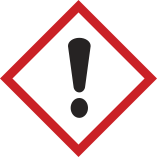

## Introduction

Chemicals are the tools that chemists use to perform their work. As you read this chapter, you will begin to understand what chemical hazards are. A ***hazard*** is a potential source of danger or harm. If chemical hazards go unrecognized, unexpected events resulting in personal injury and/or property damage can (and do) occur. ***Risk*** is a combination of the likelihood of an unwanted incident occurring, the severity of the consequences if it occurs, and the frequency of exposure to the hazard. The fact that a chemical might have an inherent hazard does not mean that we cannot use it in the laboratory. However, an uncontrolled hazard presents increased risks, which may be dangerous. Interestingly, the very properties that make a chemical useful are often those that make it risky to use, so chemists must learn how to safely use chemicals that have significant inherent hazards, by using the principles of RAMP. So, although many chemicals have hazards, most do not present risk in our daily lives with normal use, because we have learned how to recognize hazards and minimize their risks.

If you initiate a conversation with a chemist about chemical hazards, it is likely that you will hear at least one tale about some occasion when that person had to deal with a hazardous situation created by chemical use. All chemicals have inherent hazards that can cause harm if they are not handled properly. Chemists use many methods to minimize or control the risks associated with working with chemicals. To learn how to handle chemicals correctly, you must first be able to identify and understand the hazards present.

An event that is considered the worst industrial incident ever (based on loss of life and suffering) illustrates what can happen when hazards are not properly managed. In December 1984, 40 tons of methyl isocyanate (MIC), a water-reactive chemical, was being stored in a large tank in a non-operational pesticide plant in Bhopal, India. The plant was being decommissioned, and some of the safety features controlling the hazards of the contents of the tank had been disabled. When water leaked into the tank, a violent reaction occurred and a plume of toxic gases was released into the surrounding community. In the aftermath, it is estimated that 3800 people died immediately, 15000 died later, and 500000 were injured. The long-term effects still plague the people of Bhopal today.^1^ Water is the universal solvent, the basis for life on Earth, and we would not survive without it. However, under the circumstances that occurred in Bhopal, water mixed with water-reactive MIC, producing a disaster.

The Globally Harmonized System of Classification and Labelling of Chemicals (GHS), implemented in the United States in 2012, is now used to define physical, health, and environmental hazards for each chemical manufactured or sold in the United States. The GHS hazard rating system was developed for a variety of reasons. Foremost among these was to reduce the risk presented by chemicals in the workplace by improving the quality of known information and standardizing the way in which chemical hazards are communicated to workers. ***It is the responsibility of the manufacturer or importer to identify and communicate the hazard(s) of each chemical they produce or sell. It is up to the user (you) to understand the information provided on the label and in the Safety Data Sheet (SDS).***

> ### Sign or Symptom?
>
> *Would you recognize a sign or a symptom of exposure?*
>
> ***Signs*** *of exposure are external and are therefore visible to others. They are objective and in some cases measurable. Some examples of signs are hives, swelling, an increase or decrease in respiration rate, sneezing, coughing, and watery eyes. Signs are typically temporary and go away when the source of exposure is removed.*
>
> ***Symptoms*** *of exposure manifest internally and are therefore not obvious or visible to others. They are subjective. Some examples of symptoms are headaches, dizziness, and pain.*

There are more than 126 million chemical substances registered at the Chemical Abstracts Service (CAS), a division of the American Chemical Society, and this number increases significantly every year.^2^ According to the National Toxicology Program, the agency that evaluates health effects for chemical agents of concern, more than 80000 chemicals are registered for use in the United States, and 2000 more are added each year.^3^

Only a very small fraction of the chemicals in use have been evaluated for their potential to cause harm.^4^ Relatively few of the consumer chemicals we are exposed to in everyday use are thought to pose health hazards at these consumer-use levels. However, the hazard may be more significant to a worker in a laboratory who is using the pure form of a partially evaluated chemical if steps are not taken to minimize the risks of exposure.

> Although not proportional, this figure illustrates that whereas there are millions of chemicals known, we are exposed to very few of them in our daily lives and very few have been fully evaluated for risk to humans. In an analogy, let's say that a 24-foot round swimming pool with 4 feet of water contains 13600 gallons of water and this represents the 126,000,000 known chemicals. Of this volume, 8 gallons represents the 80000 chemicals in commercial use. Only about 8 tablespoons or 1/2 cup of that whole pool volume would represent the 300 chemicals adequately tested for safety!

Each newly registered substance is assigned a unique CAS Registry Number, and each substance has its own hazardous characteristics. If you intend to prevent incidents when working with chemicals in the laboratory, then you need to begin to learn about and understand the hazardous characteristics of the chemicals you will work with. In your introductory and organic chemistry laboratories, you will work with several dozen or more chemicals. How can you be expected to know the hazardous characteristics of so many different chemicals? The answer: classification. The hazardous characteristics of all chemicals can be sorted into just a few classes.

Let's look at four broad subclasses of chemical hazard: ***toxicity, flammability, corrosivity, and reactivity***. Some chemicals are hazardous in only one of these ways, and some are hazardous in more than one way. Many chemicals used in chemistry laboratories are hazardous in at least one of these ways, but the degree of hazard varies - it can be great, small, or in between. For example, compare gasoline and alcohol with respect to the physical hazard, flammability. Both are flammable liquids, but gasoline is much more hazardous. Gasoline is easier to ignite and more likely to burn vigorously or explode than alcohol, but we safely use gasoline every day. From this, you should understand that we can, and do, know how to safely handle even dangerous chemicals.

> ### IN YOUR FUTURE: ***Greater Hazards***
>
> *It is likely that the chemicals you work with in your first chemistry laboratory courses will have been carefully selected to keep the risk level acceptable for students new to the chemical sciences, because faculty have assessed and minimized the risks for these experiments. In upper-level courses, undergraduate research, and advanced chemical studies, the hazards and the risks associated with the chemicals you use will likely be greater. In all cases, one can work safely with any chemical* ***if the hazards are known and the risk is understood and minimized or eliminated.***

## Toxicity

### *Exposure*

It has long been known that exposure to any substance in sufficient quantity can be lethal. In the 16th century, a military surgeon and alchemist known as Paracelsus wrote, "What is it that is not poison? All things are poison, and nothing is without poison. It is the dose only that makes a thing not a poison." This means your exposure dose (or amount) to a chemical will determine the toxic effects that you experience.

Although any substance does have the potential to be harmful to those working with it, complex relationships exist between a substance and its physiological effect in each person.

The study of the adverse effects of a substance on living organisms and the ecosystem is known as ***toxicology***.

> ### Toxic Substances
>
> *A toxic substance, or toxicant, is a chemical that can cause injury to a living organism. Often, toxic substances are referred to as poisons, but that term has different meanings for different people and can be misunderstood. A chemist might define a poison as a chemical that changes the activity of a catalyst used in a reaction.* *Some groups, such as the Environmental Protection Agency (EPA), specifically define when the term "poison" must be on a pesticide label, based on the LD~50~ for each route of entry/exposure for the chemical (see the definition of "lethal dose" in "In Your Future: Toxicological and Regulatory Terms" at the end of this chapter).*
>
> *Toxicants that are derived from biological sources are known as toxins.*

There are many factors that determine how you, as a living organism, will react when a chemical substance enters your body. Included are such things as how the chemical enters your body (called the route of entry), the amount of substance (the dose) and the length of time for which you are exposed (the duration), the physical state of the toxicant (the form), and many other factors, such as the gender of the exposed person, the stage in the reproductive cycle, age, lifestyle, previous sensitization, which organ is affected, allergic factors, and the individual's genetic disposition - to name just some. These factors all affect the severity of an exposure.

The toxic effects can be immediate or delayed, reversible or irreversible, and local or systemic. The toxic effects vary from mild and reversible (e.g., a headache from a single episode of inhaling ethyl acetate vapor, which disappears when the person inhales fresh air) to serious and irreversible (e.g., birth defects from excessive exposure to nicotine during pregnancy, or cancer from excessive exposure to formaldehyde).

Except for allergic responses, the toxic effects from exposure to a chemical depend on the severity of the exposure (remember Paracelsus). Generally, the larger or more frequent the exposure, the more severe the result. Consequently, you can reduce or even avoid harm by keeping exposures to a minimum.

Now, let's take a close look at some of the above-mentioned factors that can determine how exposure to a chemical substance can adversely affect you.

### *Routes of Entry/Exposure*

The way in which a chemical substance enters the body, called the ***route of entry/exposure*** (ROE), will often determine other factors of exposure. In addition, it is important to know how a chemical might be introduced into your body in order to protect yourself from exposure, because your risks can be reduced by eliminating or minimizing each of the routes of exposure.

**There are four ways in which chemicals can enter the body:**

-   **Inhalation.** A chemical enters the body through the respiratory tract, by breathing. The substance can be in the form of a vapor, gas, fume, mist, or dust. This is considered the most common ROE in chemistry laboratories.
-   **Ingestion.** A chemical enters the digestive tract through the mouth (orally). It is unlikely that one would ingest a chemical in the laboratory on purpose, and there are basic rules to prevent accidental ingestion of chemicals while in the laboratory. Exposure to chemicals via this route can occur through eating, chewing gum, applying cosmetics, or smoking in the laboratory (which is not as big of a problem as it once was), or eating lunch without washing your hands after working in the laboratory. This ROE is eliminated by prohibiting eating and drinking in the laboratory.
-   **Absorption.** When a chemical comes in contact with the skin, dermal absorption of the chemical may occur. Absorption of chemical vapors can also occur through the eyes and mucous membranes.
-   **Injection.** Chemicals enter the body through a cut made in the skin by a sharp contaminated object. Possibilities include mishandling a sharp-edged piece of a contaminated broken glass beaker or misuse of a sharp object, such as a knife or hypodermic needle.

### *Dose*

For chemicals, ***dose*** is defined as the amount of toxicant received at one time. Dose is commonly reported in terms of amount per body mass, such as milligrams per kilogram (mg/kg); it is normalized on body mass so that it can be compared with other dose reports. But dose may be reported in other ways for other routes of exposure. For example, skin or dermal doses are usually reported in terms of amount per skin surface area, such as milligrams per square centimeter (mg/cm^2^). Airborne doses are usually reported in terms of amount per unit volume of air (concentration), such as micrograms per liter (µg/L), milligrams per cubic meter (mg/m^3^), or parts per million (ppm) for a given time period.

> ### Target Organs
>
> *These are* ***organs*** *(kidney, liver, skin, eyes, etc.) or* ***systems*** *(respiratory system, central nervous system, etc.) likely to be adversely affected by an exposure to a chemical.* *Toxicants or toxins are often named for the organ or system they "target". Some examples are* ***hepatotoxin*** *(liver),* ***neurotoxin*** *(nervous system),* ***hematopoietic toxin*** *(blood system),* ***nephrotoxin*** *(kidney),* ***mutagen*** *(genetic material), and* ***teratogen*** *(embryo).*

### *Duration and Frequency of Exposure*

The health effects from a toxicant can be described by the duration of exposure and the onset of the effect.

**Acute exposure** is characterized by rapid assimilation of the toxic substance in one or more doses within 24 hours or less. Typically, the resulting effect has a sudden onset and is localized, and it can be painful, severe, or even fatal. Usually, a single exposure to a high concentration is involved (see the definition of "lethal dose" in "In Your Future: Toxicological and Regulatory Terms" at the end of this chapter).

The effects of an acute exposure are often reversible. For example, if you inhale a toxicant and you immediately experience difficulty breathing but your breathing returns to normal when you leave the room and get fresh air, this would be described as an acute exposure resulting in an acute effect. However, if the toxicant gets into your bloodstream and results in a ***systemic effect*** in another organ, the effect may not manifest immediately. In this case, an acute exposure might have a ***delayed effect*** or a ***chronic (long-term) effect.***

**Chronic exposure** is characterized by repeated exposures, typically of low doses, with a duration measured in months or years.The effects of the exposure may not be immediately apparent (said to be *insidious*) and are typically not reversible.

**Pharmacokinetics** is the study of how the body processes substances to which it is exposed. Once the substance is in the body, it will go through a defined process: absorption, distribution, metabolism, and excretion (called ADME). How rapidly and where absorption takes place, what organs the substance is distributed to, how it is (or is not) metabolized (converted into other substances), what metabolites are formed, and how quickly it can be excreted will all affect how toxic the substance will be for that individual.

### *Groups of Chemicals Known to Elicit Toxic Effects*

A ***synergistic effect*** occurs when two (or more) chemicals combined produce an adverse effect that is greater than that expected if you were to add together the effects of the individual chemicals. An example of synergy is exposure to alcohol and chlorinated solvents: the alcohol increases the toxicity of the chlorinated solvent. The opposite is also possible: one toxic substance can lessen another's effect, in an ***antagonistic effect***. There are several mechanisms of antagonism. One example of an antagonistic effect is the use of ethanol as an antidote for methanol ingestion. The metabolites of methanol are toxic, but because ethanol is preferentially metabolized, the methanol can be excreted.

***Allergens*** are agents that produce an immunological reaction, and you may encounter them in the laboratory. An allergen can cause a respiratory asthma-like response or a contact dermatitis (eczema) reaction. Not everyone is susceptible to allergens. A chemical is said to be a ***sensitizer*** if it elicits an allergic response in a significant population. Reactions to poison ivy are allergic responses. Common sensitizing chemicals to which you might be exposed in a chemistry laboratory are nickel metal, sulfur and its compounds, salicylates (aspirin and wintergreen), formalin (formaldehyde), and latex (which is used less frequently now). Tell your instructor if you know or suspect that you might be allergic to a chemical that will be used in your laboratory - yet another reason why you should read the experimental procedure before coming to the laboratory.

***Lachrymators*** are chemical substances that cause prolific tearing of the eyes due to their profound effect on the lachrymal glands. You are likely familiar with one of these substances (1-sulfinylpropane) if you have ever cut onions. Tearing is a biological response that attempts to dilute the irritating substance. In all but the most severe exposures, the effects of lachrymators do not result in permanent damage to the eye. If a chemical is a lachrymator, this information should be indicated on the label and in the SDS. Goggles will not necessarily prevent the vapors from initiating the response, and you should work with these substances only in a laboratory hood. Glassware should be rinsed in the hood before removing it to be washed in the sink. You should always wash your hands at the end of laboratory work, but it is especially important when you have been working with these chemicals, to ensure that these chemicals do not come in contact with the eyes.

***Organic solvents*** can penetrate intact skin and are easily inhaled; they therefore present a health hazard in addition to a flammability hazard. Many organic solvents can penetrate intact skin and are easily inhaled when sufficiently volatile; they therefore present a health hazard in addition to a flammability hazard posed by many of these solvents. When in contact with the skin, most organic solvents cause dryness and cracking. The vapors of all organic solvents are toxic, some more than others. Typical signs and symptoms of overexposure to organic solvent vapors include headaches, dizziness, slurred speech, changes in breathing or heart rate, unconsciousness, and, rarely, death. Typical target organs affected by organic solvents are the central nervous system, the liver, and the kidneys. Avoid skin contact with these liquids. Work with organic solvents should be carried out in a laboratory hood to keep vapors in the breathing air at acceptable levels. Gloves must be chosen carefully to make sure they are adequately protective.

***Heavy metals*** have numerous known toxicological effects. You might still encounter ***elemental mercury*** from a broken thermometer (if your laboratory still uses mercury thermometers) or a spill from a manometer, used to measure pressure in a chemistry laboratory. More and more, academic laboratories are replacing mercury-containing devices with safer alternatives because of the hazard. Mercury is a cumulative neurological toxicant. Exposures can be caused by absorption through the skin and inhalation of the vapor. When spilled, mercury forms hard-to-contain droplets, some of which are too tiny to be seen. Spilled mercury must be immediately and thoroughly cleaned up by properly trained individuals using specialized equipment and detection methods. Notify your instructor immediately if you break a mercury thermometer or see a broken thermometer.

***Asphyxiants*** are substances that have the ability to deprive the body of oxygen. A simple asphyxiant (such as nitrogen) displaces or dilutes oxygen in air to a level not compatible with life. A chemical asphyxiant (such as carbon monoxide) either prevents the body from using the oxygen available in air or impairs oxygen transport in the body.

## Flammability

### Solvents

Solvents are liquids that are used to dissolve or disperse other reagents. Organic solvents represent a large class of liquids that you will work with, especially in organic chemistry laboratories. Many organic solvents present significant flammability hazards. Flammable solvents such as acetone, hexane, methanol, ethanol, and acetonitrile are commonly used in chemical teaching and research laboratories.

Organic solvents can be divided into three broad types: those that contain only hydrogen and carbon (hydrocarbons), those that contain oxygen as well (oxygenated solvents), and those that contain halogens (halogenated solvents). Many (but not all) of the halogenated solvents (e.g., methylene chloride, carbon tetrachloride, and chloroform) are not flammable but are quite toxic. Hydrocarbons (e.g., hexane, toluene, and xylene) and oxygenated organic solvents (e.g., methanol, diethyl ether, and acetone) are typically very flammable. ***Do not*** rely on generalizations about flammability; always check the label on a solvent you are using, because it will indicate the flammability.

It is very important to understand that a flammable liquid itself cannot burn; it is the vapor (the gaseous form of the chemical) from the liquid that burns. The rate at which a liquid produces flammable vapors depends on its rate of vaporization, which increases as the temperature increases. Consequently, a flammable liquid is more hazardous at elevated temperatures than at normal temperatures. Many organic solvent vapors are denser than air and can travel to a source of ignition and "flash back". So, remember that when you are pouring out a flammable solvent, you are also pouring out the invisible, flammable vapors, which, if exposed to a nearby source of ignition, can ignite into a flash fire.

All flammable liquids and solids must be kept away from oxidizers and from inadvertent contact with ignition sources, such as hot plates in hoods. Do not store stock containers of solvent in the hood where you are working. Flammable organic solvents should be stored at room temperature in a flammable cabinet unless other storage conditions are indicated on the manufacturer's label.

> ### Concentrated and Dilute
>
> *In chemistry, the terms "concentrated" and "dilute" mean very specific things when one is referring to acids.*
>
> *Aqueous solutions of acids are typically manufactured at some specific percentage by weight of the aqueous acid. For example, concentrated hydrochloric acid, HCl (aq), is 37% (w/w) or 12 M. Concentrated sulfuric acid (H~2~SO~4~) is 96% (w/w) or 18 M.*
>
> *A concentrated acid solution may be diluted to any given lower concentration, and the term "dilute" can refer to any such solution. Local practice might therefore call a solution of 6 M, 1 M, or \<1 M "dilute".*
>
> *When chemists talk about "strong" and "weak" acids, they are referring to the dissociation of the proton(s) in solution. Strong acids dissociate 100%, and weak acids do not.*
>
> *"Strong" is not synonymous with "concentrated", and "weak" is not synonymous with "dilute". Whether concentrated or dilute, strong or weak, most acids have the ability to damage tissue, depending on their pH, the exposure time, and the acid's protein-binding capability.*

### *Flammable Solids*

Unlike pyrophoric solids (discussed in the "Reactivity" section), flammable solids require an ignition source. Many metals commonly used in teaching laboratories, such as iron, magnesium, calcium, and aluminum, are flammable. The more finely divided the material is, the greater the risk. Flammable metal fires are easy to initiate and difficult to extinguish, requiring specialized extinguishing materials. Never place finely divided metals into trash cans with combustible materials; in fact, you should not be placing any chemicals into trash cans.

## Corrosivity

### *Corrosives*

Corrosion is the gradual destruction resulting from the action of a chemical on metal or living tissue. All strong acids (e.g., hydrochloric acid, sulfuric acid, and nitric acid), all strong bases (e.g., sodium hydroxide and potassium hydroxide), some weak acids (e.g., acetic acid, carbonic acid, and phosphoric acid), some weak bases (e.g., ammonium hydroxide), and some slightly soluble bases (e.g., calcium hydroxide) are corrosive.

Even an acute exposure to a corrosive chemical can irreversibly destroy living tissue. Your eyes are particularly vulnerable. The more concentrated the acid or base and/or the longer the contact, the greater the destruction. Some acids and bases initiate damage within 15 seconds of contact. For this reason, you should always wear chemical splash goggles when handling corrosives. Chemistry laboratories where corrosive substances are used are required to have an eyewash fountain and safety shower unit accessible from any point within a 10-second time frame. You should learn where the eyewash/shower is and practice walking there, maybe with your eyes closed.

The corrosive solutions that you are most likely to encounter in various concentrations in your first chemistry laboratories are hydrochloric acid, sulfuric acid, phosphoric acid, acetic acid, nitric acid, sodium hydroxide, and ammonium hydroxide.

## *Acids*

When diluting concentrated solutions of acids, you must always remember to ***slowly add the acid to water while stirring the mixture***, because the heat of solution will greatly increase the temperature. For example, the heat of solution evolved during the dilution of concentrated sulfuric acid is so severe that the process is often carried out while the beaker is on ice, to prevent the solution from boiling and splattering.

In addition to corrosivity, many of the common laboratory acids have other hazardous characteristics. Aqueous solutions of all the hydrogen halides (HF, HCl, HBr, and HI) are toxic, but HF is of special concern (see "In Your Future: Acids That Can Be Particularly Dangerous"). The vapors of these acids are serious respiratory irritants.

Concentrated sulfuric acid is a very strong dehydrating agent (able to remove water), and all except very dilute solutions can be oxidizing (see the "Reactivity" section). Phosphoric acid is a weak acid. The concentrated acid is a viscous liquid and, like sulfuric acid, is a strong dehydrating agent.

Nitric acid is also a strong oxidizing agent. It generally reacts more rapidly than sulfuric acid does. If dilute nitric acid gets on the skin and is not washed off completely, it causes the exposed skin to become yellowish brown as a protein-denaturing reaction occurs. Nitric acid is discussed further in the "Reactivity" section.

> ### IN YOUR FUTURE: *Acids That Can Be Particularly Dangerous*
>
> *It is unlikely that you will encounter perchloric acid, picric acid, or hydrofluoric acid (HF) in your first chemistry laboratories. Each of these acids has multiple severe hazards. Their use in academic research laboratories is not as common as it once was, but when they are needed, their use and storage must be carefully controlled. The harmful consequences of improper handling of these reagents are great. Perchloric acid and picric acid are also discussed in the "Reactivity" section.*
>
> *HF is toxic and is rapidly absorbed through the skin, where it penetrates deeply and destroys the underlying tissues. Contact with a dilute solution of HF is usually painless for several hours, followed by serious burns, adverse internal effects (including bone destruction), and excruciating pain. Exposures to this acid to 25% of the body can result in death. You should never handle HF without having a full understanding of the hazards, very specific training, and proper personal protective equipment (PPE), and ensuring that emergency response procedures are in place.*

### *Bases*

The most common bases used in academic laboratories are the alkali metal hydroxides and aqueous solutions of ammonia. Sodium hydroxide and potassium hydroxide are strong alkali bases and are extremely destructive to the skin and the eyes. Ammonia in aqueous solution, commonly referred to as ammonium hydroxide, is a weak base. The vapors of aqueous solutions of ammonia are irritating and toxic. Aqueous solutions of ammonia are particularly damaging to the eyes.

**Strong bases** are all corrosive and can cause serious, destructive chemical burns, including blindness if splashed into the eyes. Bases do have good warning properties: they typically have a slippery feeling, because of the saponification of the oils in your skin, and hence you know to keep rinsing until that feeling is gone. However, if it is not completely removed by rinsing, a solution of a strong base may not cause pain until the corrosive damage is quite severe.

## Reactivity

Chemicals have the ability to react with other chemicals and transform into new substances. This is the basis of all chemical experimentation. Reactivity in and of itself is not necessarily a concern, but ***uncontrolled reactivity*** is a big concern. To manage reactivity, you must learn to recognize certain properties of chemicals. Not all reactivity is based on chemicals reacting with each other. Some chemicals are self-reactive, and others are unstable and decompose vigorously if disturbed. Reactivity includes all these characteristics. As mentioned in the introduction to this chapter, even nonhazardous chemicals (such as water) can present a hazard given the right circumstances.

> ### IN YOUR FUTURE: *Chemical Incompatibilities and Storing Chemicals Safely*
>
> *As you are learning in this chapter, chemicals have hazardous properties that must be managed in use and in storage. Most experiments in chemistry laboratories use chemicals that react with each other, and these reactions are useful and, sometimes, hazardous. Acids react with bases; oxidizing agents react with reducing agents. When these reactions present particular hazards, we often refer to the two reactants as "incompatible". Depending on the degree of incompatibility, the reaction may be mild or very vigorous. Many of these incompatibilities have been documented in the literature and on the Internet. Internet resources can easily be found by simply searching for "chemical incompatibility chart". A list of additional published resources is given in the Appendix.*
>
> *The concept of incompatibility also plays an important role in how chemicals are stored in a research laboratory or stockroom. One's first inclination is to store chemicals alphabetically or by experiment, but this can result in storing incompatible chemicals next to each other. This presents a potentially hazardous situation if containers leak or break and the chemicals mix and react. Chemical storage systems segregate categories of chemicals to keep incompatible chemicals well separated from each other. Again, numerous resources on this subject are available in print and online.*

### *Oxidizers*

One large class of reactive chemicals that you are likely to encounter, even in your first chemistry laboratories, are those classified as oxidizers. These substances either can supply oxygen in a reaction or can be reduced (gain electrons), thereby facilitating oxidation (loss of electrons) of another substance. As you learn about chemistry, you will be required to learn nomenclature - the language of chemistry. Many chemicals in this class have names that end in "ate", "ite", or "ic", or begin with "per". This is only a broad characterization and should not be taken as a certainty.

Some common oxidizing solutions you might encounter in your first experiments are various metal salts of nitrates, potassium permanganate, hydrogen peroxide, bromine (in the organic chemistry laboratory), sulfuric acid, and nitric acid. Of particular concern with oxidizing agents is proper storage. They should always be stored separately from any chemical or material that can be oxidized. This includes not storing bottles on wooden shelves or with flammable solvents.

> ### "Contains Nitric Acid - DO NOT ADD ORGANIC SOLVENTS"
>
> We cannot talk about reactive chemicals without talking about nitric acid. You are very likely to use this acid in your first chemistry laboratories.
>
> Numerous incidents involving nitric acid occur each year in academic laboratories. The majority of these are due to the very energetic reactions that occur between nitric acid and common organic materials, such as ethyl alcohol and acetone, and that can result in explosions.
>
> NEVER mix nitric acid with organic solvents. The majority of reported incidents involve either improperly labeled waste containers or users who are unaware of this hazard and mix the two in a waste container - a recipe for disaster. Never use organic cat litter to clean up a nitric acid spill.

### *Peroxide-Forming Solvents*

A peroxide is a compound that contains two oxygen atoms joined with a single bond (-O-O-). You may be familiar with the most common of these compounds: hydrogen peroxide. In organic peroxides, one or both of the hydrogen atoms has been replaced with an organic group. All peroxides are reactive, but the organic peroxides are particularly so because they pose unusual stability problems. It is unlikely that you will encounter this hazardous class of chemical in your first experiments, but ***you might work with a solvent that can form unstable peroxides over time when exposed to air or light.***

A few organic solvents (e.g., ethers and some non-aromatic unsaturated cyclic hydrocarbons) can form potentially explosive hydroperoxides and peroxides. These solvents are particularly dangerous if they are evaporated close to dryness. You may use diethyl ether in your organic chemistry laboratory, and your teaching laboratory manager should ensure that the solvent is peroxide-free. However, if you have any doubts, ask your instructor.

In any case, until you know which organic solvents form peroxides, do not move or open old containers of organic solvents if you encounter them. All organic peroxides are extremely flammable, and some are shock-sensitive and explosive. A peroxide present as a contaminating reagent in a solvent can change the course of a planned reaction. Alert your instructor or advisor immediately if you see crystals around the cap or crystals in an organic solvent.

> ### IN YOUR FUTURE: *Particularly Dangerous Hazards*
>
> *As mentioned in the "Corrosivity" section, some less commonly used acids, such as those listed here, are also reactivity hazards.*
>
> ***Perchloric acid*** *is a very powerful oxidizing agent at elevated temperatures, and it can react explosively with organic compounds and other reducing agents. Use of this acid for sample digestion requires special facilities and training.*
>
> ***Picric acid*** *is a solid acid with a chemical structure similar to that of trinitrotoluene (TNT). This acid must always remain wetted, because dry picric acid is explosive. If you encounter a bottle of this hazardous solid and cannot determine the state or age, immediately seek assistance from your instructor or advisor. This is not a chemical that should be handled by an untrained student.*
>
> ***Pyrophoric materials*** *are very reactive reagents that are hazardous, even in small quantities, because they are liable to ignite very shortly (within 5 minutes or less) after contact with air. These compounds require specialized training before use. Examples of these compounds are organolithium compounds (e.g., tert-butyllithium solution) and some very fine metal powders (e.g., magnesium). These substances should only be used with documented advanced training and advisor oversight. These compounds will have the GHS hazard code H250 (see "Globally Harmonized System of Classification and Labelling of Chemicals (GHS)").*
>
> ***Shock- and friction-sensitive materials*** *as a separate class have not been specifically discussed, but some were mentioned in the "Reactivity" section. Some well-known chemicals in this class (broadly stated) are metal azides, perchlorate salts, and organic peroxides. Use of these materials should be controlled as stated above.*

## Recognizing Chemical Hazards: Sources of Information

#### *Your Instructor or Advisor*

The instructor or advisor in charge of each laboratory is a very important resource for chemical safety information. As the initial point of contact in the laboratory, an instructor is prepared to explain the hazards associated with the laboratory chemicals in use and to give you the necessary precautions to take that will reduce risk and prevent exposure.

### *Globally Harmonized System of Classification and Labelling of Chemicals (GHS)*

The GHS^5^ is all about communicating hazards to users; remember the R and the A of RAMP: **R**ecognize hazards, and **A**ssess the risks of hazards. Using the GHS for hazard recognition requires that you have a basic understanding of the elements of the system. In the GHS, there are 17 physical hazard classes, 10 health hazard classes, and 2 environmental hazards classes. Within each class, the hazard is placed into a category based on various criteria specific to that classification. Each category is assigned a number or a letter, for example 1 to 5 or A to E. In the GHS, **the lower the category value is within each classification for a chemical, the more severe the hazard.**

The hazard categories are communicated to the user through pictograms, hazard statements, precautionary statements, and signal words. Hazard categories are especially helpful in assessing the relative risks of hazards. For example, acetonitrile is classified under the GHS as a flammable liquid (category 2) with the flame pictogram and the signal word "Danger". This solvent is also rated as a category 4 acutely toxic chemical by the oral ROE. Remember that category 1 or A is the most hazardous rating for that class.

The U.S. Occupational Safety and Health Administration (OSHA) defines a chemical presenting a **physical hazard** as "a chemical that is classified as posing one of the following hazardous effects: explosive; flammable (gases, aerosols, liquids, or solids); oxidizer (liquid, solid, or gas); self-reactive; pyrophoric (gas, liquid, or solid); self-heating; organic peroxide; corrosive to metal; gas under pressure; in contact with water emits flammable gas; or combustible dust."

OSHA defines a chemical presenting a "health hazard" as "a chemical that is classified as posing one of the following hazardous effects: acute toxicity (any route of exposure); skin corrosion or irritation; serious eye damage or eye irritation; respiratory or skin sensitization; germ cell mutagenicity; carcinogenicity; reproductive toxicity; specific target organ toxicity (single or repeated exposure); or aspiration hazard."

### *Elements of the GHS*

**Pictograms** are pictures that represent a concept. The GHS uses nine pictograms to visually alert users to the chemical's hazard class. GHS pictograms, along with the hazard classes they cover, are shown in Figure 1. The degree of each hazard for each chemical within each class must be evaluated by the manufacturer. If the degree of hazard is great enough within a class, then that pictogram is required on the label and in the SDS. There is no minimum or maximum number of pictograms that a substance may warrant.

**Hazard statements** are short statements that describe each physical, health, and/or environmental hazard. There are quite a few hazard statements, and each one is assigned an H code as an alphanumeric identifier.

**Precautionary statements** are short statements that indicate how to handle, store, prevent exposure to, and dispose of a substance. There are even more precautionary statements than hazard statements. Each of these is assigned a P code as an alphanumeric identifier.

**Signal words** provide the user with an immediate indication of the hazard severity in each class. There are two signal words: "Danger" and "Warning". Within a specific hazard class, "Danger" is used for the more severe hazards, and "Warning" is used for the less severe hazards.

> ### IN YOUR FUTURE: *Understanding the Globally Harmonized System*
>
> With so many hazard and precautionary statements, how can you know them all? The short answer to this question is that you do not need to memorize the codes, because the text of the hazard statement or precautionary statement is required on information that accompanies a hazardous chemical. However, if you do happen to see an H code or a P code by itself somewhere, there is a quick way to at least identify the basic classification represented.
>
> All hazard codes begin with the letter H, followed by three digits. The first digit after the H indicates whether the hazard is a physical (2), health (3), or environmental (4) hazard. You can also learn to recognize groupings within a class. For example, codes 220 to 230 indicate some type of flammability hazard.
>
> All precautionary statements begin with the letter P, followed by three digits. Here, the first digit after the P indicates something general (1), for prevention (2), for response (3), for storage (4), or for disposal (5).

### *Manufacturer's Container Labels*

The last thing that stands between hazard recognition and the user is right at your fingertips: the label on the container that the chemical is stored in. This is why OSHA's Hazard Communication Standard (29 CFR 1910.1200, Appendix C) was aligned with the GHS and required the labels placed on hazardous chemicals to conform to a standard format. As of June 1, 2015, hazardous chemicals are required to have the specific label elements required by this standard.

**The following items based on the elements of the GHS must be present on the manufacturer's label:**

-   The product identifier. This is typically the International Union of Pure and Applied Chemistry (IUPAC) name, but a trade name or common name for the chemical may be given instead. The CAS Registry Number is almost always included as well. The identifier on the label ***must exactly match the one in the SDS (Section 1).***

-   The **supplier's information**. This includes the name, address, and telephone number of the manufacturer, importer, or responsible party.

-   **One signal word**, if required, as determined by the level of hazard in any class. Although a chemical might have multiple hazards that warrant a signal word, **only the greatest level of hazard will be represented on the label.**

-   Each **hazard statement**, as text. This is required on the label except as otherwise specified in the regulation.

-   All **pictograms**, as determined by the level of each hazard present.

-   Each **precautionary statement**, as text.

A label may also include **supplemental hazard information,** as determined by the manufacturer.

### *Safety Data Sheets (SDSs)*

Under the GHS, OSHA defines a **hazardous chemical** as "any chemical which is classified as a physical hazard or a health hazard, a simple asphyxiant, combustible dust, pyrophoric gas, or hazard not otherwise classified."

The SDS for a hazardous chemical is a document that describes the chemical's hazards and the precautions that you must take to avoid harm. OSHA requires employers to maintain an SDS for each hazardous chemical on the premises, available to any employee who requests it. As a student, you can also request the SDS for a chemical. The Internet also makes it very easy to search for and find an SDS online, and they can be very educational.

A GHS SDS is divided into 16 sections. The order of the information presented in an SDS is mandated by regulation, so the information given is relatively uniform from manufacturer to manufacturer. The SDS must be in English. A summary of the 16 sections that must be in an SDS is shown in "The Design of a Safety Data Sheet".

> ### The Design of a Safety Data Sheet
>
> Below is a summary of the information that must be provided by the manufacturer in the Safety Data Sheet. OSHA has prepared a Brief that provides a detailed description of the contents of each section.^6^
>
> **Section 1:** Identification **Section 2:** Hazard(s) Identification **Section 3:** Composition/Information on Ingredients **Section 4:** First-Aid Measures **Section 5:** Fire-Fighting Measures **Section 6:** Accidental Release Measures **Section 7:** Handling and Storage **Section 8:** Exposure Controls/Personal Protection **Section 9:** Physical and Chemical Properties **Section 10:** Stability and Reactivity **Section 11:** Toxicological Information **Section 12:** Ecological Information **Section 13:** Disposal Considerations **Section 14:** Transport Information **Section 15:** Regulatory information **Section 16:** Other Information

### IN YOUR FUTURE: *Toxicological and Regulatory Terms*

Exposure guidelines are established for many chemicals and will be included in an SDS if they are known. Guidelines can be based on basic health hazard information, legal or recommended limits of exposure set by various agencies, or animal studies. PELs, TLVs, TWAs, STELs, and C values (explained below) are for air contaminants. When evaluating the numerical values, do not consider them as some magical cutoff line between a "safe" exposure and an "unsafe" one. In addition, the air must be sampled to determine these values in your breathing air. For most chemicals, this is not a trivial measurement. Often in an SDS you will see the statement "Data not available" in the Toxicological Information section. **Do not** assume that this equates with "safe"; it simply means that the substance has not been evaluated with respect to that value.

**Lethal dose** refers to the measurement of an adverse effect in a test population of a specific animal species. Lethal dose, 50% (LD~50~) is the calculated single dose (milligrams of substance per kilogram of body mass) expected to result in the mortality of 50% of the test population when administered by any ROE other than inhalation. For inhalation, the dose is the lethal concentration, 50% (LC~50~). It is the concentration of a chemical in breathing air calculated to result in the mortality of 50% of the test population exposed over a specific time period.

**Permissible exposure limits (PELs)** are established by OSHA, and they are considered to be the maximum concentration of a toxicant that can be inhaled without harm by an adult worker for 8 hours a day, 40 hours a week, during his or her working lifetime. The PEL is a legal limit.

**Threshold limit values (TLVs)** are established by the American Conference of Governmental Industrial Hygienists (ACGIH). The TLV is a voluntary, recommended limit, and TLVs may differ from PELs. Most authorities have noted that TLVs are more reliable for protection than PELs because they are revised annually, whereas the PEL list is rarely revised.

The **time-weighted average (TWA)** is a practical average value of worker exposures measured and averaged over an 8-hour workday.

The **short-term exposure limit (STEL)** is the concentration in parts per million (ppm) or milligrams per cubic meter (mg/m^3^) that should not be exceeded for more than a short period (usually 15 minutes) during the 8-hour workday.

**Ceiling limits(C values)** are assigned to some chemicals with very severe health hazards. The ceiling limit is a value that must not be exceeded at any time, regardless of duration.

## SUMMARY

All chemicals have inherent hazardous properties, and OSHA has aligned U.S. regulations to use the GHS to classify chemical hazards into three broad categories: physical, health, and environmental hazards. Within the broad classifications of hazards, there are several major subclasses: toxicity, flammability, corrosivity, and reactivity. The risk involved in using chemicals can vary from very low to very high but can be managed if hazards are identified and controls are put in place.

Typically, introductory and organic chemistry experiments have been designed to manage known hazards. With guidance from your instructor and by heeding the precautions that are described on labels, you will be able to work safely in these laboratories. As you progress in chemistry, you will need to learn how to manage greater hazards by developing a deeper understanding of the properties and toxicology of hazardous chemicals by evaluating Safety Data Sheets (SDSs) and using hazard analysis and risk management tools.

When working with chemicals in the laboratory, it is always prudent to prevent or minimize chemical exposure. This is done by understanding the hazardous properties of the chemicals you are working with, adhering to established best practices, reading safety precautions in experimental procedures, wearing your personal protective equipment (PPE) as instructed (see Chapter 2), and working with volatile organic solvents in a hood, which prevents inhalation - the most common route of entry (ROE) of toxicants into the body.

**Broadly speaking, there are four classes of exposure-effect relationships:**

-   an acute exposure resulting in an immediate acute effect (e.g., cyanide poisoning);

-   an acute exposure resulting in a delayed acute effect (e.g., acetaminophen overdose, which is initially asymptomatic, followed by liver failure starting 24-48 hours after the acute ingestion);

-   an acute exposure resulting in a chronic effect (e.g., acute exposures to some neurotoxic pesticides can contribute to chronic neurodegenerative disorders, such as Parkinson's disease);

-   a chronic exposure resulting in a chronic effect (e.g., alcoholic cirrhosis).

You should realize that, as a new chemistry student, there are limitations to your knowledge about chemical hazards. You are currently at the stage of learning a subject where you don't know what you don't know. To protect yourself and others, ask questions if you are unsure, and read all the safety information you are given, so that you can begin to learn to recognize hazards associated with the chemicals you use.

Finally, you should think of chemicals as useful tools for chemists, and for all of society. In fact, chemicals save lives and improve the quality of life for millions of people each day. We need and use chemicals in much of what we do every day, and we can and must learn to minimize the risks of chemical hazards, to maintain our safety and the safety of others.

## REFERENCES

^1^ Broughton, E. The Bhopal Disaster and Its Aftermath: A Review. Environ. Health. 2005, 4, 6. <http://dx.doi.org/10.1186/1476-069X-4-6>

^2^ Chemical Substances - CAS REGISTRY. A Division of the American Chemical Society. [www.cas.org/content/chemical-substances](www.cas.org/content/chemical-substances) (accessed March 6, 2017).

^3^ About NTP, National Toxicology Program, U.S. Department of Health and Human Services. <http://ntp.niehs.nih.gov/about/index.html> (accessed March 6, 2017).

^4^ Fischetti M. The Great Chemical Unknown: A Graphical View of Limited Lab Testing. Scientific American, Nov 1, 2010. [www.scientificamerican.com/article/the-great-chemical-unknown](www.scientificamerican.com/article/the-great-chemical-unknown) (accessed March 6, 2017).

^5^ United Nations. Globally Harmonized System of Classification and Labelling of Chemicals (GHS), Fifth revised edition, ST/SG/AC.10/30/Rev.5; New York and Geneva, 2013.

^6^ OSHA. Hazard Communication Standard: Safety Data Sheets, 2012. [www.osha.gov/Publications/OSHA3514.html](www.osha.gov/Publications/OSHA3514.html) (accessed March 6, 2017).